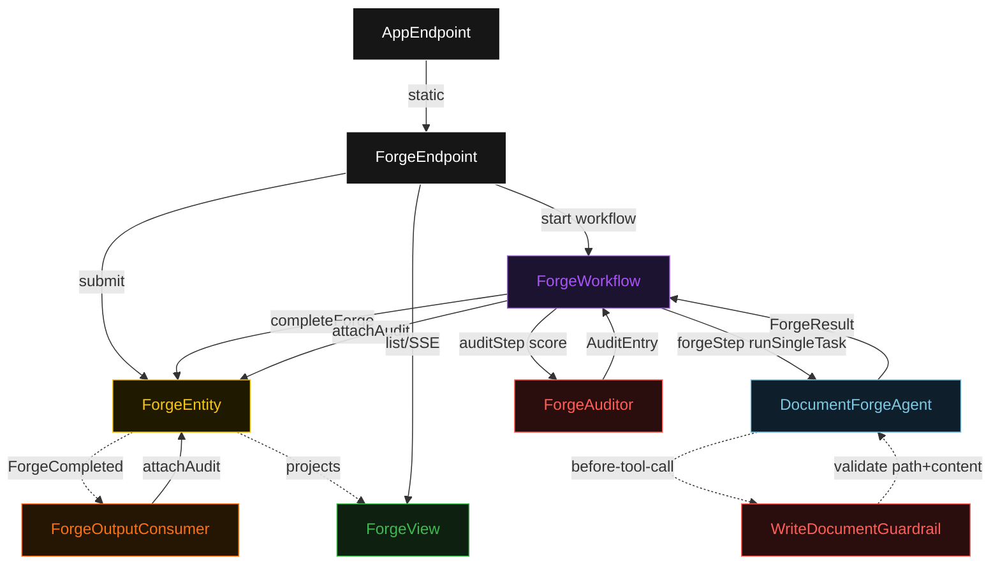
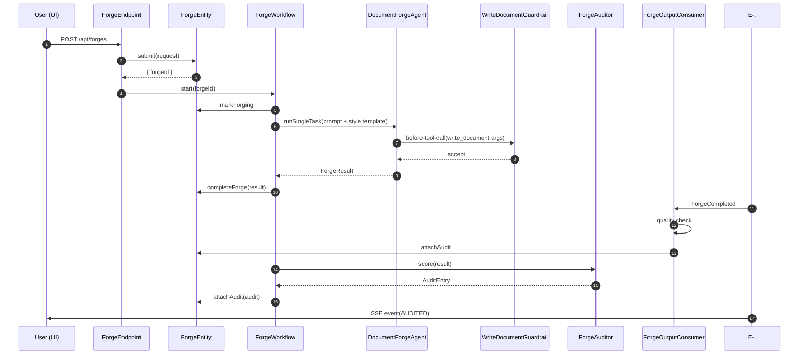
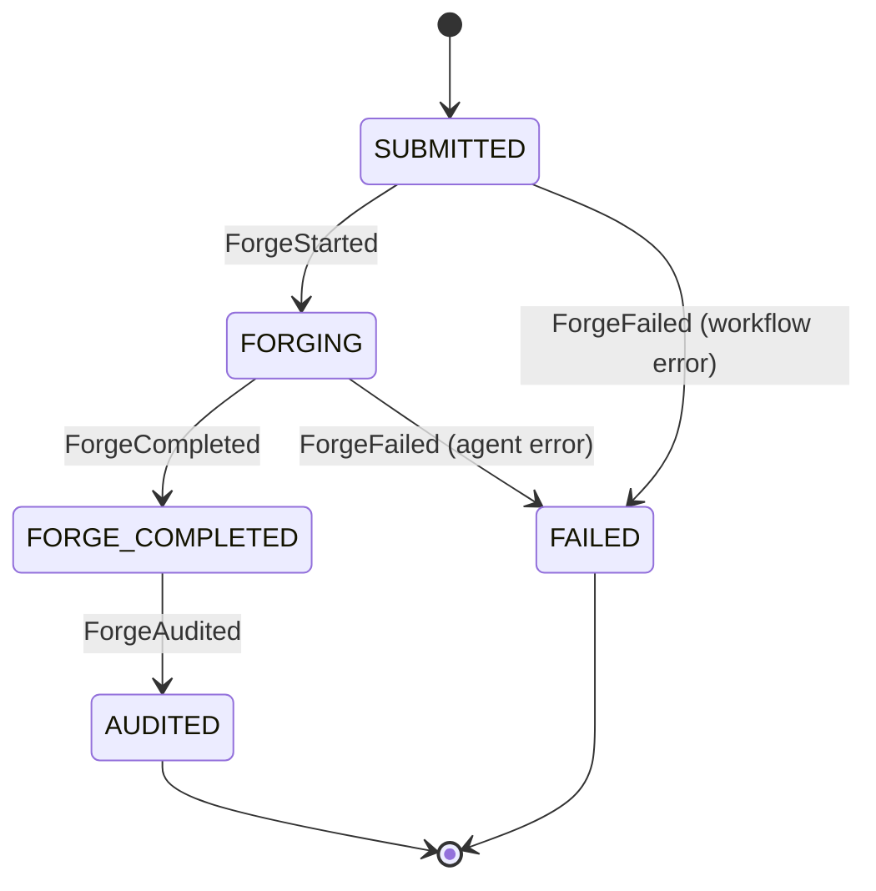
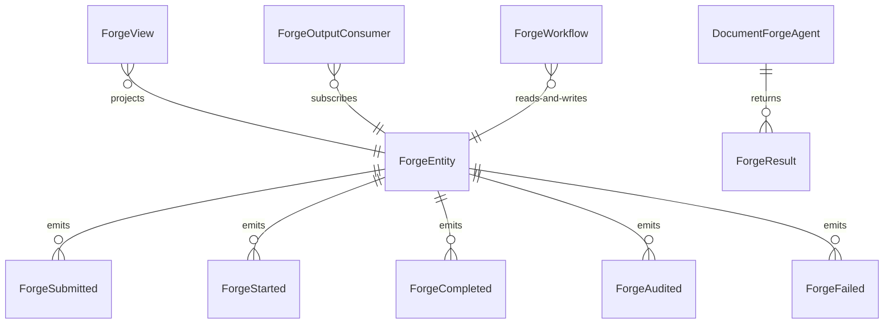

# PLAN — document-forge-agent

Architectural sketch consumed by `/akka:plan` and rendered on the generated system's Architecture tab. The four mermaid diagrams below carry the theme variables and CSS overrides from Lesson 24; without them, state names render black-on-black and edge labels clip.

---

## Component graph

## Interaction sequence — J1 (happy path)

## State machine — `ForgeEntity`

## Entity model

## Component table — Java file targets

| Component | Path (generated) |
|---|---|
| `ForgeEndpoint` | `api/ForgeEndpoint.java` |
| `AppEndpoint` | `api/AppEndpoint.java` |
| `ForgeEntity` | `application/ForgeEntity.java` (state in `domain/ForgeRun.java`, events in `domain/ForgeEvent.java`) |
| `ForgeOutputConsumer` | `application/ForgeOutputConsumer.java` |
| `ForgeWorkflow` | `application/ForgeWorkflow.java` |
| `DocumentForgeAgent` | `application/DocumentForgeAgent.java` (tasks in `application/ForgeTasks.java`) |
| `WriteDocumentGuardrail` | `application/WriteDocumentGuardrail.java` |
| `ForgeAuditor` | `application/ForgeAuditor.java` |
| `ForgeView` | `application/ForgeView.java` |
| `MockModelProvider` (option-a only) | `application/MockModelProvider.java` |
| Bootstrap | `Bootstrap.java` |

## Concurrency notes

- **Per-step timeout**: `forgeStep` 60 s, `auditStep` 5 s, `error` 5 s. Default step recovery `maxRetries(2).failoverTo(ForgeWorkflow::error)`. The 60 s on `forgeStep` accommodates LLM latency (Lesson 4).
- **Idempotency**: every workflow uses `"forge-" + forgeId` as the workflow id. `ForgeEntity.completeForge` is event-version-guarded — a second completion attempt against an already-completed forge is a no-op.
- **One agent per forge**: the AutonomousAgent instance id is `"forger-" + forgeId`, giving each task its own conversation context. The agent's `capability(...).maxIterationsPerTask(3)` caps guardrail-triggered retries at 3.
- **Guardrail-driven retry**: when `WriteDocumentGuardrail` rejects a tool call, the rejection is returned to the agent loop as a structured error. If all 3 iterations produce guardrail-blocked tool calls, `forgeStep` fails over to `error` and the entity transitions to `FAILED`.
- **Audit is synchronous and deterministic**: `ForgeAuditor` runs in-process inside `auditStep`. No LLM call — the same output always scores the same. This preserves the single-agent promise.
- **No saga / no compensation**: every step is either append-only event write or a single-task agent call. There is nothing external to roll back.
