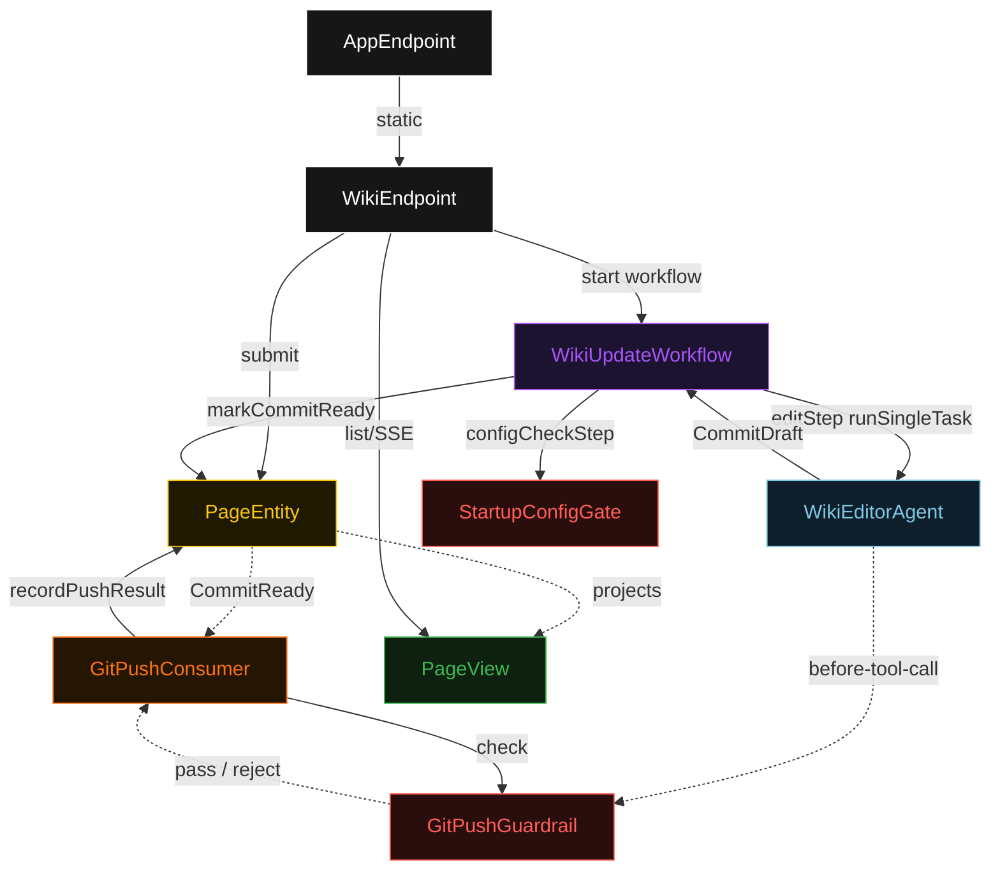
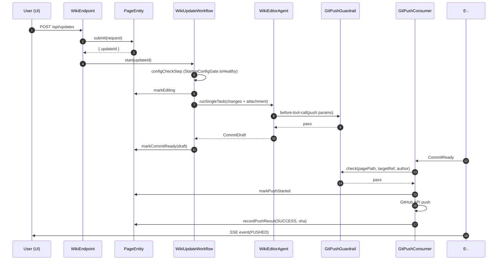
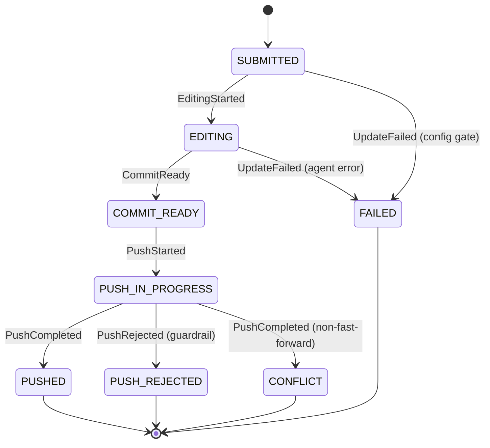
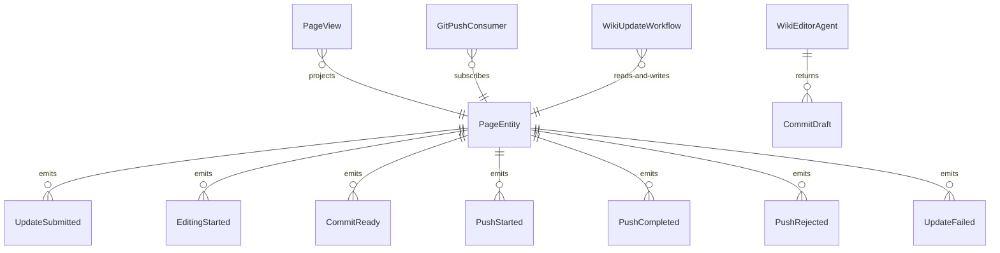

# PLAN — gitwiki

Architectural sketch consumed by `/akka:plan` and rendered on the generated system's Architecture tab. The four mermaid diagrams below carry the theme variables and CSS overrides from Lesson 24; without them, state names render black-on-black and edge labels clip.

---

## Component graph

## Interaction sequence — J1 (happy path)

## State machine — `PageEntity`

## Entity model

## Component table — Java file targets

| Component | Path (generated) |
|---|---|
| `WikiEndpoint` | `api/WikiEndpoint.java` |
| `AppEndpoint` | `api/AppEndpoint.java` |
| `PageEntity` | `application/PageEntity.java` (state in `domain/CommitOutcome.java`, events in `domain/PageEvent.java`) |
| `GitPushConsumer` | `application/GitPushConsumer.java` |
| `WikiUpdateWorkflow` | `application/WikiUpdateWorkflow.java` |
| `WikiEditorAgent` | `application/WikiEditorAgent.java` (tasks in `application/WikiTasks.java`) |
| `GitPushGuardrail` | `application/GitPushGuardrail.java` |
| `StartupConfigGate` | `application/StartupConfigGate.java` |
| `PageView` | `application/PageView.java` |
| `MockModelProvider` (option-a only) | `application/MockModelProvider.java` |
| Bootstrap | `Bootstrap.java` |

## Concurrency notes

- **Per-step timeout**: `configCheckStep` 5 s, `editStep` 60 s, `awaitPushStep` 30 s, `error` 5 s. Default step recovery `maxRetries(1).failoverTo(WikiUpdateWorkflow::error)`. The 60 s on `editStep` accommodates LLM latency (Lesson 4).
- **Idempotency**: every workflow uses `"update-" + updateId` as the workflow id. `GitPushConsumer` is allowed to redeliver `CommitReady` events because `PageEntity.markCommitReady` is event-version-guarded — a second delivery against an already-committed update is a no-op.
- **One agent per update**: the AutonomousAgent instance id is `"editor-" + updateId`, giving each task its own conversation context. The agent's `capability(...).maxIterationsPerTask(2)` caps guardrail-triggered retries at 2.
- **Guardrail-driven rejection**: when `GitPushGuardrail` rejects a push attempt, the rejection is recorded synchronously; `GitPushConsumer` calls `PageEntity.recordPushResult(PushResult.rejected(reason))`. The entity transitions to `PUSH_REJECTED`. No retry — a rejected push requires human intervention to correct configuration.
- **Conflict handling**: a GitHub API 422 response from the ref-update call is mapped to `PushResult.conflict(sha)` and recorded on the entity as `CONFLICT`. The conflicting SHA is visible in the UI so the user can rebase manually.
- **No compensation**: every step is either a config probe, an append-only entity write, or a single HTTP call. There is nothing external to roll back beyond what GitHub's own ref-update atomicity provides.
