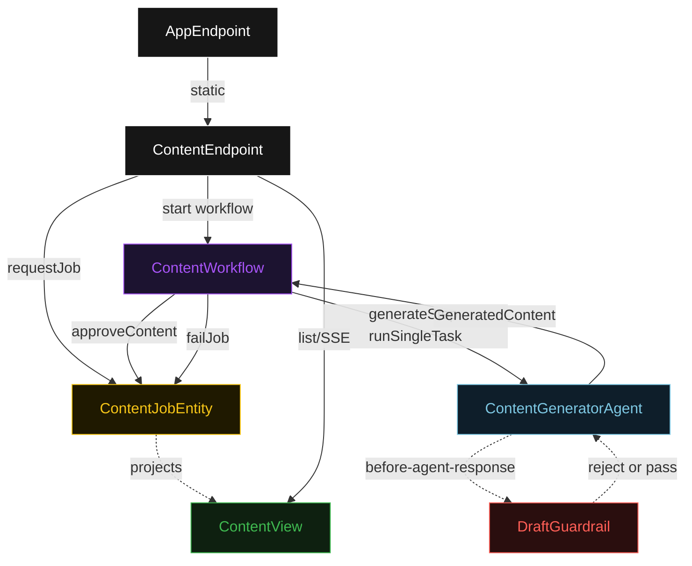
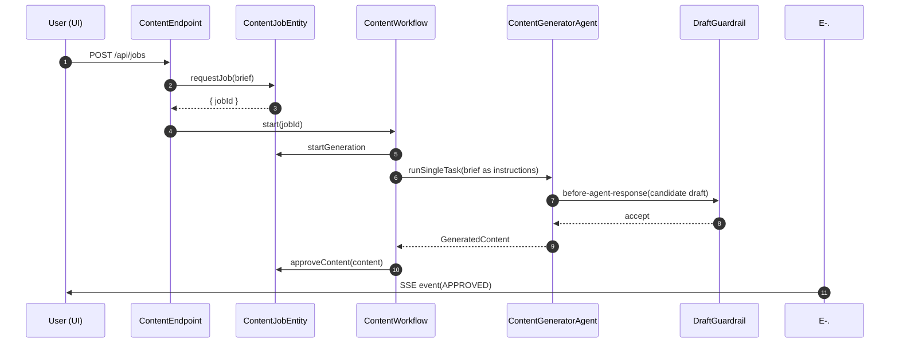
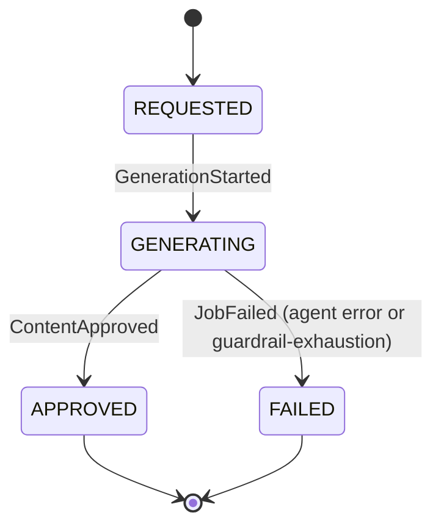
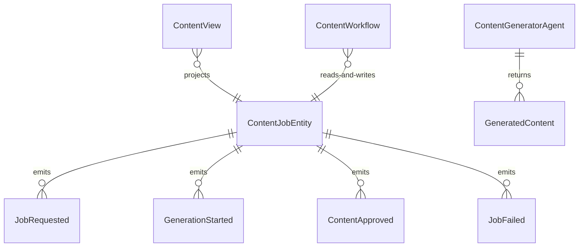

# PLAN — http-content-agent

Architectural sketch consumed by `/akka:plan` and rendered on the generated system's Architecture
tab. The four mermaid diagrams below carry the theme variables and CSS overrides from Lesson 24;
without them, state names render black-on-black and edge labels clip.

---

## Component graph

## Interaction sequence — J1 (happy path)

## State machine — `ContentJobEntity`

## Entity model

## Component table — Java file targets

| Component | Path (generated) |
|---|---|
| `ContentEndpoint` | `api/ContentEndpoint.java` |
| `AppEndpoint` | `api/AppEndpoint.java` |
| `ContentJobEntity` | `application/ContentJobEntity.java` (state in `domain/ContentJob.java`, events in `domain/ContentJobEvent.java`) |
| `ContentWorkflow` | `application/ContentWorkflow.java` |
| `ContentGeneratorAgent` | `application/ContentGeneratorAgent.java` (tasks in `application/ContentTasks.java`) |
| `DraftGuardrail` | `application/DraftGuardrail.java` |
| `ContentView` | `application/ContentView.java` |
| `MockModelProvider` (option-a only) | `application/MockModelProvider.java` |
| Bootstrap | `Bootstrap.java` |

## Concurrency notes

- **Per-step timeout**: `generateStep` 90 s, `error` 5 s. Default step recovery
  `maxRetries(2).failoverTo(ContentWorkflow::error)`. The 90 s on `generateStep` accommodates
  LLM latency on longer-form content (Lesson 4).
- **Idempotency**: the workflow uses `"content-" + jobId` as the workflow id; re-delivery of
  the `ContentEndpoint` start call is harmless because the workflow id is fixed.
- **One agent per job**: the AutonomousAgent instance id is `"generator-" + jobId`, giving each
  task its own conversation context. The agent's `capability(...).maxIterationsPerTask(3)` caps
  guardrail-triggered retries at 3.
- **Guardrail-driven retry**: when `DraftGuardrail` rejects a candidate response, the rejection
  names the specific failed check(s) in the structured error returned to the agent loop. The
  loop counts toward `maxIterationsPerTask`; if all 3 iterations fail validation the workflow's
  `generateStep` fails over to `error` and the entity transitions to `FAILED`.
- **No saga / no compensation**: every step is either an entity command write or a single-task
  agent call. There is nothing external to roll back.
