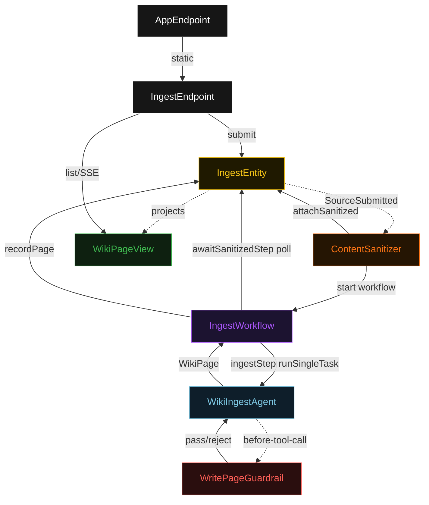
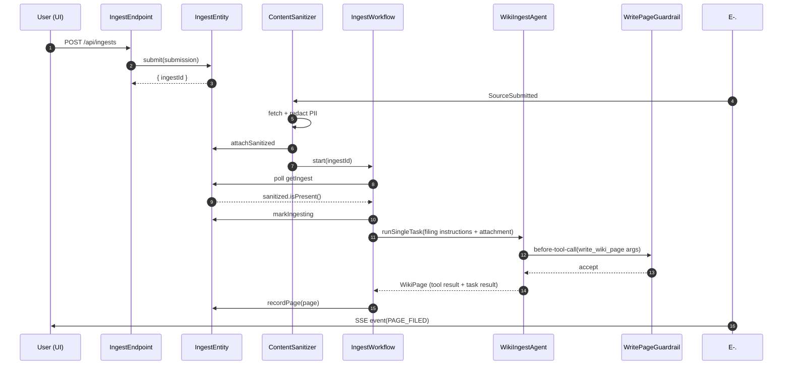
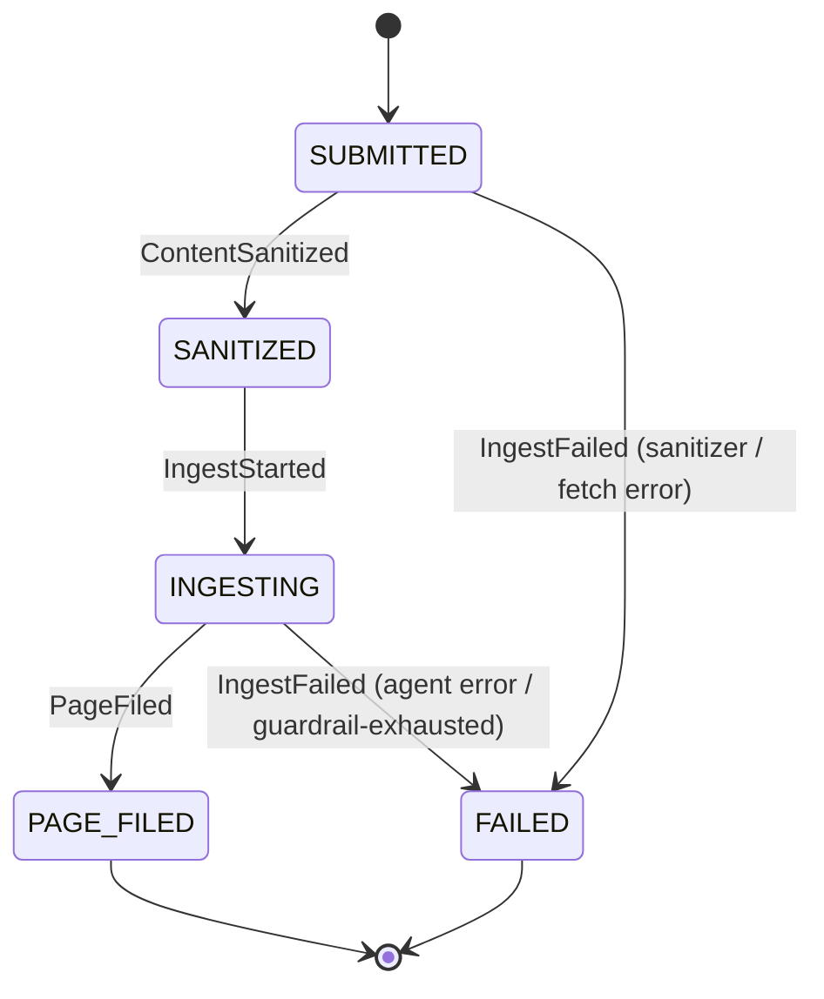
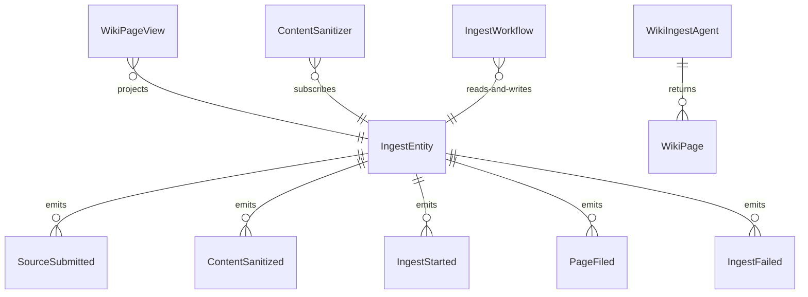

# PLAN — localwiki-ingest-agent

Architectural sketch consumed by `/akka:plan` and rendered on the generated system's Architecture tab. The four mermaid diagrams below carry the theme variables and CSS overrides from Lesson 24; without them, state names render black-on-black and edge labels clip.

---

## Component graph

## Interaction sequence — J1 (happy path)

## State machine — `IngestEntity`

## Entity model

## Component table — Java file targets

| Component | Path (generated) |
|---|---|
| `IngestEndpoint` | `api/IngestEndpoint.java` |
| `AppEndpoint` | `api/AppEndpoint.java` |
| `IngestEntity` | `application/IngestEntity.java` (state in `domain/Ingest.java`, events in `domain/IngestEvent.java`) |
| `ContentSanitizer` | `application/ContentSanitizer.java` |
| `IngestWorkflow` | `application/IngestWorkflow.java` |
| `WikiIngestAgent` | `application/WikiIngestAgent.java` (tasks in `application/IngestTasks.java`) |
| `WritePageGuardrail` | `application/WritePageGuardrail.java` |
| `WikiPageView` | `application/WikiPageView.java` |
| `MockModelProvider` (option-a only) | `application/MockModelProvider.java` |
| Bootstrap | `Bootstrap.java` |

## Concurrency notes

- **Per-step timeout**: `awaitSanitizedStep` 15 s, `ingestStep` 60 s, `error` 5 s. Default step recovery `maxRetries(2).failoverTo(IngestWorkflow::error)`. The 60 s on `ingestStep` accommodates LLM latency plus the in-process fetch simulation (Lesson 4).
- **Idempotency**: every workflow uses `"ingest-" + ingestId` as the workflow id; the `ContentSanitizer` Consumer is allowed to redeliver `SourceSubmitted` events because `IngestEntity.attachSanitized` is event-version-guarded — a second sanitize attempt against an already-sanitized ingest is a no-op.
- **One agent per ingest**: the AutonomousAgent instance id is `"ingest-agent-" + ingestId`, which gives each task its own conversation context. The agent's `capability(...).maxIterationsPerTask(3)` caps guardrail-triggered retries at 3.
- **Guardrail-driven retry**: when `WritePageGuardrail` rejects a proposed tool call, the rejection is returned as a structured error to the agent loop. The loop counts toward `maxIterationsPerTask`; if all 3 iterations fail validation, the workflow's `ingestStep` fails over to `error` and the entity transitions to `FAILED`.
- **No saga / no compensation**: every step is either pure read, append-only event write, or a single-task agent call. There is nothing external to roll back.
