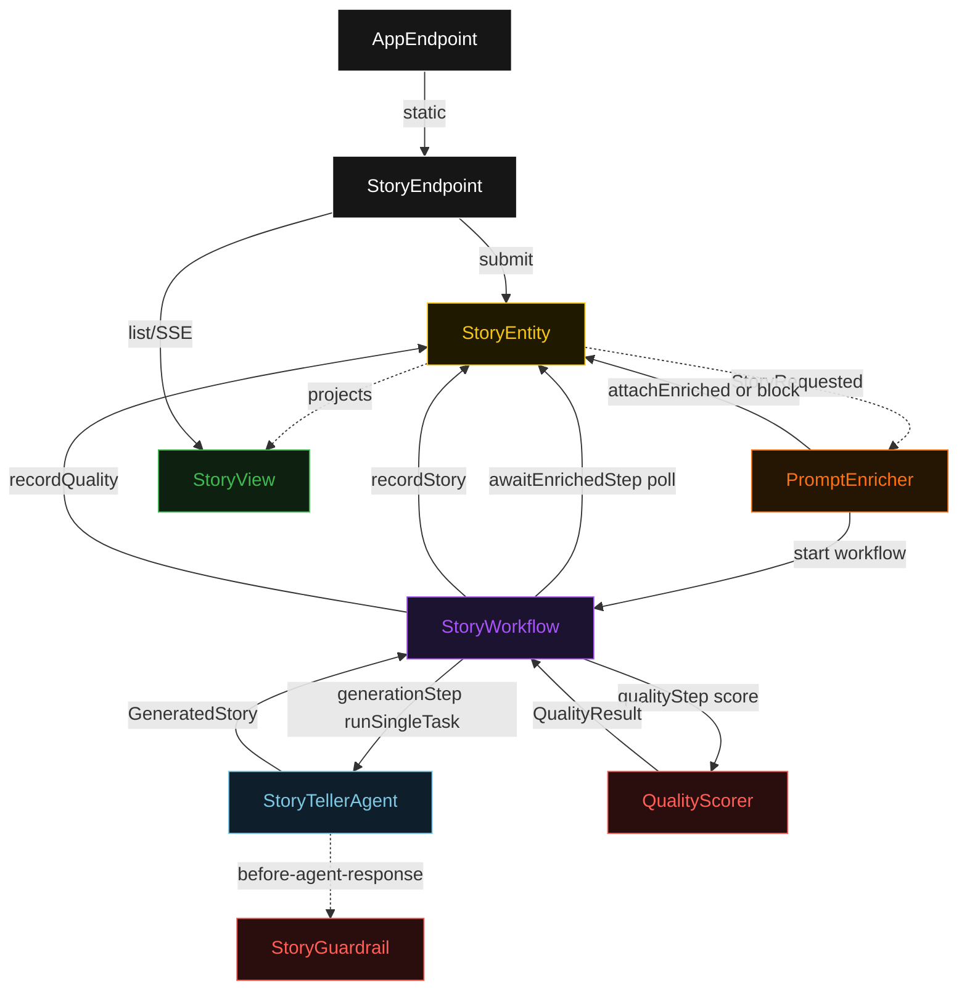
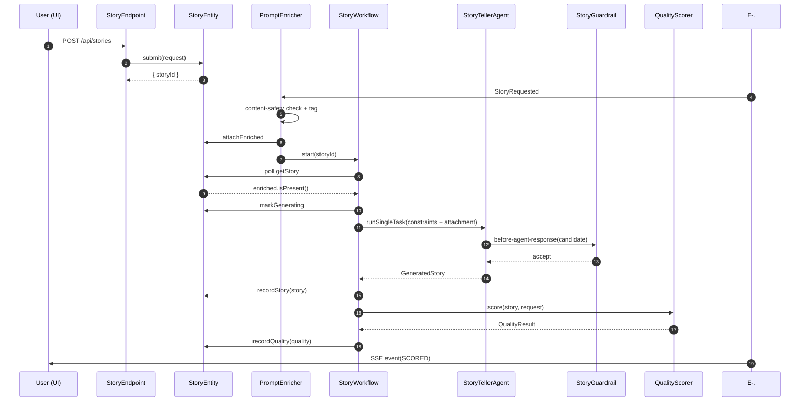
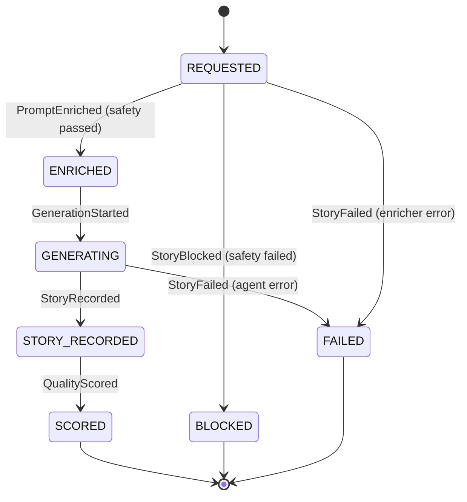
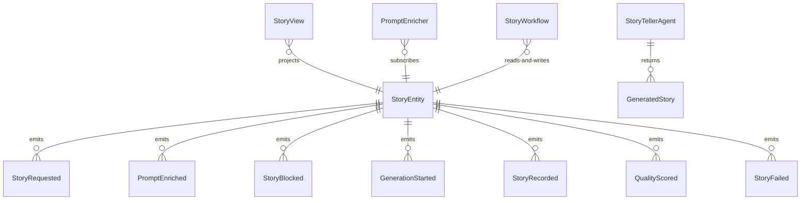

# PLAN — story-teller

Architectural sketch consumed by `/akka:plan` and rendered on the generated system's Architecture tab. The four mermaid diagrams below carry the theme variables and CSS overrides from Lesson 24; without them, state names render black-on-black and edge labels clip.

---

## Component graph

## Interaction sequence — J1 (happy path)

## State machine — `StoryEntity`

## Entity model

## Component table — Java file targets

| Component | Path (generated) |
|---|---|
| `StoryEndpoint` | `api/StoryEndpoint.java` |
| `AppEndpoint` | `api/AppEndpoint.java` |
| `StoryEntity` | `application/StoryEntity.java` (state in `domain/Story.java`, events in `domain/StoryEvent.java`) |
| `PromptEnricher` | `application/PromptEnricher.java` |
| `StoryWorkflow` | `application/StoryWorkflow.java` |
| `StoryTellerAgent` | `application/StoryTellerAgent.java` (tasks in `application/StoryTasks.java`) |
| `StoryGuardrail` | `application/StoryGuardrail.java` |
| `QualityScorer` | `application/QualityScorer.java` |
| `StoryView` | `application/StoryView.java` |
| `MockModelProvider` (option-a only) | `application/MockModelProvider.java` |
| Bootstrap | `Bootstrap.java` |

## Concurrency notes

- **Per-step timeout**: `awaitEnrichedStep` 15 s, `generationStep` 60 s, `qualityStep` 5 s, `error` 5 s. Default step recovery `maxRetries(2).failoverTo(StoryWorkflow::error)`. The 60 s on `generationStep` accommodates LLM latency (Lesson 4).
- **Idempotency**: every workflow uses `"story-" + storyId` as the workflow id; the `PromptEnricher` Consumer is allowed to redeliver `StoryRequested` events because `StoryEntity.attachEnriched` is event-version-guarded — a second enrichment attempt against an already-enriched story is a no-op.
- **One agent per story**: the AutonomousAgent instance id is `"teller-" + storyId`, which gives each task its own conversation context. The agent's `capability(...).maxIterationsPerTask(3)` caps guardrail-triggered retries at 3.
- **Guardrail-driven retry**: when `StoryGuardrail` rejects a candidate response, the rejection is returned as a structured error to the agent loop. The loop counts toward `maxIterationsPerTask`; if all 3 iterations fail validation, the workflow's `generationStep` fails over to `error` and the entity transitions to `FAILED`.
- **Quality eval is synchronous and deterministic**: `QualityScorer` runs in-process inside `qualityStep`. No LLM call, no external service — the same story always scores the same. This is a deliberate single-agent guarantee.
- **Blocked path skips agent entirely**: when `PromptEnricher` calls `StoryEntity.block(reason)`, the workflow's `awaitEnrichedStep` detects `status == BLOCKED` and transitions to terminal done without invoking `StoryTellerAgent`. No model credit consumed.
- **No saga / no compensation**: every step is either pure read, append-only event write, or a single-task agent call. There is nothing external to roll back.
