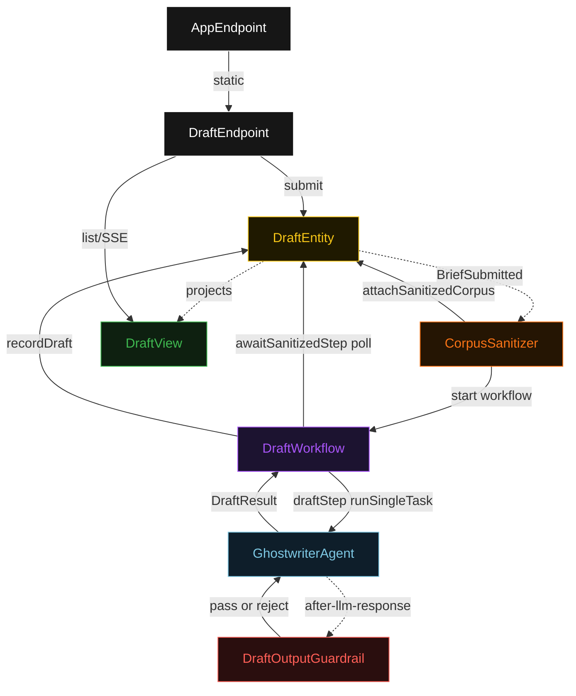
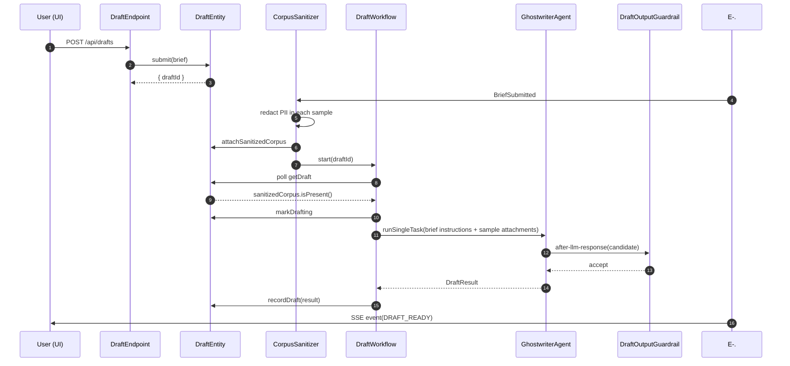
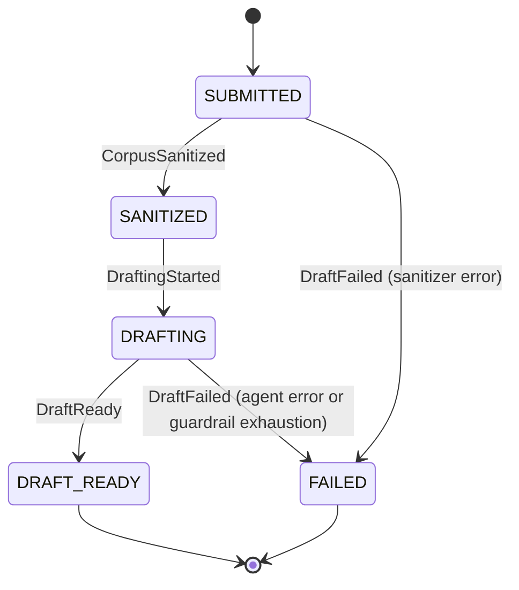
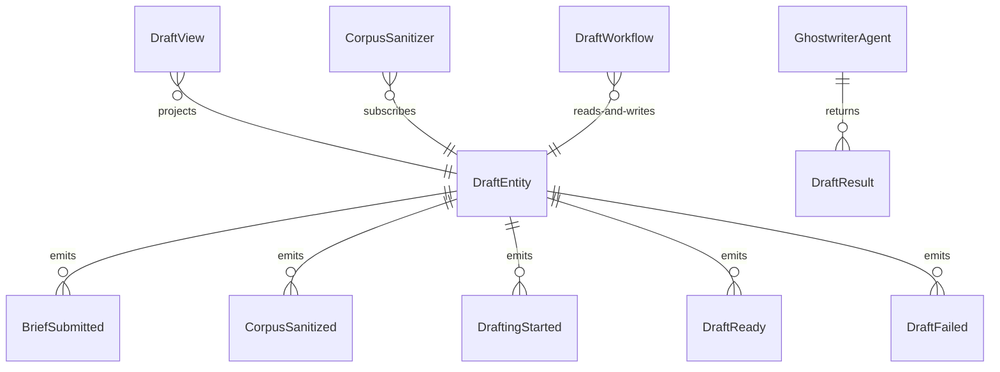

# PLAN — ghostwriter

Architectural sketch consumed by `/akka:plan` and rendered on the generated system's Architecture tab. The four mermaid diagrams below carry the theme variables and CSS overrides from Lesson 24; without them, state names render black-on-black and edge labels clip.

---

## Component graph

## Interaction sequence — J1 (happy path)

## State machine — `DraftEntity`

## Entity model

## Component table — Java file targets

| Component | Path (generated) |
|---|---|
| `DraftEndpoint` | `api/DraftEndpoint.java` |
| `AppEndpoint` | `api/AppEndpoint.java` |
| `DraftEntity` | `application/DraftEntity.java` (state in `domain/Draft.java`, events in `domain/DraftEvent.java`) |
| `CorpusSanitizer` | `application/CorpusSanitizer.java` |
| `DraftWorkflow` | `application/DraftWorkflow.java` |
| `GhostwriterAgent` | `application/GhostwriterAgent.java` (tasks in `application/DraftTasks.java`) |
| `DraftOutputGuardrail` | `application/DraftOutputGuardrail.java` |
| `DraftView` | `application/DraftView.java` |
| `MockModelProvider` (option-a only) | `application/MockModelProvider.java` |
| Bootstrap | `Bootstrap.java` |

## Concurrency notes

- **Per-step timeout**: `awaitSanitizedStep` 15 s, `draftStep` 90 s, `error` 5 s. Default step recovery `maxRetries(2).failoverTo(DraftWorkflow::error)`. The 90 s on `draftStep` accommodates multi-sample corpus processing plus LLM latency (Lesson 4).
- **Idempotency**: every workflow uses `"draft-" + draftId` as the workflow id; `CorpusSanitizer` may redeliver `BriefSubmitted` events because `DraftEntity.attachSanitizedCorpus` is event-version-guarded — a second sanitize attempt against an already-sanitized draft is a no-op.
- **One agent per draft**: the AutonomousAgent instance id is `"ghostwriter-" + draftId`, giving each task its own conversation context. `capability(...).maxIterationsPerTask(3)` caps guardrail-triggered retries at 3.
- **Guardrail-driven retry**: when `DraftOutputGuardrail` rejects a candidate response, the rejection returns as a structured error to the agent loop. The loop counts toward `maxIterationsPerTask`; if all 3 iterations fail validation, `draftStep` fails over to `error` and the entity transitions to `FAILED`.
- **No saga / no compensation**: every step is either a pure read, an append-only event write, or a single-task agent call. There is nothing external to roll back.
