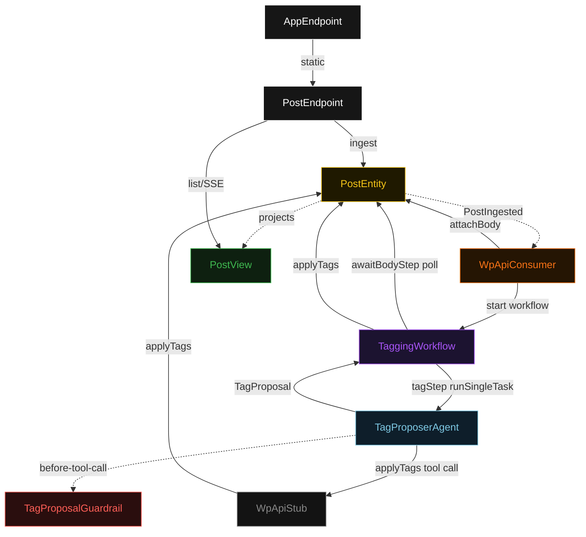
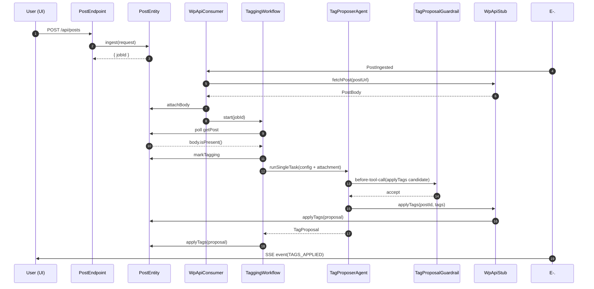
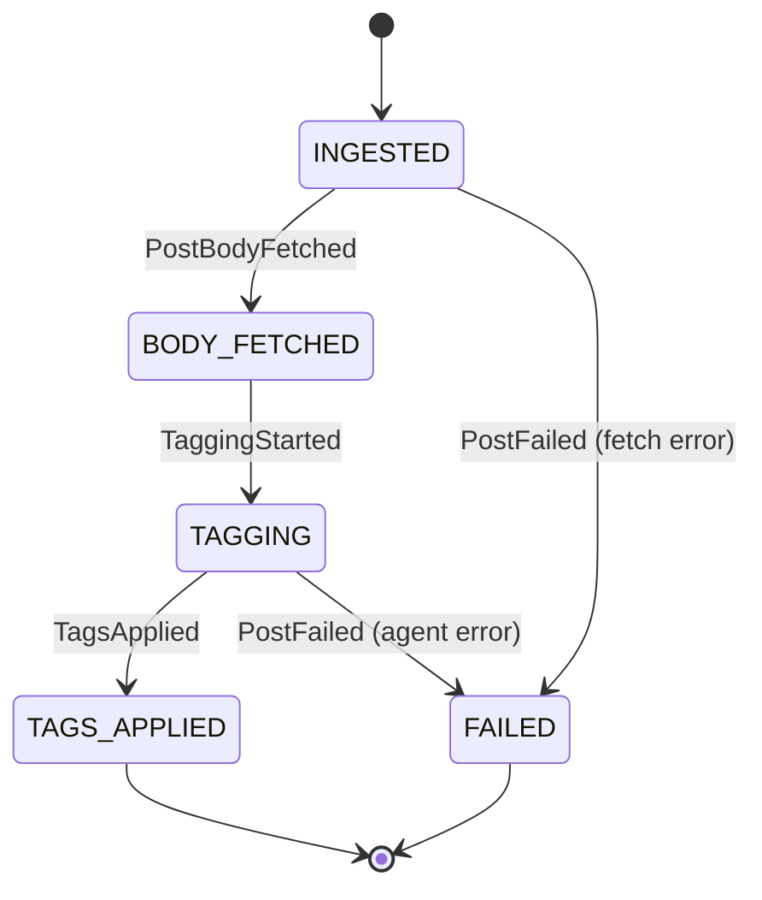
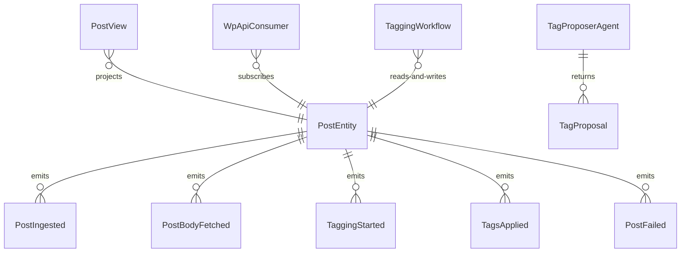

# PLAN — wp-autotagger

Architectural sketch consumed by `/akka:plan` and rendered on the generated system's Architecture tab. The four mermaid diagrams below carry the theme variables and CSS overrides from Lesson 24; without them, state names render black-on-black and edge labels clip.

---

## Component graph

## Interaction sequence — J1 (happy path)

## State machine — `PostEntity`

## Entity model

## Component table — Java file targets

| Component | Path (generated) |
|---|---|
| `PostEndpoint` | `api/PostEndpoint.java` |
| `AppEndpoint` | `api/AppEndpoint.java` |
| `PostEntity` | `application/PostEntity.java` (state in `domain/Post.java`, events in `domain/PostEvent.java`) |
| `WpApiConsumer` | `application/WpApiConsumer.java` |
| `WpApiStub` | `application/WpApiStub.java` |
| `TaggingWorkflow` | `application/TaggingWorkflow.java` |
| `TagProposerAgent` | `application/TagProposerAgent.java` (tasks in `application/TaggingTasks.java`) |
| `TagProposalGuardrail` | `application/TagProposalGuardrail.java` |
| `PostView` | `application/PostView.java` |
| `MockModelProvider` (option-a only) | `application/MockModelProvider.java` |
| Bootstrap | `Bootstrap.java` |

## Concurrency notes

- **Per-step timeout**: `awaitBodyStep` 15 s, `tagStep` 60 s, `error` 5 s. Default step recovery `maxRetries(2).failoverTo(TaggingWorkflow::error)`. The 60 s on `tagStep` accommodates LLM latency (Lesson 4).
- **Idempotency**: every workflow uses `"tagging-" + jobId` as the workflow id; the `WpApiConsumer` Consumer is allowed to redeliver `PostIngested` events because `PostEntity.attachBody` is event-version-guarded — a second fetch attempt against an already-fetched post is a no-op.
- **One agent per job**: the AutonomousAgent instance id is `"tagger-" + jobId`, which gives each task its own conversation context. The agent's `capability(...).maxIterationsPerTask(3)` caps guardrail-triggered retries at 3.
- **Guardrail-driven retry**: when `TagProposalGuardrail` rejects an `applyTags` tool call, the rejection is returned as a structured error to the agent loop. The loop counts toward `maxIterationsPerTask`; if all 3 iterations fail validation, the workflow's `tagStep` fails over to `error` and the entity transitions to `FAILED`.
- **No saga / no compensation**: every step is either a pure read, an append-only event write, or a single-task agent call. There is nothing external to roll back.
