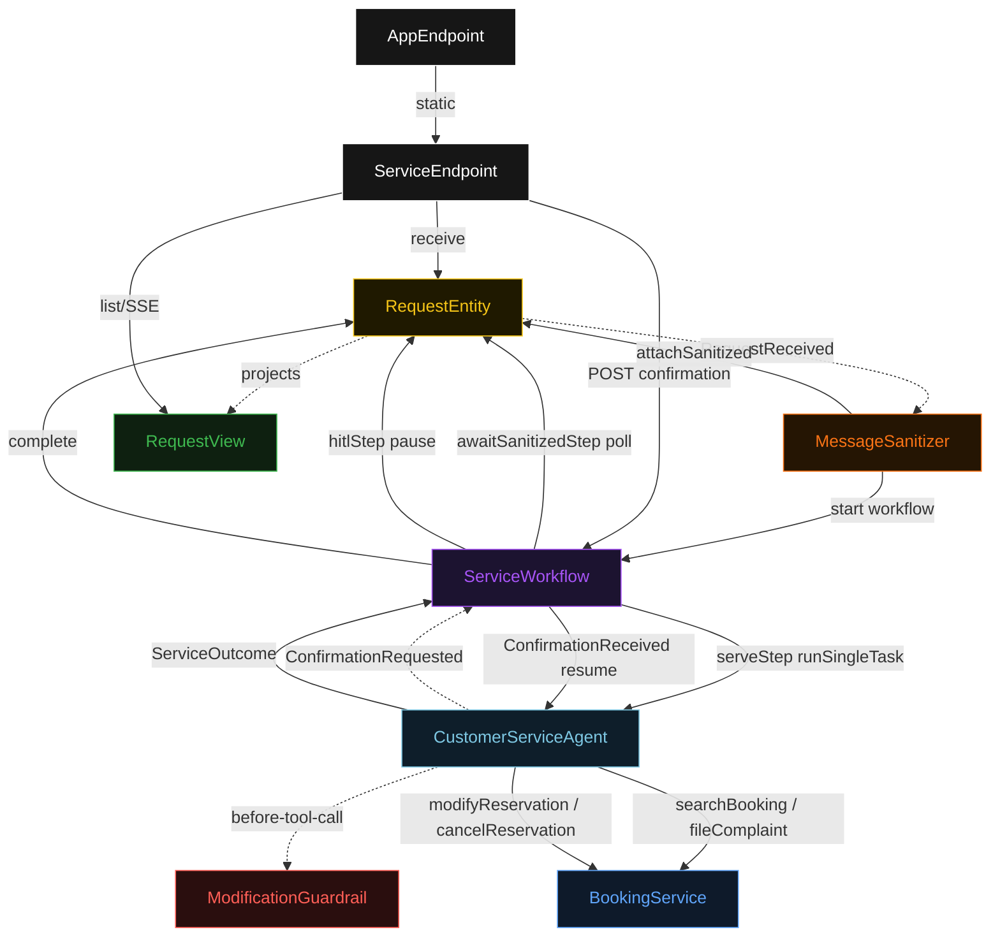
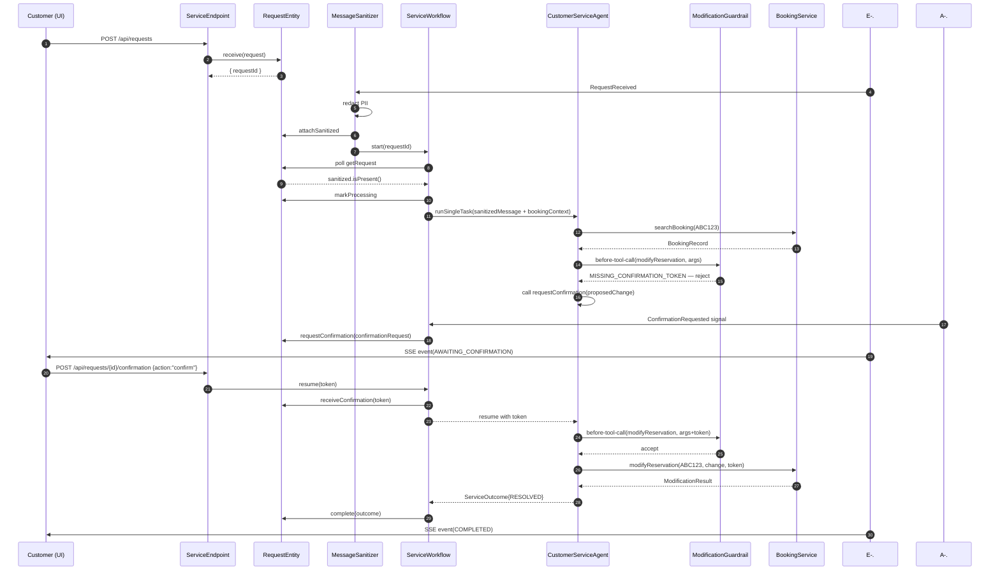
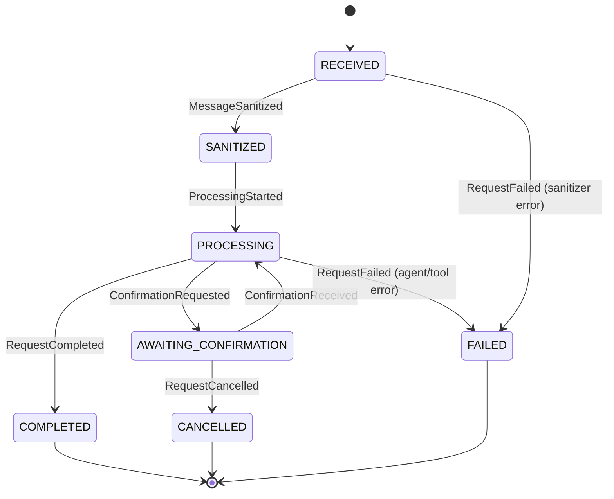
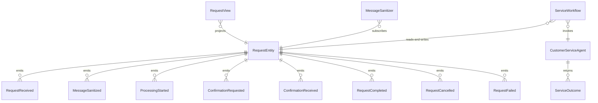

# PLAN — airline-cs

Architectural sketch consumed by `/akka:plan` and rendered on the generated system's Architecture tab. The four mermaid diagrams below carry the theme variables and CSS overrides from Lesson 24; without them, state names render black-on-black and edge labels clip.

---

## Component graph

## Interaction sequence — J1 (seat change with HITL)

## State machine — `RequestEntity`

## Entity model

## Component table — Java file targets

| Component | Path (generated) |
|---|---|
| `ServiceEndpoint` | `api/ServiceEndpoint.java` |
| `AppEndpoint` | `api/AppEndpoint.java` |
| `RequestEntity` | `application/RequestEntity.java` (state in `domain/ServiceRequestState.java`, events in `domain/RequestEvent.java`) |
| `MessageSanitizer` | `application/MessageSanitizer.java` |
| `ServiceWorkflow` | `application/ServiceWorkflow.java` |
| `CustomerServiceAgent` | `application/CustomerServiceAgent.java` (tasks in `application/ServiceTasks.java`) |
| `ModificationGuardrail` | `application/ModificationGuardrail.java` |
| `BookingService` | `application/BookingService.java` |
| `RequestView` | `application/RequestView.java` |
| `MockModelProvider` (option-a only) | `application/MockModelProvider.java` |
| Bootstrap | `Bootstrap.java` |

## Concurrency notes

- **Per-step timeout**: `awaitSanitizedStep` 15 s, `serveStep` 120 s, `hitlStep` 3600 s (customer paced), `completeStep` 5 s, `error` 5 s. Default step recovery `maxRetries(2).failoverTo(ServiceWorkflow::error)`. The 120 s on `serveStep` accommodates multi-turn ReAct loops with LLM latency plus potential mid-loop HITL round-trips (Lesson 4).
- **HITL suspension**: when the agent calls `requestConfirmation`, the workflow transitions to `hitlStep` and suspends. The entity records `ConfirmationRequested`. A call to `POST /api/requests/{id}/confirmation` resumes the workflow. The 3600 s hitlStep timeout is intentional — customers may take minutes to respond. If the timeout expires, the step fails over to `error`.
- **Idempotency**: every workflow uses `"service-" + requestId` as the workflow id; `MessageSanitizer` is allowed to redeliver `RequestReceived` because `RequestEntity.attachSanitized` is event-version-guarded.
- **One agent per request**: agent instance id is `"agent-" + requestId`, giving each task its own conversation context. `maxIterationsPerTask(8)` accommodates multi-tool ReAct loops including one confirmation round-trip.
- **Guardrail-driven re-route**: when `ModificationGuardrail` rejects a tool call, the rejection returns a structured error to the agent loop. The loop counts toward `maxIterationsPerTask`. If the agent exhausts its budget without obtaining a confirmation token, the workflow fails over to `error`.
- **BookingService is not an agent**: it is a plain Java class, not an AutonomousAgent. Tool call routing stays inside the agent's ReAct loop. This is what makes the single-agent invariant hold.
