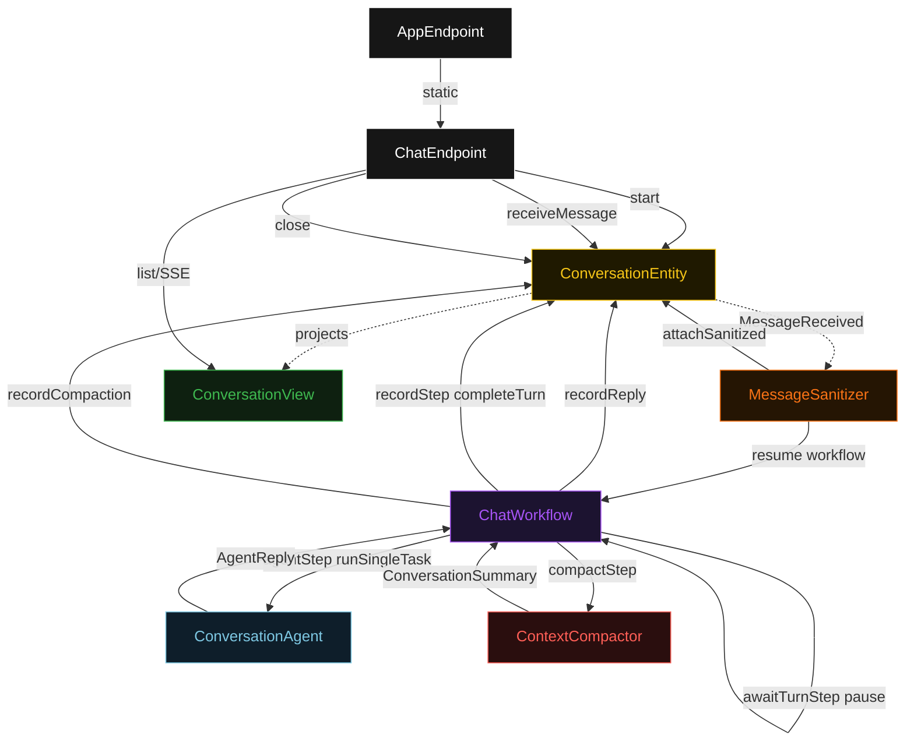
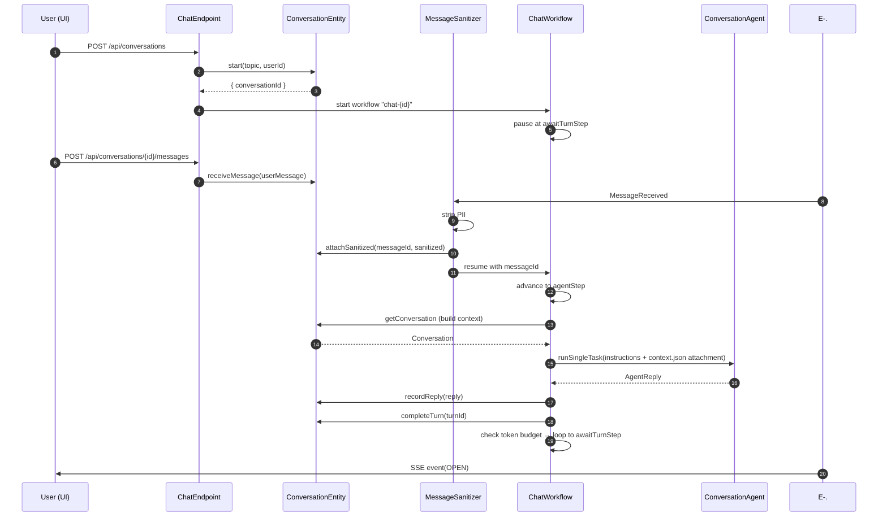
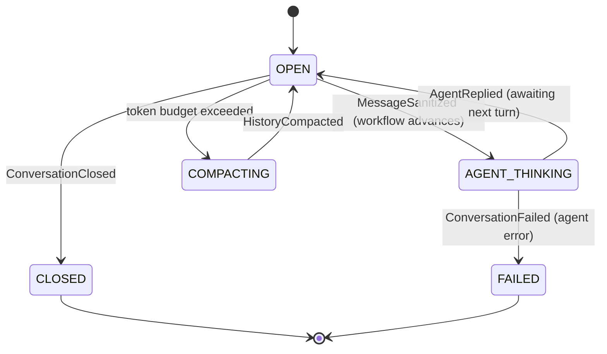
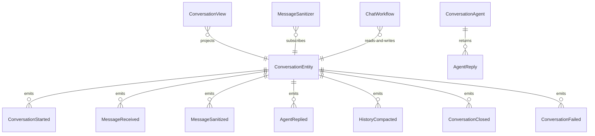

# PLAN — entity-workflow-chat

Architectural sketch consumed by `/akka:plan` and rendered on the generated system's Architecture tab. The four mermaid diagrams below carry the theme variables and CSS overrides from Lesson 24; without them, state names render black-on-black and edge labels clip.

---

## Component graph

## Interaction sequence — J1 (happy path, single turn)

## State machine — `ConversationEntity`

## Entity model

## Component table — Java file targets

| Component | Path (generated) |
|---|---|
| `ChatEndpoint` | `api/ChatEndpoint.java` |
| `AppEndpoint` | `api/AppEndpoint.java` |
| `ConversationEntity` | `application/ConversationEntity.java` (state in `domain/Conversation.java`, events in `domain/ConversationEvent.java`) |
| `MessageSanitizer` | `application/MessageSanitizer.java` |
| `ChatWorkflow` | `application/ChatWorkflow.java` |
| `ConversationAgent` | `application/ConversationAgent.java` (tasks in `application/ChatTasks.java`) |
| `ContextCompactor` | `application/ContextCompactor.java` |
| `ConversationView` | `application/ConversationView.java` |
| `MockModelProvider` (option-a only) | `application/MockModelProvider.java` |
| Bootstrap | `Bootstrap.java` |

## Concurrency notes

- **Per-step timeout**: `awaitTurnStep` 300 s (session idle window), `agentStep` 60 s, `recordStep` 5 s, `compactStep` 10 s, `error` 5 s. Default step recovery `maxRetries(2).failoverTo(ChatWorkflow::error)`. The 60 s on `agentStep` accommodates LLM latency (Lesson 4).
- **Workflow pause**: `awaitTurnStep` calls `Workflow.pause()`. It is resumed by `ChatEndpoint.sendMessage` via a workflow signal or equivalent mechanism after `MessageSanitizer` has written the sanitized message to the entity.
- **One agent instance per turn**: the AutonomousAgent instance id is `"agent-" + conversationId + "-" + turnId`, which gives each turn its own isolated context. `maxIterationsPerTask(3)` caps retries.
- **Compaction trigger**: the `recordStep` estimates token count as `totalChars / 4`. When the estimate exceeds 4 000, the step transitions to `compactStep` rather than looping to `awaitTurnStep`.
- **Compactor is synchronous and deterministic**: `ContextCompactor` runs in-process inside `compactStep`. No LLM call, no external service — same turn list always produces the same summary. This is a deliberate single-agent guarantee.
- **Idempotency**: `ConversationEntity.attachSanitized` is event-version-guarded — a redelivered `MessageReceived` from the Consumer does not produce a duplicate sanitize event if the message is already sanitized.
- **No saga / no compensation**: every step is either a pure entity read, an append-only event write, or a single-task agent call. Nothing external needs rollback.
