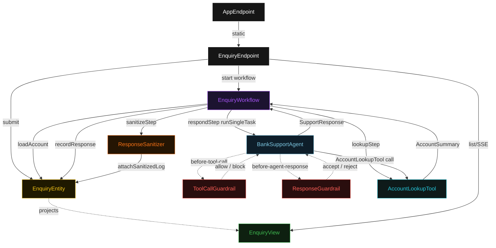
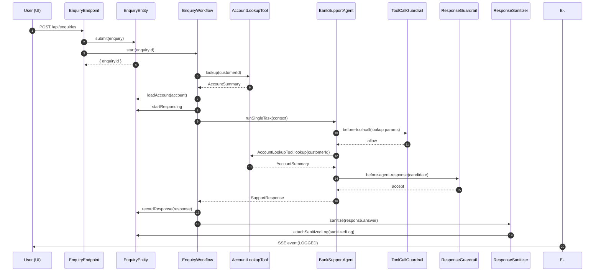
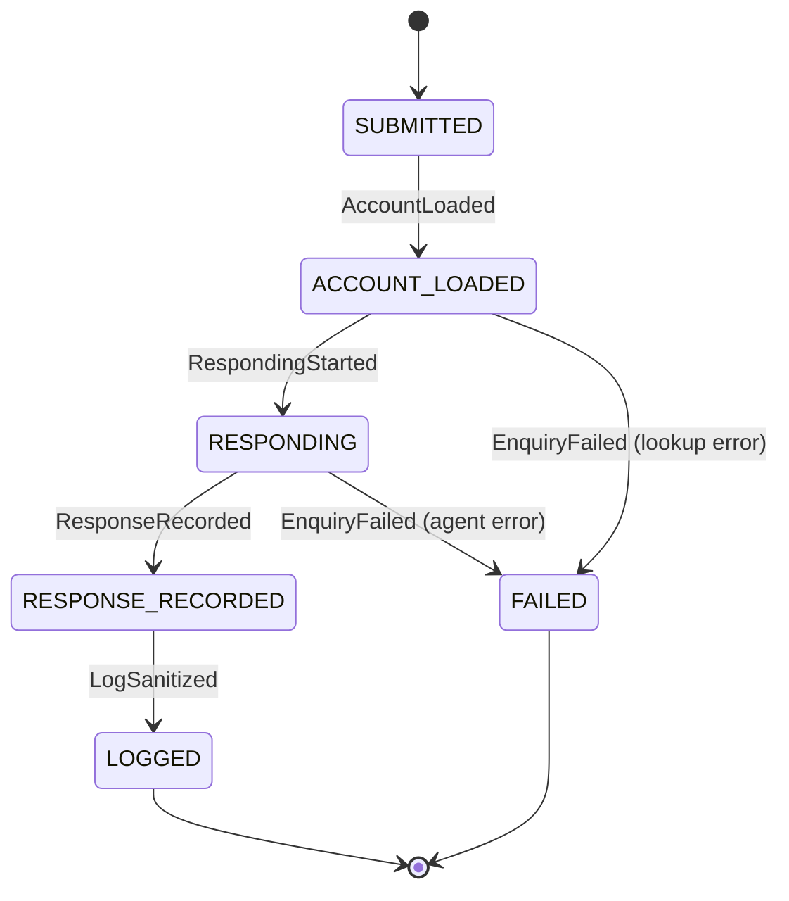
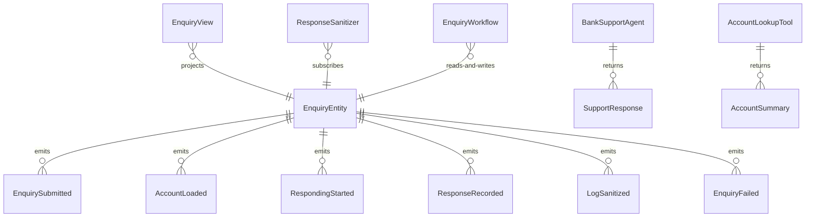

# PLAN — bank-support-agent

Architectural sketch consumed by `/akka:plan` and rendered on the generated system's Architecture tab. The four mermaid diagrams below carry the theme variables and CSS overrides from Lesson 24; without them, state names render black-on-black and edge labels clip.

---

## Component graph

## Interaction sequence — J1 (happy path)

## State machine — `EnquiryEntity`

## Entity model

## Component table — Java file targets

| Component | Path (generated) |
|---|---|
| `EnquiryEndpoint` | `api/EnquiryEndpoint.java` |
| `AppEndpoint` | `api/AppEndpoint.java` |
| `EnquiryEntity` | `application/EnquiryEntity.java` (state in `domain/Enquiry.java`, events in `domain/EnquiryEvent.java`) |
| `EnquiryWorkflow` | `application/EnquiryWorkflow.java` |
| `BankSupportAgent` | `application/BankSupportAgent.java` (tasks in `application/EnquiryTasks.java`) |
| `AccountLookupTool` | `application/AccountLookupTool.java` |
| `ToolCallGuardrail` | `application/ToolCallGuardrail.java` |
| `ResponseGuardrail` | `application/ResponseGuardrail.java` |
| `ResponseSanitizer` | `application/ResponseSanitizer.java` |
| `EnquiryView` | `application/EnquiryView.java` |
| `MockModelProvider` (option-a only) | `application/MockModelProvider.java` |
| Bootstrap | `Bootstrap.java` |

## Concurrency notes

- **Per-step timeout**: `lookupStep` 10 s, `respondStep` 60 s, `sanitizeStep` 5 s, `error` 5 s. Default step recovery `maxRetries(2).failoverTo(EnquiryWorkflow::error)`. The 60 s on `respondStep` accommodates LLM latency (Lesson 4).
- **Idempotency**: every workflow uses `"enquiry-" + enquiryId` as the workflow id; the `EnquiryEndpoint` also passes `enquiryId` to `EnquiryEntity.submit`, which is event-version-guarded — a duplicate submit is a no-op.
- **One agent per enquiry**: the AutonomousAgent instance id is `"support-" + enquiryId`, giving each task its own conversation context. The agent's `capability(...).maxIterationsPerTask(3)` caps guardrail-triggered retries at 3.
- **Guardrail-driven retry**: when `ResponseGuardrail` rejects a candidate response, the rejection returns as a structured error to the agent loop. If all 3 iterations fail validation, the workflow's `respondStep` fails over to `error` and the entity transitions to `FAILED`.
- **Tool-call veto**: when `ToolCallGuardrail` blocks a `blockCard=true` call, the block is returned to the agent as a pre-condition error. The agent must re-plan — it cannot call `blockCardRequest` directly.
- **Sanitizer runs synchronously in sanitizeStep**: unlike the docreview pattern where a Consumer fires asynchronously after entity events, here the sanitizer is invoked directly inside `sanitizeStep`. This keeps the lifecycle tightly ordered: `RESPONSE_RECORDED → LOGGED` happens in a single workflow step, preventing a window where the raw answer is visible in the view.
- **No saga / no compensation**: every step is either pure read, append-only event write, or a single-task agent call. There is nothing external to roll back.
