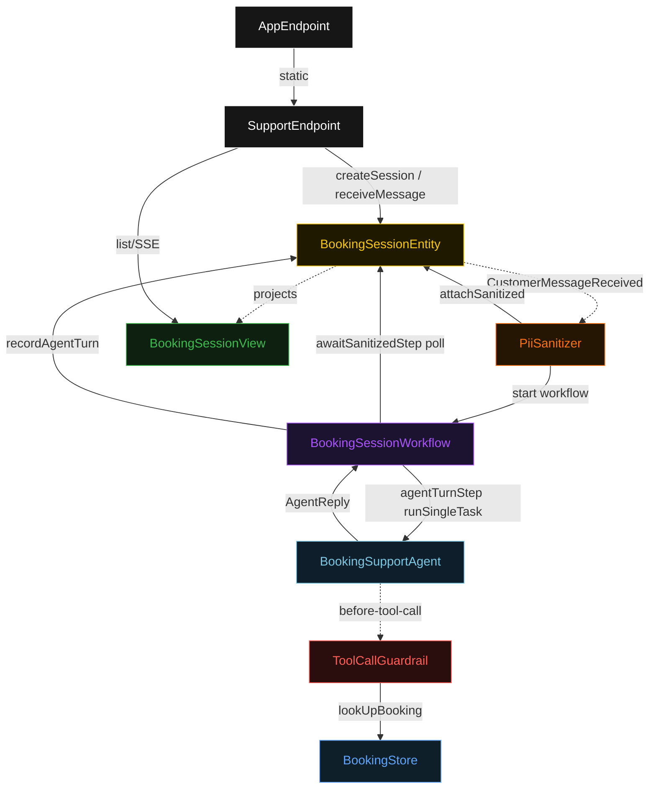
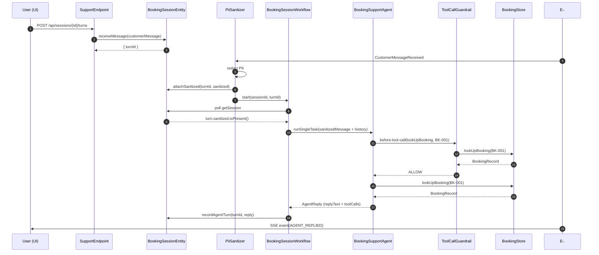
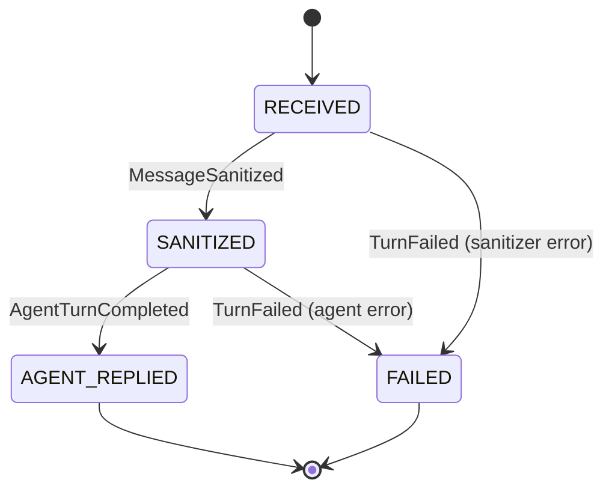
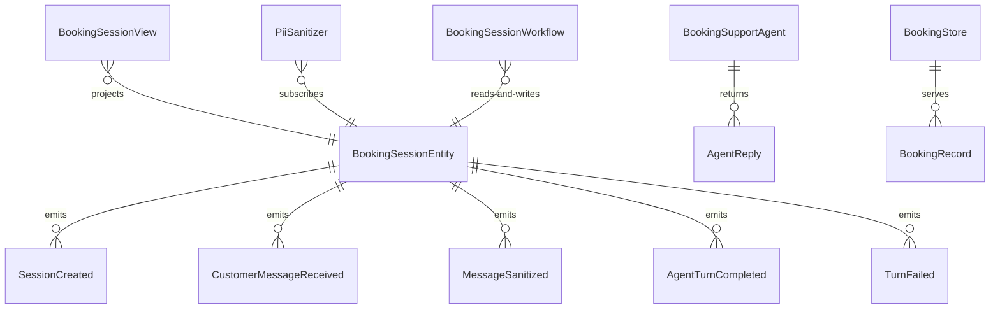

# PLAN — booking-support-agent

Architectural sketch consumed by `/akka:plan` and rendered on the generated system's Architecture tab. The four mermaid diagrams below carry the theme variables and CSS overrides from Lesson 24; without them, state names render black-on-black and edge labels clip.

---

## Component graph

## Interaction sequence — J1 (happy path, booking lookup)

## State machine — `BookingSessionEntity` (turn lifecycle)

## Entity model

## Component table — Java file targets

| Component | Path (generated) |
|---|---|
| `SupportEndpoint` | `api/SupportEndpoint.java` |
| `AppEndpoint` | `api/AppEndpoint.java` |
| `BookingSessionEntity` | `application/BookingSessionEntity.java` (state in `domain/BookingSession.java`, events in `domain/BookingSessionEvent.java`) |
| `PiiSanitizer` | `application/PiiSanitizer.java` |
| `BookingSessionWorkflow` | `application/BookingSessionWorkflow.java` |
| `BookingSupportAgent` | `application/BookingSupportAgent.java` (tasks in `application/BookingSupportTasks.java`) |
| `ToolCallGuardrail` | `application/ToolCallGuardrail.java` |
| `BookingStore` | `application/BookingStore.java` |
| `BookingSessionView` | `application/BookingSessionView.java` |
| `JudgeAssertions` | `test/JudgeAssertions.java` |
| `MockModelProvider` (option-a only) | `application/MockModelProvider.java` |
| Bootstrap | `Bootstrap.java` |

## Concurrency notes

- **Per-step timeout**: `awaitSanitizedStep` 15 s, `agentTurnStep` 60 s, `recordTurnStep` 5 s, `error` 5 s. Default step recovery `maxRetries(2).failoverTo(BookingSessionWorkflow::error)`. The 60 s on `agentTurnStep` accommodates LLM latency (Lesson 4).
- **Idempotency**: every workflow uses `"turn-" + turnId` as the workflow id; `PiiSanitizer` Consumer is allowed to redeliver `CustomerMessageReceived` events because `BookingSessionEntity.attachSanitized` is turn-version-guarded — a second sanitize attempt for an already-sanitized turn is a no-op.
- **One agent per session**: `BookingSupportAgent` instance id is `"support-" + sessionId`, giving each session its own conversation context across turns. `capability(...).maxIterationsPerTask(4)` allows up to 4 tool-call iterations per turn, enough for a lookup → modify → confirm flow.
- **Guardrail and tool execution**: `ToolCallGuardrail` runs as `before-tool-call`; a BLOCK prevents the tool from executing. `BookingStore` serves only read-only lookups in the baseline — all mutations are recorded as entity events rather than written back to the store.
- **CI gate timing**: `JudgeAssertions` runs during `mvn test` only (not at runtime). It requires a model provider key or mock mode. The CI gate is a build-time concern; it does not add any runtime latency.
- **No saga / no compensation**: workflow steps are either read-only, append-only entity writes, or single-task agent calls. There is nothing external to roll back. Booking mutations in a real deployment would need compensation logic outside this baseline's scope.
