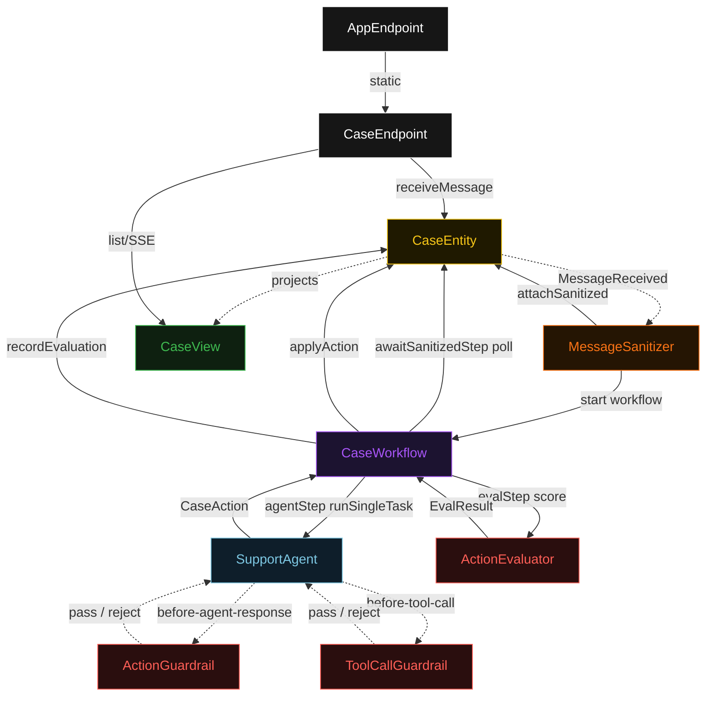
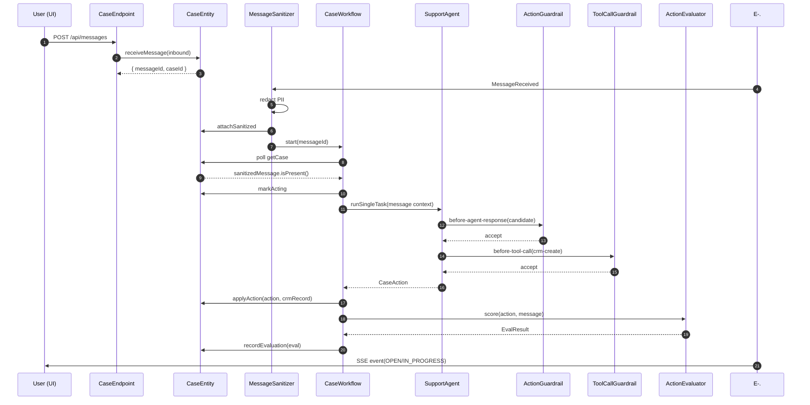
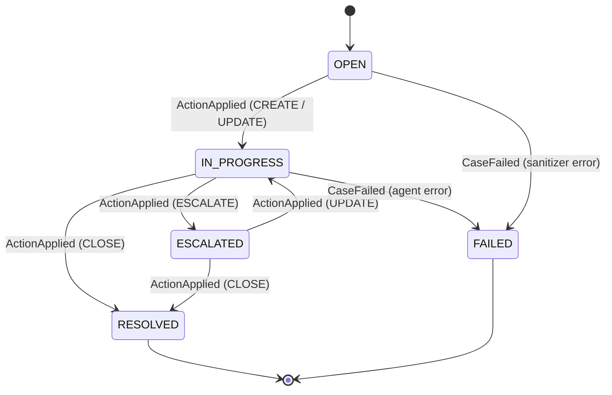
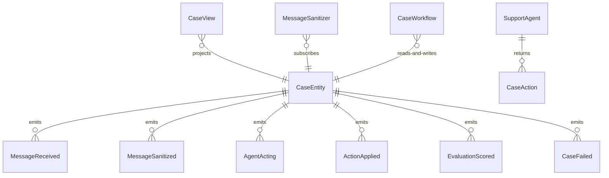

# PLAN — case-management-agent

Architectural sketch consumed by `/akka:plan` and rendered on the generated system's Architecture tab. The four mermaid diagrams below carry the theme variables and CSS overrides from Lesson 24; without them, state names render black-on-black and edge labels clip.

---

## Component graph

## Interaction sequence — J1 (happy path)

## State machine — `CaseEntity`

## Entity model

## Component table — Java file targets

| Component | Path (generated) |
|---|---|
| `CaseEndpoint` | `api/CaseEndpoint.java` |
| `AppEndpoint` | `api/AppEndpoint.java` |
| `CaseEntity` | `application/CaseEntity.java` (state in `domain/CaseRecord.java`, events in `domain/CaseEvent.java`) |
| `MessageSanitizer` | `application/MessageSanitizer.java` |
| `CaseWorkflow` | `application/CaseWorkflow.java` |
| `SupportAgent` | `application/SupportAgent.java` (tasks in `application/CaseTasks.java`) |
| `ActionGuardrail` | `application/ActionGuardrail.java` |
| `ToolCallGuardrail` | `application/ToolCallGuardrail.java` |
| `ActionEvaluator` | `application/ActionEvaluator.java` |
| `CaseView` | `application/CaseView.java` |
| `MockModelProvider` (option-a only) | `application/MockModelProvider.java` |
| Bootstrap | `Bootstrap.java` |

## Concurrency notes

- **Per-step timeout**: `awaitSanitizedStep` 15 s, `agentStep` 60 s, `evalStep` 5 s, `error` 5 s. Default step recovery `maxRetries(2).failoverTo(CaseWorkflow::error)`. The 60 s on `agentStep` accommodates LLM latency plus potential guardrail retries (Lesson 4).
- **Idempotency**: every workflow uses `"case-" + messageId` as its workflow id; `MessageSanitizer` is allowed to redeliver `MessageReceived` events because `CaseEntity.attachSanitized` is event-version-guarded — a second sanitize attempt against an already-sanitized case is a no-op.
- **One agent per message**: the AutonomousAgent instance id is `"agent-" + messageId`, giving each task its own conversation context. The agent's `capability(...).maxIterationsPerTask(3)` caps guardrail-triggered retries at 3.
- **Two independent guardrails**: `ActionGuardrail` fires on every candidate response before the agent loop accepts it; `ToolCallGuardrail` fires before each tool invocation. They enforce distinct risk surfaces — structural correctness vs. CRM write policy — and neither silently covers the other.
- **Eval is synchronous and deterministic**: `ActionEvaluator` runs in-process inside `evalStep`. No LLM call, no external service — the same action always scores the same.
- **No saga / no compensation**: every step is either a pure read, an append-only event write, or a single-task agent call. There is nothing external to roll back.
