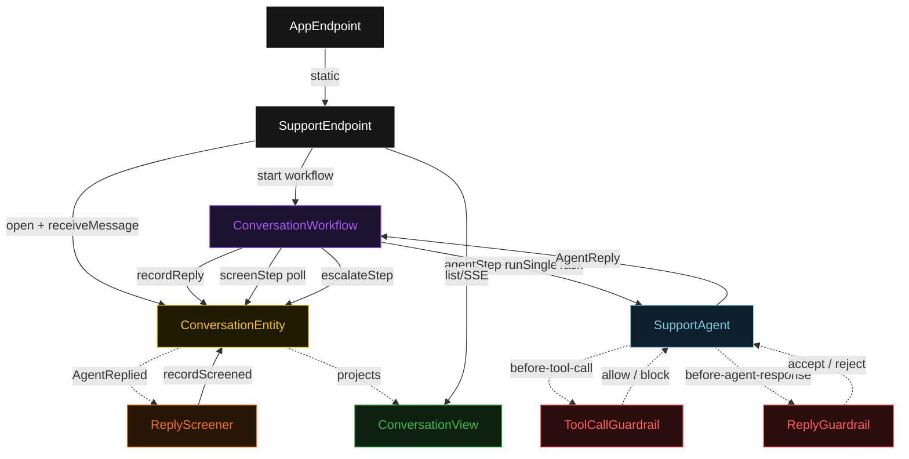
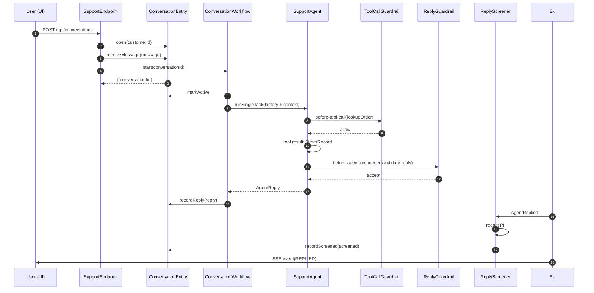
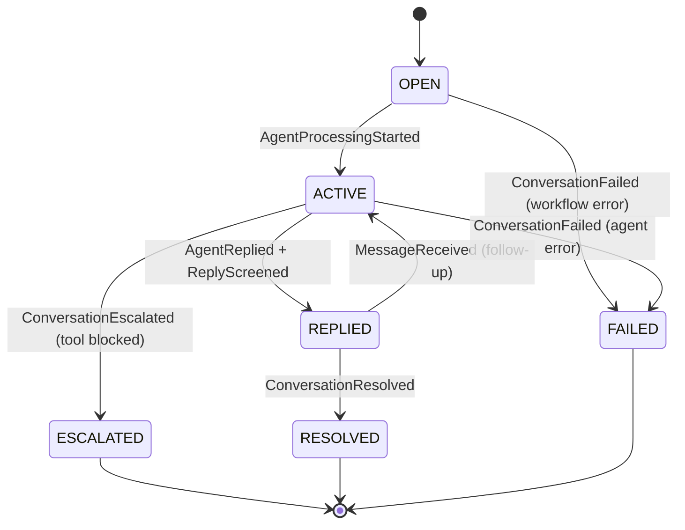
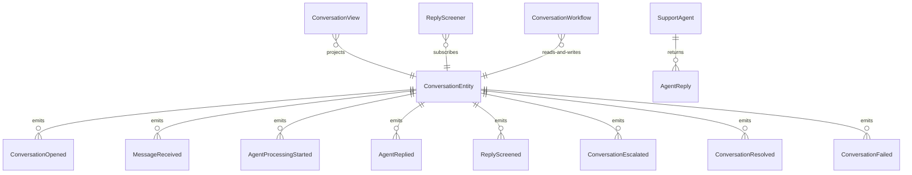

# PLAN — customer-service-tool-agent

Architectural sketch consumed by `/akka:plan` and rendered on the generated system's Architecture tab. The four mermaid diagrams below carry the theme variables and CSS overrides from Lesson 24; without them, state names render black-on-black and edge labels clip.

---

## Component graph

## Interaction sequence — J1 (happy path)

## State machine — `ConversationEntity`

## Entity model

## Component table — Java file targets

| Component | Path (generated) |
|---|---|
| `SupportEndpoint` | `api/SupportEndpoint.java` |
| `AppEndpoint` | `api/AppEndpoint.java` |
| `ConversationEntity` | `application/ConversationEntity.java` (state in `domain/Conversation.java`, events in `domain/ConversationEvent.java`) |
| `ReplyScreener` | `application/ReplyScreener.java` |
| `ConversationWorkflow` | `application/ConversationWorkflow.java` |
| `SupportAgent` | `application/SupportAgent.java` (tasks in `application/SupportTasks.java`) |
| `ToolCallGuardrail` | `application/ToolCallGuardrail.java` |
| `ReplyGuardrail` | `application/ReplyGuardrail.java` |
| `ConversationView` | `application/ConversationView.java` |
| `OrderTools` | `application/OrderTools.java` |
| `AccountTools` | `application/AccountTools.java` |
| `InventoryTools` | `application/InventoryTools.java` |
| `EscalationTools` | `application/EscalationTools.java` |
| `MockModelProvider` (option-a only) | `application/MockModelProvider.java` |
| Bootstrap | `Bootstrap.java` |

## Concurrency notes

- **Per-step timeout**: `agentStep` 90 s, `screenStep` 15 s, `escalateStep` 10 s, `error` 5 s. Default step recovery `maxRetries(2).failoverTo(ConversationWorkflow::error)`. The 90 s on `agentStep` accommodates LLM latency plus multiple tool-call round trips (Lesson 4).
- **Idempotency**: every workflow uses `"conv-" + conversationId + "-turn-" + turnIndex` as its id so multi-turn re-delivery is safe. `ConversationEntity.recordReply` is event-version-guarded — a duplicate call for the same turn is a no-op.
- **One agent per conversation**: the AutonomousAgent instance id is `"agent-" + conversationId`, giving each session its own conversation context. `maxIterationsPerTask(4)` caps guardrail-triggered retries.
- **G1 blocking**: when `ToolCallGuardrail` blocks a write call, the block result is returned as the tool's synthetic result. The agent reads the block message and can choose to escalate — no external rollback is needed because the tool never executed.
- **G2 retry**: when `ReplyGuardrail` rejects a candidate response, the agent loop counts one iteration. If all 4 iterations fail, `agentStep` fails over to `error` and the entity transitions to `FAILED`.
- **Screener is async**: `ReplyScreener` processes `AgentReplied` asynchronously. `screenStep` polls up to 15 s for `ReplyScreened` to land. This decouples PII log hygiene from the agent's reply latency.
- **No saga / no compensation**: within the auto-approve threshold, writes are idempotent (refund minted once per turn). Above threshold the write never executes — nothing to roll back.
