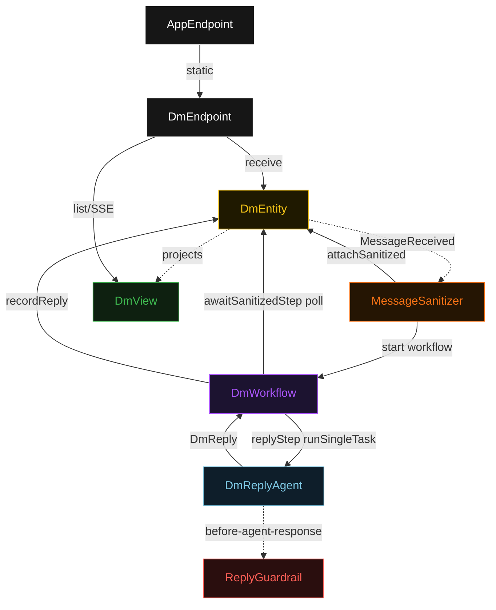
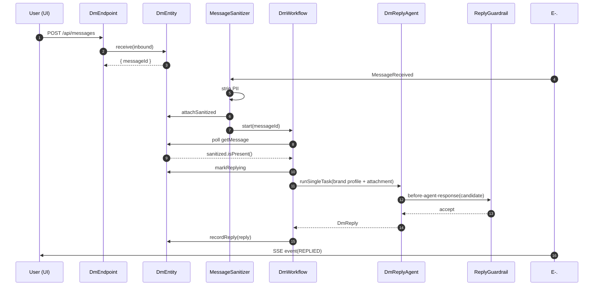
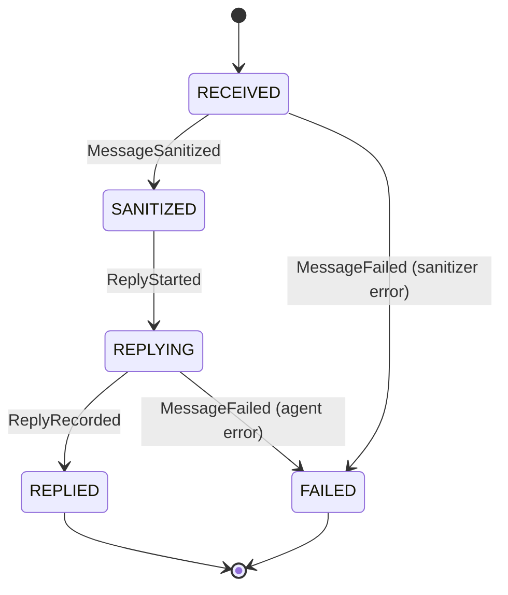
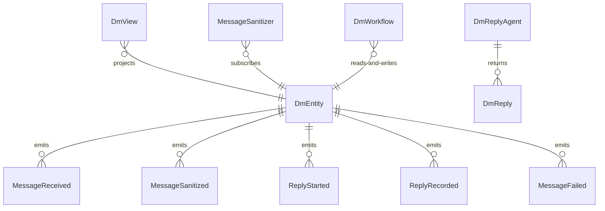

# PLAN — ig-dm-agent

Architectural sketch consumed by `/akka:plan` and rendered on the generated system's Architecture tab. The four mermaid diagrams below carry the theme variables and CSS overrides from Lesson 24; without them, state names render black-on-black and edge labels clip.

---

## Component graph

## Interaction sequence — J1 (happy path)

## State machine — `DmEntity`

## Entity model

## Component table — Java file targets

| Component | Path (generated) |
|---|---|
| `DmEndpoint` | `api/DmEndpoint.java` |
| `AppEndpoint` | `api/AppEndpoint.java` |
| `DmEntity` | `application/DmEntity.java` (state in `domain/DmMessage.java`, events in `domain/DmEvent.java`) |
| `MessageSanitizer` | `application/MessageSanitizer.java` |
| `DmWorkflow` | `application/DmWorkflow.java` |
| `DmReplyAgent` | `application/DmReplyAgent.java` (tasks in `application/DmTasks.java`) |
| `ReplyGuardrail` | `application/ReplyGuardrail.java` |
| `DmView` | `application/DmView.java` |
| `MockModelProvider` (option-a only) | `application/MockModelProvider.java` |
| Bootstrap | `Bootstrap.java` |

## Concurrency notes

- **Per-step timeout**: `awaitSanitizedStep` 15 s, `replyStep` 60 s, `error` 5 s. Default step recovery `maxRetries(2).failoverTo(DmWorkflow::error)`. The 60 s on `replyStep` accommodates LLM latency (Lesson 4).
- **Idempotency**: every workflow uses `"dm-" + messageId` as the workflow id; the `MessageSanitizer` Consumer is allowed to redeliver `MessageReceived` events because `DmEntity.attachSanitized` is event-version-guarded — a second sanitize attempt against an already-sanitized message is a no-op.
- **One agent per message**: the AutonomousAgent instance id is `"dm-agent-" + messageId`, giving each task its own conversation context. The agent's `capability(...).maxIterationsPerTask(3)` caps guardrail-triggered retries at 3.
- **Guardrail-driven retry**: when `ReplyGuardrail` rejects a candidate reply, the rejection is returned as a structured error to the agent loop. The loop counts toward `maxIterationsPerTask`; if all 3 iterations fail validation, the workflow's `replyStep` fails over to `error` and the entity transitions to `FAILED`.
- **No saga / no compensation**: every step is either pure read, append-only event write, or a single-task agent call. There is nothing external to roll back.
