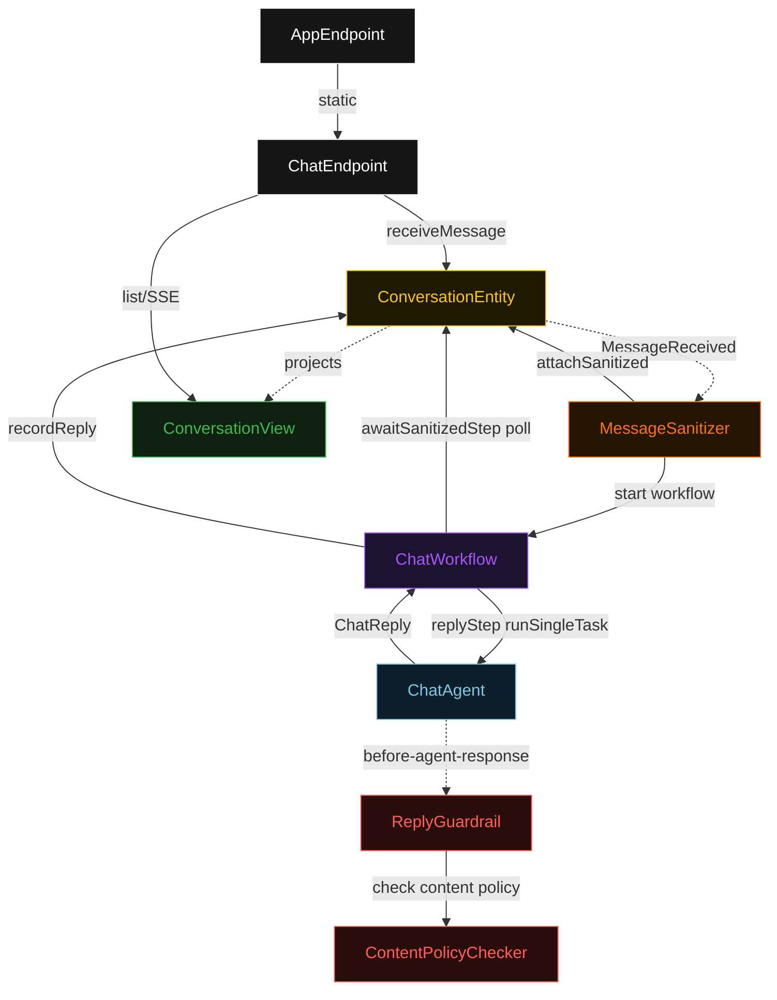
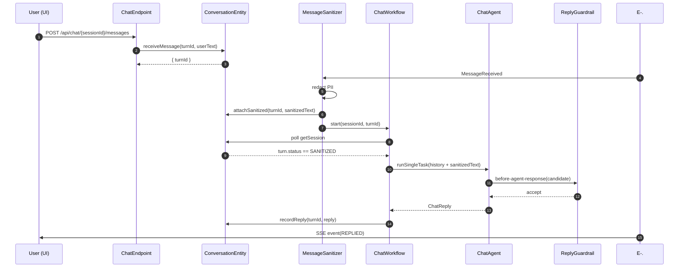
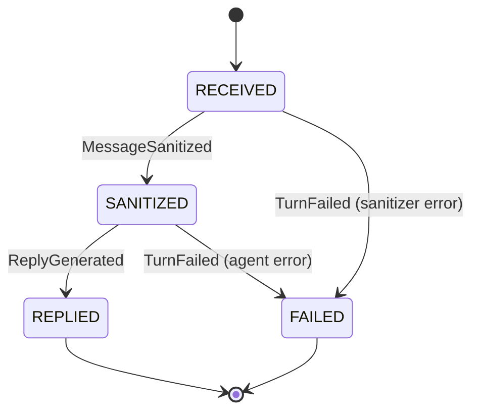
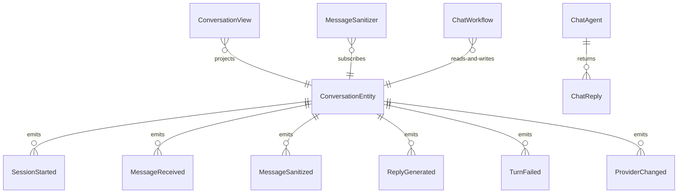

# PLAN — multi-model-chatbot

Architectural sketch consumed by `/akka:plan` and rendered on the generated system's Architecture tab. The four mermaid diagrams below carry the theme variables and CSS overrides from Lesson 24; without them, state names render black-on-black and edge labels clip.

---

## Component graph

## Interaction sequence — J1 (happy path)

## State machine — `ConversationEntity` turn lifecycle

## Entity model

## Component table — Java file targets

| Component | Path (generated) |
|---|---|
| `ChatEndpoint` | `api/ChatEndpoint.java` |
| `AppEndpoint` | `api/AppEndpoint.java` |
| `ConversationEntity` | `application/ConversationEntity.java` (state in `domain/ConversationSession.java`, events in `domain/ConversationEvent.java`) |
| `MessageSanitizer` | `application/MessageSanitizer.java` |
| `ChatWorkflow` | `application/ChatWorkflow.java` |
| `ChatAgent` | `application/ChatAgent.java` (tasks in `application/ChatTasks.java`) |
| `ReplyGuardrail` | `application/ReplyGuardrail.java` |
| `ContentPolicyChecker` | `application/ContentPolicyChecker.java` |
| `ConversationView` | `application/ConversationView.java` |
| `MockModelProvider` (option-a only) | `application/MockModelProvider.java` |
| Bootstrap | `Bootstrap.java` |

## Concurrency notes

- **Per-step timeout**: `awaitSanitizedStep` 15 s, `replyStep` 60 s, `error` 5 s. Default step recovery `maxRetries(2).failoverTo(ChatWorkflow::error)`. The 60 s on `replyStep` accommodates LLM latency (Lesson 4).
- **Idempotency**: every workflow uses `"chat-" + sessionId + "-" + turnId` as the workflow id; the `MessageSanitizer` Consumer is allowed to redeliver `MessageReceived` events because `ConversationEntity.attachSanitized` is event-version-guarded — a second sanitize attempt against an already-sanitized turn is a no-op.
- **One agent per session**: the AutonomousAgent instance id is `"chat-" + sessionId`, which scopes the conversation context to a single session. The agent's `capability(...).maxIterationsPerTask(3)` caps guardrail-triggered retries at 3.
- **Guardrail-driven retry**: when `ReplyGuardrail` rejects a candidate response, the rejection is returned as a structured error to the agent loop. The loop counts toward `maxIterationsPerTask`; if all 3 iterations fail validation, the workflow's `replyStep` fails over to `error` and the turn transitions to `FAILED`.
- **Content policy is synchronous and deterministic**: `ContentPolicyChecker` runs in-process inside `ReplyGuardrail`. No LLM call — same reply always produces the same check result. This is a deliberate single-agent guarantee.
- **Provider switching**: `ConversationEntity.changeProvider` emits `ProviderChanged`; subsequent `ChatWorkflow` instances read `session.activeProvider` before invoking the agent, binding the correct model configuration. Prior turn replies retain their original `providerName` in the stored `ChatReply`.
- **No saga / no compensation**: every step is either pure read, append-only event write, or a single-task agent call. There is nothing external to roll back.
