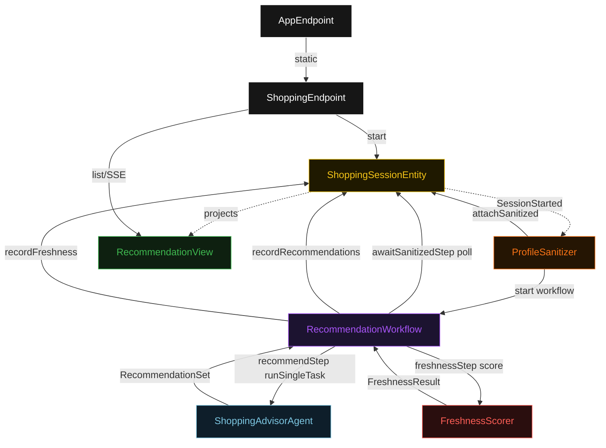
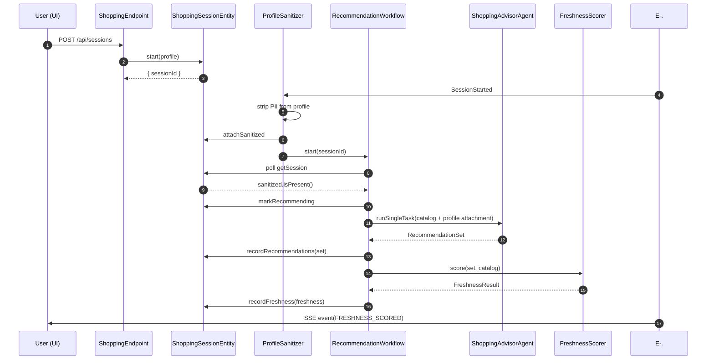
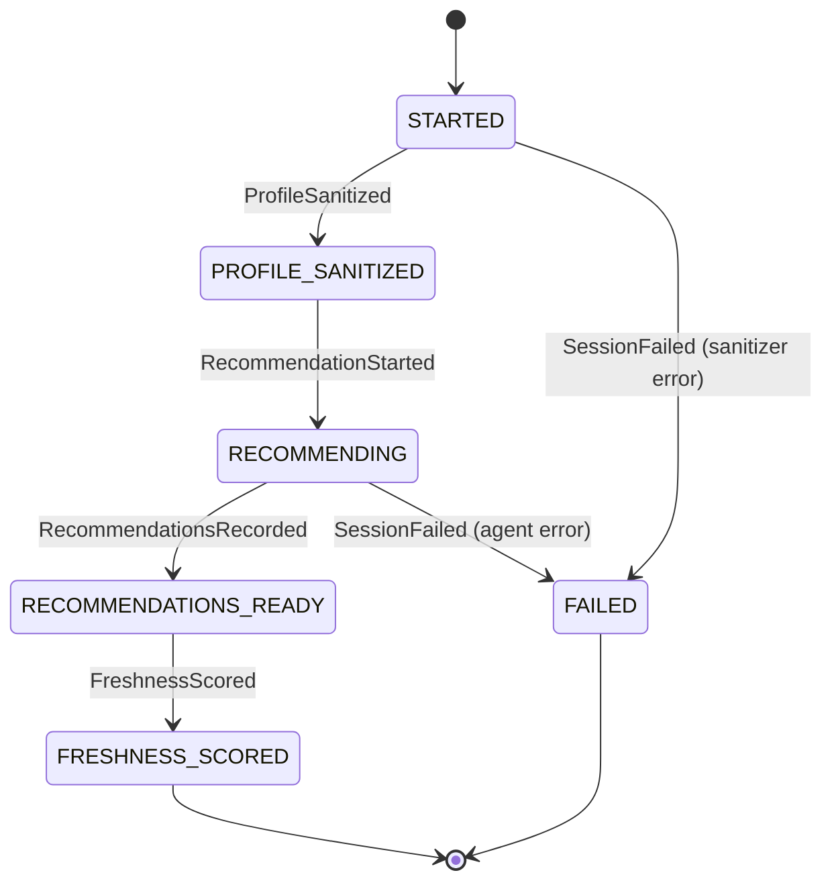
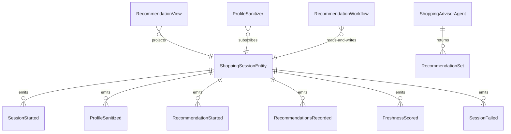

# PLAN — personalized-shopper

Architectural sketch consumed by `/akka:plan` and rendered on the generated system's Architecture tab. The four mermaid diagrams below carry the theme variables and CSS overrides from Lesson 24; without them, state names render black-on-black and edge labels clip.

---

## Component graph

## Interaction sequence — J1 (happy path)

## State machine — `ShoppingSessionEntity`

## Entity model

## Component table — Java file targets

| Component | Path (generated) |
|---|---|
| `ShoppingEndpoint` | `api/ShoppingEndpoint.java` |
| `AppEndpoint` | `api/AppEndpoint.java` |
| `ShoppingSessionEntity` | `application/ShoppingSessionEntity.java` (state in `domain/ShoppingSession.java`, events in `domain/SessionEvent.java`) |
| `ProfileSanitizer` | `application/ProfileSanitizer.java` |
| `RecommendationWorkflow` | `application/RecommendationWorkflow.java` |
| `ShoppingAdvisorAgent` | `application/ShoppingAdvisorAgent.java` (tasks in `application/ShoppingTasks.java`) |
| `FreshnessScorer` | `application/FreshnessScorer.java` |
| `RecommendationView` | `application/RecommendationView.java` |
| `MockModelProvider` (option-a only) | `application/MockModelProvider.java` |
| Bootstrap | `Bootstrap.java` |

## Concurrency notes

- **Per-step timeout**: `awaitSanitizedStep` 15 s, `recommendStep` 60 s, `freshnessStep` 5 s, `error` 5 s. Default step recovery `maxRetries(2).failoverTo(RecommendationWorkflow::error)`. The 60 s on `recommendStep` accommodates LLM latency (Lesson 4).
- **Idempotency**: every workflow uses `"rec-" + sessionId` as the workflow id; the `ProfileSanitizer` Consumer is allowed to redeliver `SessionStarted` events because `ShoppingSessionEntity.attachSanitized` is event-version-guarded — a second sanitize attempt against an already-sanitized session is a no-op.
- **One agent per session**: the AutonomousAgent instance id is `"advisor-" + sessionId`, which gives each task its own conversation context. The agent's `capability(...).maxIterationsPerTask(3)` caps retries at 3.
- **Freshness is synchronous and deterministic**: `FreshnessScorer` runs in-process inside `freshnessStep`. No LLM call, no external service — the same recommendation set against the same catalog always scores the same. This is a deliberate single-agent guarantee.
- **No saga / no compensation**: every step is either a pure read, an append-only event write, or a single-task agent call. There is nothing external to roll back.
- **Catalog is passed as instructions**: the full catalog snapshot is formatted into the agent's `TaskDef.instructions(...)` text so it is bounded by the model's context window and does not require an attachment slot. The sanitized profile — not the catalog — occupies the attachment.
