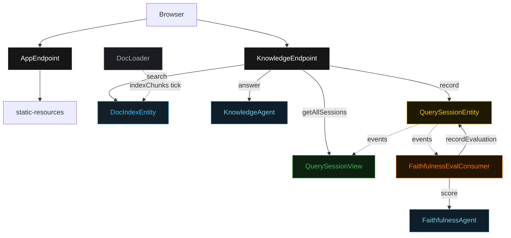
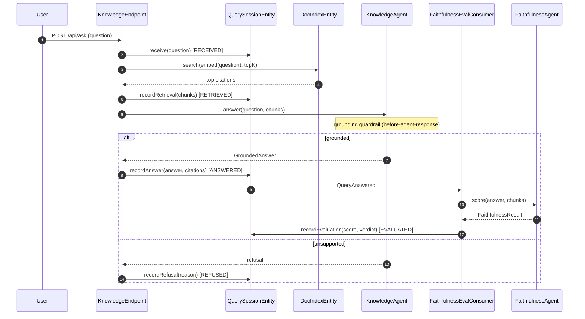
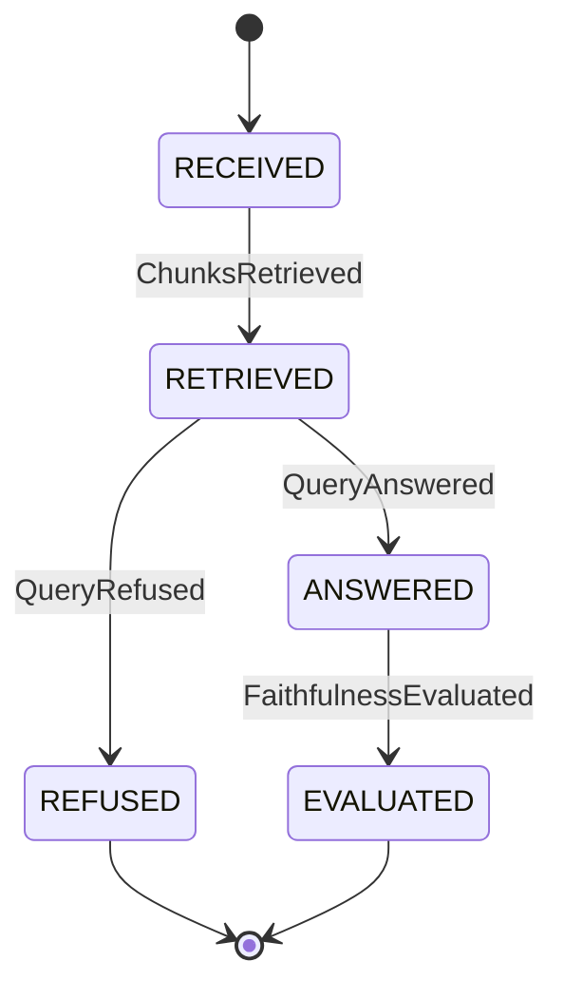
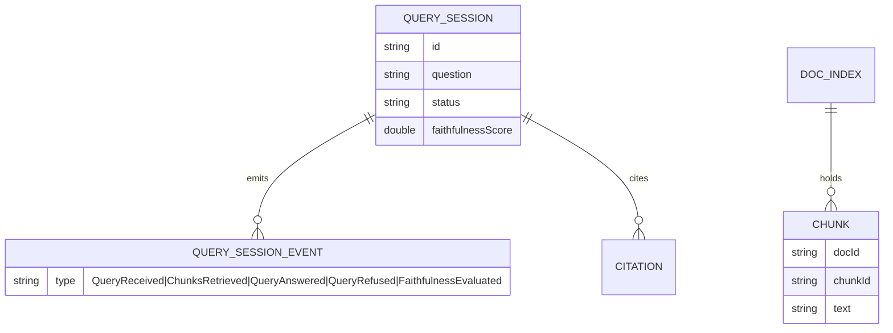

# PLAN — rag-knowledge-agent

Architectural sketch. All four mermaid diagrams + the component table.

---

## Component graph

Solid arrows are synchronous commands; dashed arrows are event subscriptions; dotted arrows are scheduled ticks.

## Interaction sequence

## State machine

## Entity model

## Component table

| Component | Path (generated) |
|---|---|
| KnowledgeAgent | `application/KnowledgeAgent.java` |
| FaithfulnessAgent | `application/FaithfulnessAgent.java` |
| DocIndexEntity | `application/DocIndexEntity.java` |
| DocLoader | `application/DocLoader.java` |
| QuerySessionEntity | `application/QuerySessionEntity.java` |
| QuerySessionView | `application/QuerySessionView.java` |
| FaithfulnessEvalConsumer | `application/FaithfulnessEvalConsumer.java` |
| KnowledgeEndpoint | `api/KnowledgeEndpoint.java` |
| AppEndpoint | `api/AppEndpoint.java` |
| Domain records | `domain/*.java` |

## Concurrency notes

- The endpoint's `KnowledgeAgent.answer` call and the consumer's `FaithfulnessAgent.score` call each get a 60s timeout — LLM calls exceed the 5s default (Lesson 4).
- `DocLoader` is idempotent: it no-ops when the index already covers the current files, so repeated ticks do not duplicate chunks.
- `POST /api/ask` uses the new session id as the idempotency key; a retried request with the same id is a no-op on the entity.
- No saga: a refusal is a terminal branch, not a compensation. The faithfulness eval is a downstream non-blocking projection driven by the `QueryAnswered` event, so a slow eval never blocks the answer returned to the user.
