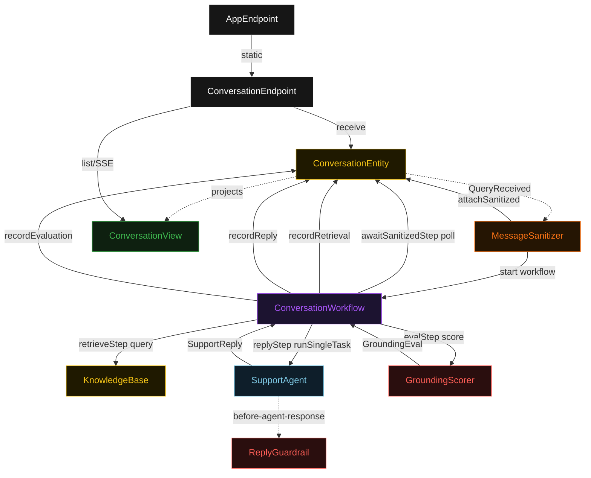
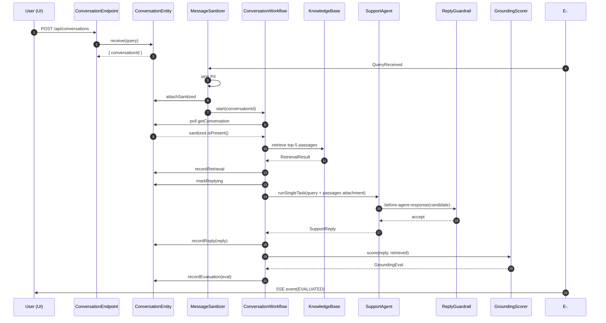
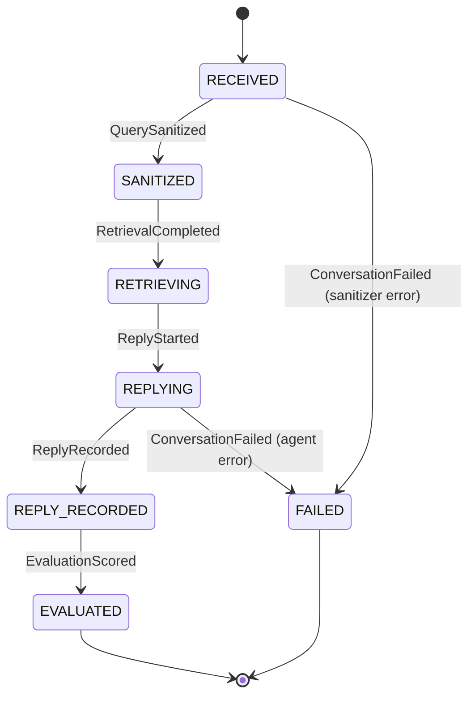
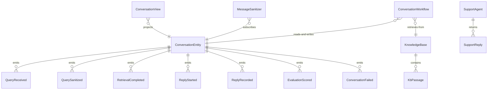

# PLAN — rag-support-bot

Architectural sketch consumed by `/akka:plan` and rendered on the generated system's Architecture tab. The four mermaid diagrams below carry the theme variables and CSS overrides from Lesson 24; without them, state names render black-on-black and edge labels clip.

---

## Component graph

## Interaction sequence — J1 (happy path)

## State machine — `ConversationEntity`

## Entity model

## Component table — Java file targets

| Component | Path (generated) |
|---|---|
| `ConversationEndpoint` | `api/ConversationEndpoint.java` |
| `AppEndpoint` | `api/AppEndpoint.java` |
| `ConversationEntity` | `application/ConversationEntity.java` (state in `domain/Conversation.java`, events in `domain/ConversationEvent.java`) |
| `KnowledgeBase` | `application/KnowledgeBase.java` (article record in `domain/KbArticle.java`) |
| `MessageSanitizer` | `application/MessageSanitizer.java` |
| `ConversationWorkflow` | `application/ConversationWorkflow.java` |
| `SupportAgent` | `application/SupportAgent.java` (tasks in `application/SupportTasks.java`) |
| `ReplyGuardrail` | `application/ReplyGuardrail.java` |
| `GroundingScorer` | `application/GroundingScorer.java` |
| `ConversationView` | `application/ConversationView.java` |
| `MockModelProvider` (option-a only) | `application/MockModelProvider.java` |
| Bootstrap | `Bootstrap.java` |

## Concurrency notes

- **Per-step timeout**: `awaitSanitizedStep` 15 s, `retrieveStep` 10 s, `replyStep` 60 s, `evalStep` 5 s, `error` 5 s. Default step recovery `maxRetries(2).failoverTo(ConversationWorkflow::error)`. The 60 s on `replyStep` accommodates LLM latency (Lesson 4).
- **Idempotency**: every workflow uses `"conv-" + conversationId` as the workflow id; the `MessageSanitizer` Consumer is allowed to redeliver `QueryReceived` events because `ConversationEntity.attachSanitized` is event-version-guarded — a second sanitize attempt against an already-sanitized conversation is a no-op.
- **One agent per conversation**: the AutonomousAgent instance id is `"support-" + conversationId`, giving each task its own conversation context. `capability(...).maxIterationsPerTask(3)` caps guardrail-triggered retries at 3.
- **Guardrail-driven retry**: when `ReplyGuardrail` rejects a candidate response, the rejection is returned as a structured error to the agent loop. If all 3 iterations fail validation, the workflow's `replyStep` fails over to `error` and the entity transitions to `FAILED`.
- **Retrieval is in-process**: `retrieveStep` queries `KnowledgeBase` entity instances directly via `componentClient`. No external vector store — the baseline stays self-contained.
- **Eval is synchronous and deterministic**: `GroundingScorer` runs in-process inside `evalStep`. No LLM call — the same reply always scores the same. This is the single-agent guarantee.
- **No saga / no compensation**: every step is either pure read, append-only event write, or a single-task agent call. There is nothing external to roll back.
