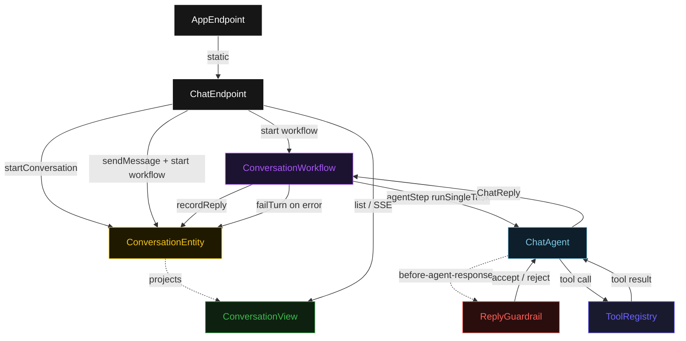
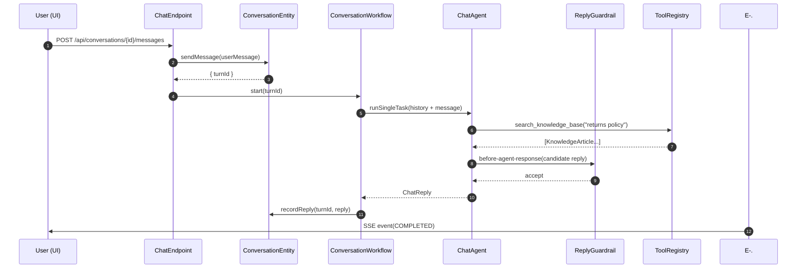
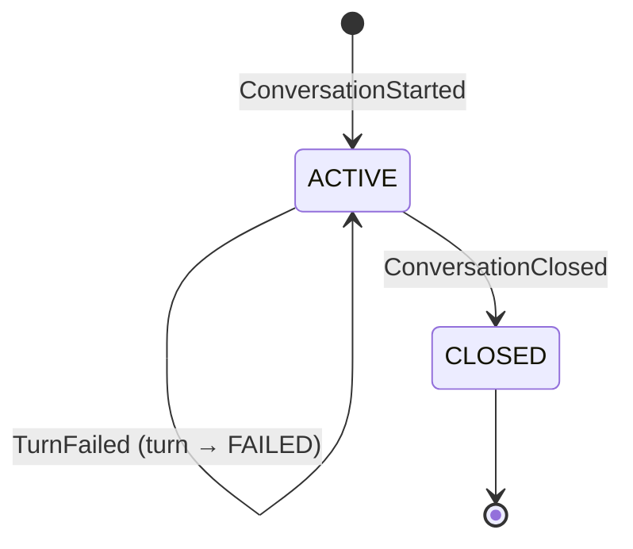
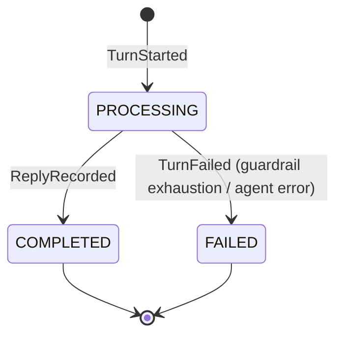
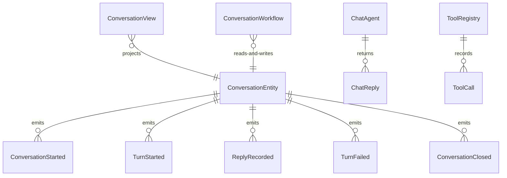

# PLAN — react-chatbot

Architectural sketch consumed by `/akka:plan` and rendered on the generated system's Architecture tab. The four mermaid diagrams below carry the theme variables and CSS overrides from Lesson 24; without them, state names render black-on-black and edge labels clip.

---

## Component graph

## Interaction sequence — J1 (happy path)

## State machine — `ConversationEntity` turn lifecycle

## Turn state machine

## Entity model

## Component table — Java file targets

| Component | Path (generated) |
|---|---|
| `ChatEndpoint` | `api/ChatEndpoint.java` |
| `AppEndpoint` | `api/AppEndpoint.java` |
| `ConversationEntity` | `application/ConversationEntity.java` (state in `domain/Conversation.java`, events in `domain/ConversationEvent.java`) |
| `ConversationWorkflow` | `application/ConversationWorkflow.java` |
| `ChatAgent` | `application/ChatAgent.java` (tasks in `application/ChatTasks.java`) |
| `ReplyGuardrail` | `application/ReplyGuardrail.java` |
| `ToolRegistry` | `application/ToolRegistry.java` |
| `ConversationView` | `application/ConversationView.java` |
| `MockModelProvider` (option-a only) | `application/MockModelProvider.java` |
| Bootstrap | `Bootstrap.java` |

## Concurrency notes

- **Per-step timeout**: `agentStep` 60 s, `recordStep` 5 s, `error` 5 s. Default step recovery `maxRetries(2).failoverTo(ConversationWorkflow::error)`. The 60 s on `agentStep` accommodates LLM latency plus multiple tool-call round-trips (Lesson 4).
- **One agent per turn**: the AutonomousAgent instance id is `"chat-" + conversationId + "-" + turnId`, which gives each turn its own conversation context. The agent's `capability(...).maxIterationsPerTask(3)` caps guardrail-triggered retries at 3.
- **Concurrent-turn guard**: `ChatEndpoint.sendMessage` checks `ConversationEntity.getConversation()` for an existing `PROCESSING` turn and returns `409 Conflict` before starting a new workflow. This prevents two concurrent agent calls against the same conversation state.
- **Guardrail-driven retry**: when `ReplyGuardrail` rejects a candidate reply, the rejection is returned as a structured error to the agent loop. The loop counts toward `maxIterationsPerTask`; if all 3 iterations fail validation, `agentStep` fails over to `error` and the entity emits `TurnFailed`.
- **Tool calls are synchronous and in-process**: `ToolRegistry` executes each tool stub from a pre-loaded JSON resource. No external service, no network call — the same tool input always returns the same stub output. This is a deliberate single-agent guarantee.
- **No saga / no compensation**: every step is either a pure entity read, an append-only event write, or a single-task agent call. There is nothing external to roll back.
