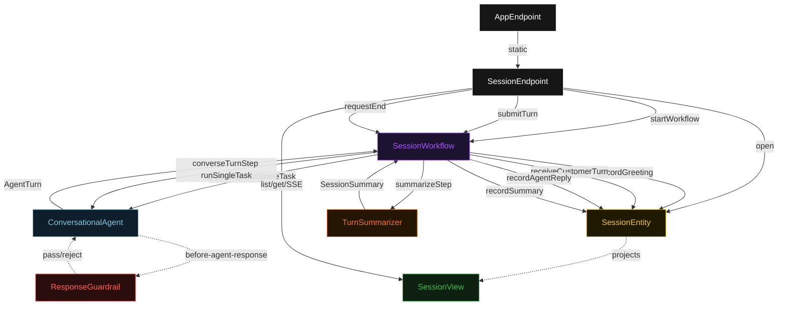
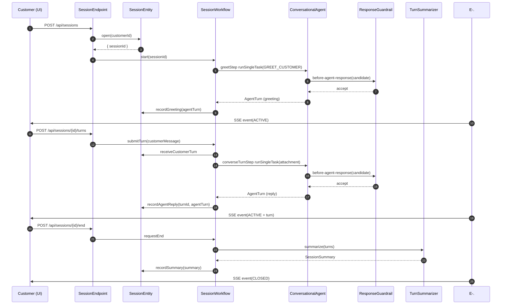
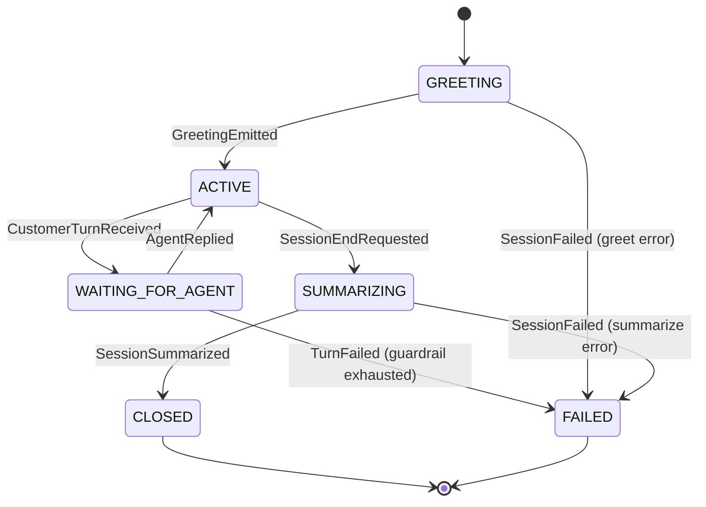
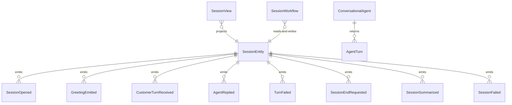

# PLAN — realtime-conversational-agent

Architectural sketch consumed by `/akka:plan` and rendered on the generated system's Architecture tab. The four mermaid diagrams below carry the theme variables and CSS overrides from Lesson 24; without them, state names render black-on-black and edge labels clip.

---

## Component graph

## Interaction sequence — J1 (happy path, 2-turn session)

## State machine — `SessionEntity`

## Entity model

## Component table — Java file targets

| Component | Path (generated) |
|---|---|
| `SessionEndpoint` | `api/SessionEndpoint.java` |
| `AppEndpoint` | `api/AppEndpoint.java` |
| `SessionEntity` | `application/SessionEntity.java` (state in `domain/Session.java`, events in `domain/SessionEvent.java`) |
| `SessionWorkflow` | `application/SessionWorkflow.java` |
| `ConversationalAgent` | `application/ConversationalAgent.java` (tasks in `application/ConversationTasks.java`) |
| `ResponseGuardrail` | `application/ResponseGuardrail.java` |
| `TurnSummarizer` | `application/TurnSummarizer.java` |
| `SessionView` | `application/SessionView.java` |
| `MockModelProvider` (option-a only) | `application/MockModelProvider.java` |
| Bootstrap | `Bootstrap.java` |

## Concurrency notes

- **Per-step timeout**: `greetStep` 15 s, `converseTurnStep` 60 s, `summarizeStep` 5 s, `error` 5 s. Default step recovery `maxRetries(2).failoverTo(SessionWorkflow::error)`. The 60 s on `converseTurnStep` accommodates real-time LLM latency (Lesson 4).
- **Idempotency**: every workflow uses `"session-" + sessionId` as the workflow id; `SessionEndpoint.submitTurn` mints a new `turnId` per request; duplicate POSTs to the same turn endpoint produce a no-op if the turn is already in `AGENT_REPLIED` state.
- **One agent per session**: the AutonomousAgent instance id is `"agent-" + sessionId`, giving each session its own conversation context across turns. The agent's `capability(...).maxIterationsPerTask(3)` caps guardrail-triggered retries at 3 per turn.
- **Guardrail-driven retry**: when `ResponseGuardrail` rejects a candidate reply, the rejection is returned as a structured error to the agent loop. The loop counts toward `maxIterationsPerTask`; if all 3 iterations fail, the workflow's `converseTurnStep` fails over to `error` and the entity records a `TurnFailed` event.
- **Summarizer is synchronous and deterministic**: `TurnSummarizer` runs in-process inside `summarizeStep`. No LLM call, no external service — the same turn list always produces the same summary score. This is the single-agent guarantee.
- **No saga / no compensation**: session state is append-only. There is nothing to roll back; a failed session preserves its partial turn history for operator review.
