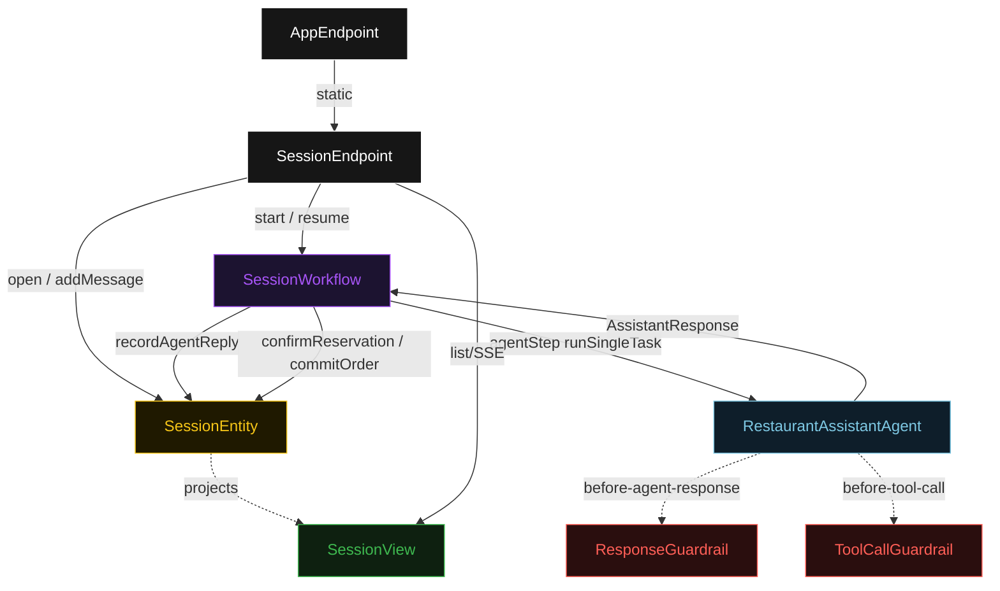
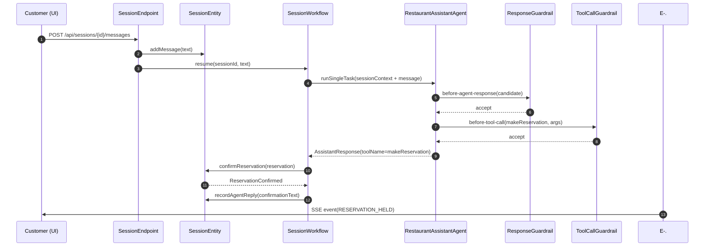
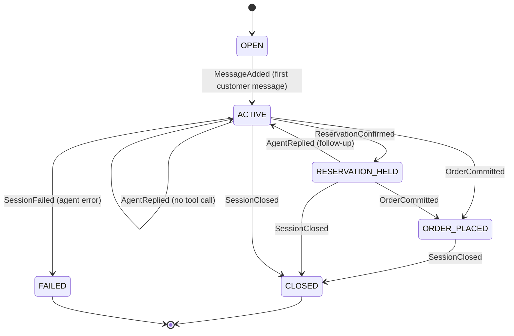
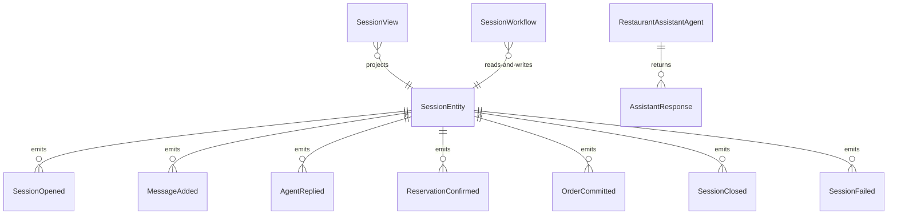

# PLAN — restaurant-assistant

Architectural sketch consumed by `/akka:plan` and rendered on the generated system's Architecture tab. The four mermaid diagrams below carry the theme variables and CSS overrides from Lesson 24; without them, state names render black-on-black and edge labels clip.

---

## Component graph

## Interaction sequence — J2 (reservation path)

## State machine — `SessionEntity`

## Entity model

## Component table — Java file targets

| Component | Path (generated) |
|---|---|
| `SessionEndpoint` | `api/SessionEndpoint.java` |
| `AppEndpoint` | `api/AppEndpoint.java` |
| `SessionEntity` | `application/SessionEntity.java` (state in `domain/Session.java`, events in `domain/SessionEvent.java`) |
| `SessionWorkflow` | `application/SessionWorkflow.java` |
| `RestaurantAssistantAgent` | `application/RestaurantAssistantAgent.java` (tasks in `application/SessionTasks.java`) |
| `ResponseGuardrail` | `application/ResponseGuardrail.java` |
| `ToolCallGuardrail` | `application/ToolCallGuardrail.java` |
| `MenuCatalog` | `application/MenuCatalog.java` |
| `SessionView` | `application/SessionView.java` |
| `MockModelProvider` (option-a only) | `application/MockModelProvider.java` |
| Bootstrap | `Bootstrap.java` |

## Concurrency notes

- **Per-step timeout**: `agentStep` 60 s, `commitStep` 10 s, `closeStep` 5 s, `error` 5 s. Default step recovery `maxRetries(2).failoverTo(SessionWorkflow::error)`. The 60 s on `agentStep` accommodates LLM latency including guardrail retries (Lesson 4).
- **Idempotency**: every workflow uses `"session-" + sessionId` as the workflow id. A second `POST /sessions/{id}/messages` call resumes the existing workflow rather than starting a new one. `SessionEntity.addMessage` is event-version-guarded to prevent duplicate message events.
- **One agent per session**: the AutonomousAgent instance id is `"assistant-" + sessionId`, giving each session its own conversation context. The agent's `capability(...).maxIterationsPerTask(3)` caps guardrail-triggered retries at 3.
- **Dual-guardrail order**: `ResponseGuardrail` fires on the complete candidate reply; `ToolCallGuardrail` fires on the extracted tool-call arguments before the workflow receives them. They are independent checks at different cut points.
- **No saga / no compensation**: reservations and orders are append-only events on the entity. There is no external booking system to roll back in this baseline.
