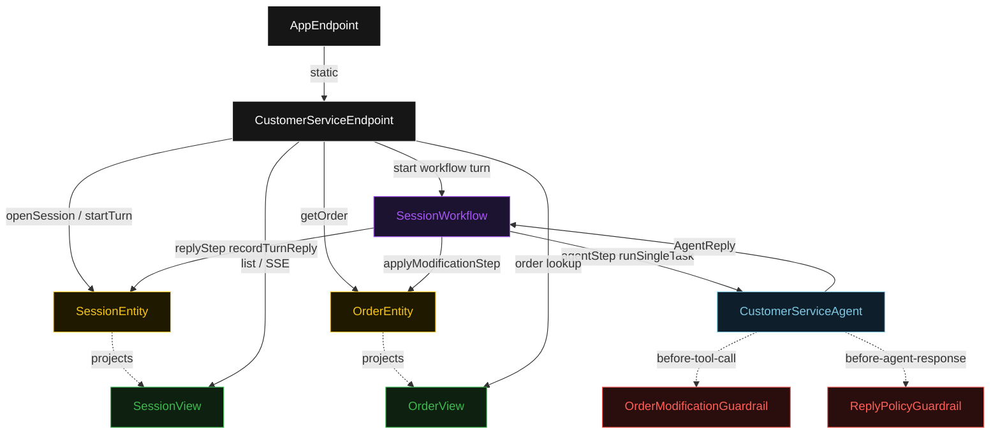
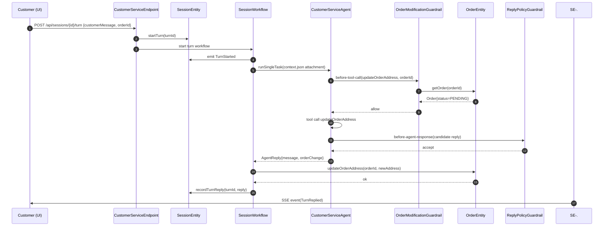
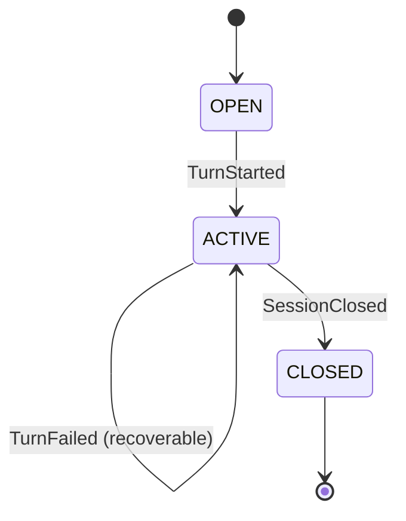
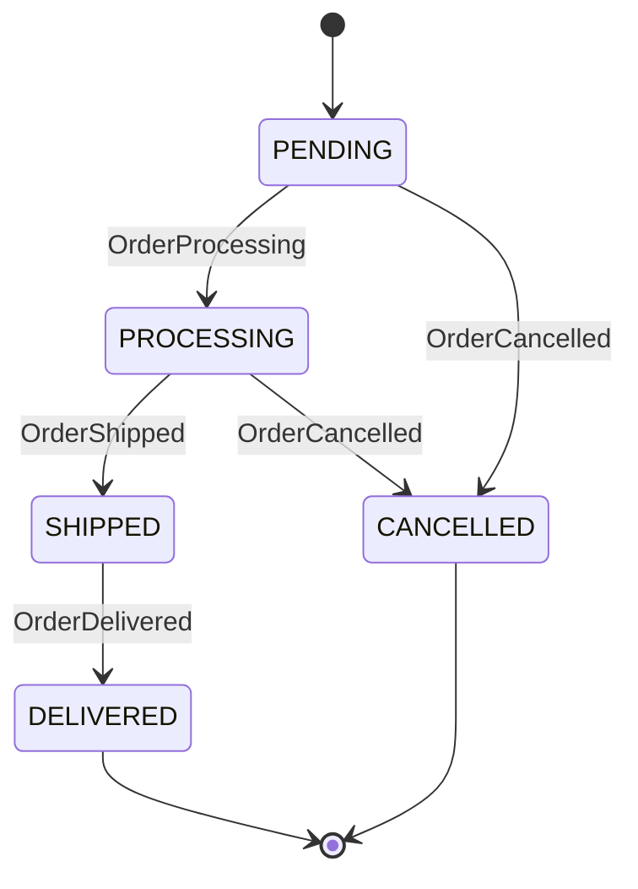
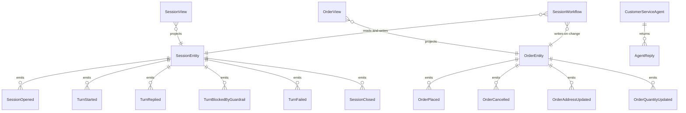

# PLAN — retail-customer-service

Architectural sketch consumed by `/akka:plan` and rendered on the generated system's Architecture tab. The four mermaid diagrams below carry the theme variables and CSS overrides from Lesson 24; without them, state names render black-on-black and edge labels clip.

---

## Component graph

## Interaction sequence — J2 (order address-change happy path)

## State machine — `SessionEntity`

## State machine — `OrderEntity`

## Entity model

## Component table — Java file targets

| Component | Path (generated) |
|---|---|
| `CustomerServiceEndpoint` | `api/CustomerServiceEndpoint.java` |
| `AppEndpoint` | `api/AppEndpoint.java` |
| `SessionEntity` | `application/SessionEntity.java` (state in `domain/Session.java`, events in `domain/SessionEvent.java`) |
| `OrderEntity` | `application/OrderEntity.java` (state in `domain/Order.java`, events in `domain/OrderEvent.java`) |
| `SessionWorkflow` | `application/SessionWorkflow.java` |
| `CustomerServiceAgent` | `application/CustomerServiceAgent.java` (tasks in `application/CustomerServiceTasks.java`) |
| `OrderModificationGuardrail` | `application/OrderModificationGuardrail.java` |
| `ReplyPolicyGuardrail` | `application/ReplyPolicyGuardrail.java` |
| `SessionView` | `application/SessionView.java` |
| `OrderView` | `application/OrderView.java` |
| `MockModelProvider` (option-a only) | `application/MockModelProvider.java` |
| Bootstrap | `Bootstrap.java` |

## Concurrency notes

- **Per-step timeout**: `agentStep` 60 s, `applyModificationStep` 15 s, `replyStep` 5 s, `error` 5 s. Default step recovery `maxRetries(2).failoverTo(SessionWorkflow::error)`. The 60 s on `agentStep` accommodates LLM latency plus up to 4 guardrail-retry iterations (Lesson 4).
- **Idempotency**: every workflow uses `"turn-" + sessionId + "-" + turnId` as the workflow id; duplicate `startTurn` calls are no-ops on the entity.
- **One agent per session**: the AutonomousAgent instance id is `"cs-" + sessionId`, giving each session its own conversation context across turns. The agent's `maxIterationsPerTask(4)` caps guardrail-triggered retries at 4 per turn.
- **Guardrail-driven retry**: when either guardrail rejects, the loop retries. If all 4 iterations exhaust on guardrail blocks, `agentStep` fails over to `error` and the turn transitions to `TurnFailed`.
- **Order entity as second-line defense**: modification commands on `OrderEntity` validate status independently of the guardrail. If a modification arrives directly (e.g., via the REST endpoint), the entity rejects it if the order is in a terminal state.
- **No saga / no compensation**: if `applyModificationStep` fails after `agentStep` succeeded, the workflow retries up to 2 times. If it ultimately fails, the turn is recorded as `TurnBlockedByGuardrail` so the agent's reply is still delivered — the modification simply did not apply, and the next turn can retry.
