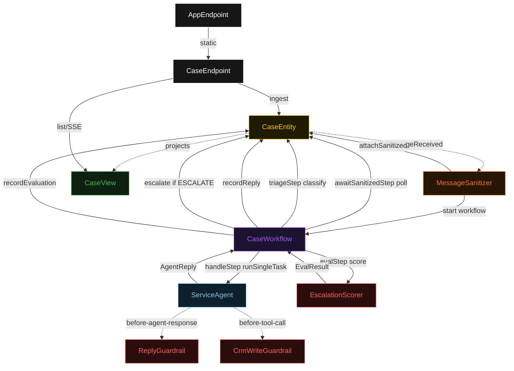
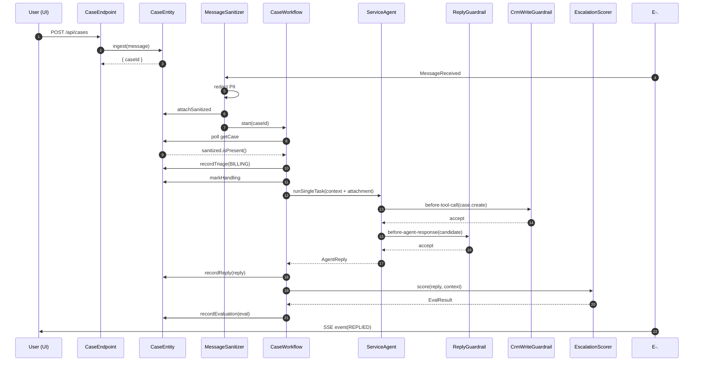
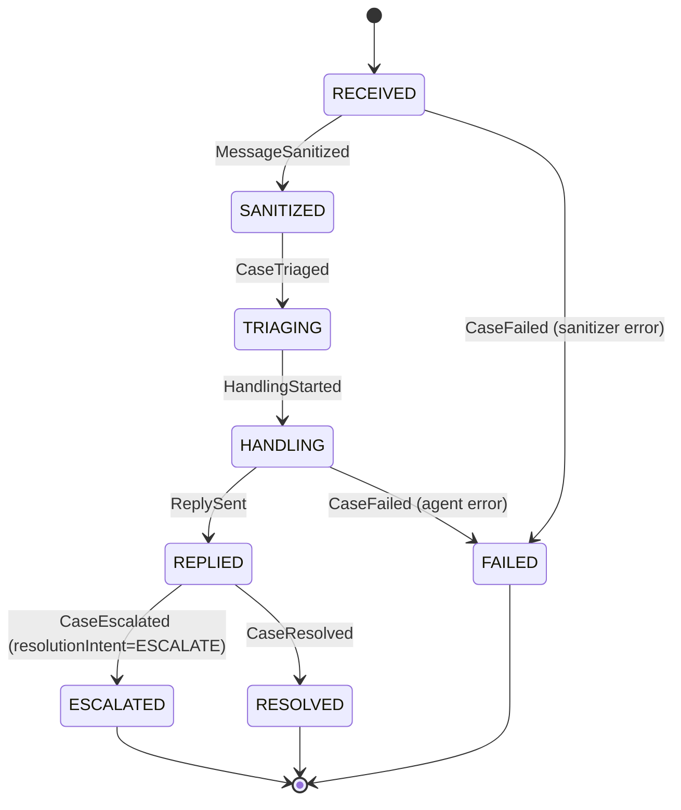
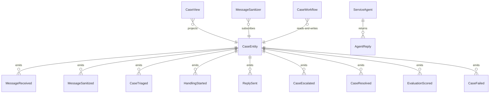

# PLAN — service-agent-omnichannel

Architectural sketch consumed by `/akka:plan` and rendered on the generated system's Architecture tab. The four mermaid diagrams below carry the theme variables and CSS overrides from Lesson 24; without them, state names render black-on-black and edge labels clip.

---

## Component graph

## Interaction sequence — J1 (happy path)

## State machine — `CaseEntity`

## Entity model

## Component table — Java file targets

| Component | Path (generated) |
|---|---|
| `CaseEndpoint` | `api/CaseEndpoint.java` |
| `AppEndpoint` | `api/AppEndpoint.java` |
| `CaseEntity` | `application/CaseEntity.java` (state in `domain/Case.java`, events in `domain/CaseEvent.java`) |
| `MessageSanitizer` | `application/MessageSanitizer.java` |
| `CaseWorkflow` | `application/CaseWorkflow.java` |
| `ServiceAgent` | `application/ServiceAgent.java` (tasks in `application/CaseTasks.java`) |
| `ReplyGuardrail` | `application/ReplyGuardrail.java` |
| `CrmWriteGuardrail` | `application/CrmWriteGuardrail.java` |
| `CaseTriage` | `application/CaseTriage.java` |
| `EscalationScorer` | `application/EscalationScorer.java` |
| `CaseView` | `application/CaseView.java` |
| `MockModelProvider` (option-a only) | `application/MockModelProvider.java` |
| Bootstrap | `Bootstrap.java` |

## Concurrency notes

- **Per-step timeout**: `awaitSanitizedStep` 15 s, `triageStep` 5 s, `handleStep` 60 s, `evalStep` 5 s, `error` 5 s. Default step recovery `maxRetries(2).failoverTo(CaseWorkflow::error)`. The 60 s on `handleStep` accommodates LLM latency (Lesson 4).
- **Idempotency**: every workflow uses `"case-" + caseId` as the workflow id; the `MessageSanitizer` Consumer is allowed to redeliver `MessageReceived` events because `CaseEntity.attachSanitized` is event-version-guarded — a second sanitize attempt against an already-sanitized case is a no-op.
- **One agent per case**: the AutonomousAgent instance id is `"agent-" + caseId`, giving each task its own conversation context. The agent's `capability(...).maxIterationsPerTask(3)` caps guardrail-triggered retries at 3.
- **Two guardrails, one agent**: both `ReplyGuardrail` (before-agent-response) and `CrmWriteGuardrail` (before-tool-call) are registered on the same `ServiceAgent` definition. They run at different points in the agent loop — the tool-call guard fires before each tool invocation; the response guard fires before each proposed final reply. Both count toward `maxIterationsPerTask`.
- **Escalation is terminal**: once `CaseEntity.escalate` is called, the workflow's `handleStep` does not retry the agent. The case sits in `ESCALATED` state for human resolution. No saga compensation is required — CRM writes that landed before escalation are left as-is.
- **Triage is synchronous and deterministic**: `CaseTriage.classify` runs in-process inside `triageStep`. No LLM call.
- **Eval is synchronous and deterministic**: `EscalationScorer` runs in-process inside `evalStep`. No LLM call — the same reply for the same context always scores the same.
