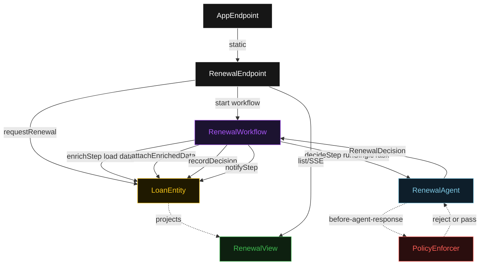
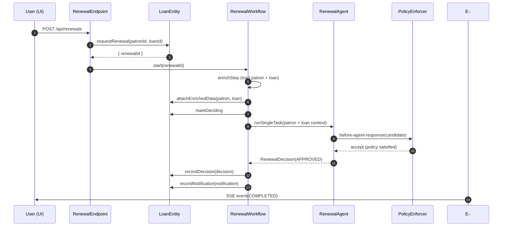
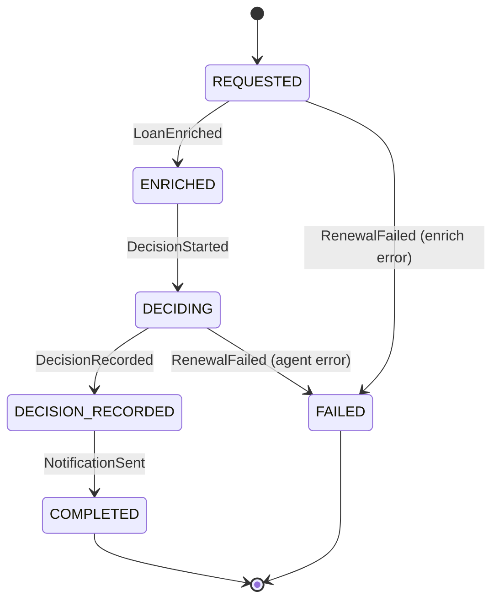
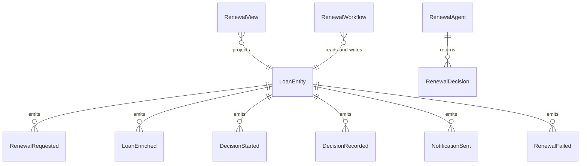

# PLAN — steered-renewal-agent

Architectural sketch consumed by `/akka:plan` and rendered on the generated system's Architecture tab. The four mermaid diagrams below carry the theme variables and CSS overrides from Lesson 24; without them, state names render black-on-black and edge labels clip.

---

## Component graph

## Interaction sequence — J1 (happy path)

## State machine — `LoanEntity`

## Entity model

## Component table — Java file targets

| Component | Path (generated) |
|---|---|
| `RenewalEndpoint` | `api/RenewalEndpoint.java` |
| `AppEndpoint` | `api/AppEndpoint.java` |
| `LoanEntity` | `application/LoanEntity.java` (state in `domain/Renewal.java`, events in `domain/RenewalEvent.java`) |
| `RenewalWorkflow` | `application/RenewalWorkflow.java` |
| `RenewalAgent` | `application/RenewalAgent.java` (tasks in `application/RenewalTasks.java`) |
| `PolicyEnforcer` | `application/PolicyEnforcer.java` |
| `RenewalView` | `application/RenewalView.java` |
| `MockModelProvider` (option-a only) | `application/MockModelProvider.java` |
| Bootstrap | `Bootstrap.java` |

## Concurrency notes

- **Per-step timeout**: `enrichStep` 10 s, `decideStep` 60 s, `notifyStep` 5 s, `error` 5 s. Default step recovery `maxRetries(2).failoverTo(RenewalWorkflow::error)`. The 60 s on `decideStep` accommodates LLM latency (Lesson 4).
- **Idempotency**: every workflow uses `"renewal-" + renewalId` as the workflow id; `RenewalEndpoint` mints the `renewalId` before calling `LoanEntity.requestRenewal`, so a duplicate POST with the same IDs starts a new renewal with a new ID — no ambiguity.
- **One agent per renewal**: the AutonomousAgent instance id is `"renewal-agent-" + renewalId`, giving each task its own conversation context. The agent's `capability(...).maxIterationsPerTask(3)` caps guardrail-triggered retries at 3.
- **Guardrail-driven retry**: when `PolicyEnforcer` rejects a candidate decision, the rejection is returned as a structured error to the agent loop. The loop counts toward `maxIterationsPerTask`; if all 3 iterations fail policy checks, the workflow's `decideStep` fails over to `error` and the entity transitions to `FAILED`.
- **Notification is synchronous and deterministic**: `notifyStep` builds a `NotificationRecord` in-process. No LLM call, no external service. This is a deliberate single-agent guarantee.
- **No external rollback**: every step is either a pure read, an append-only event write, or a single-task agent call. There is nothing external to compensate.
