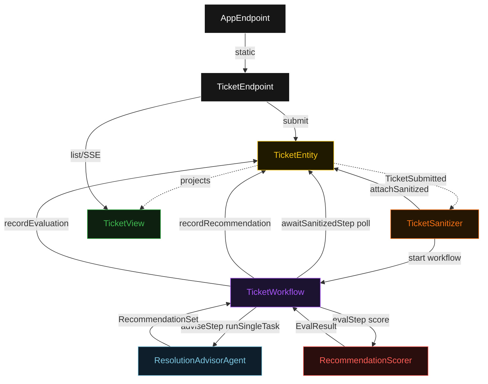
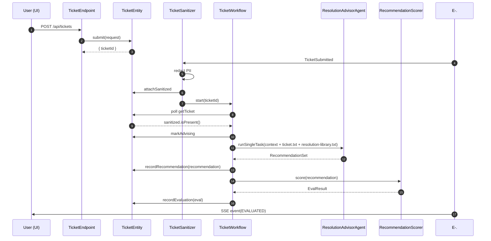
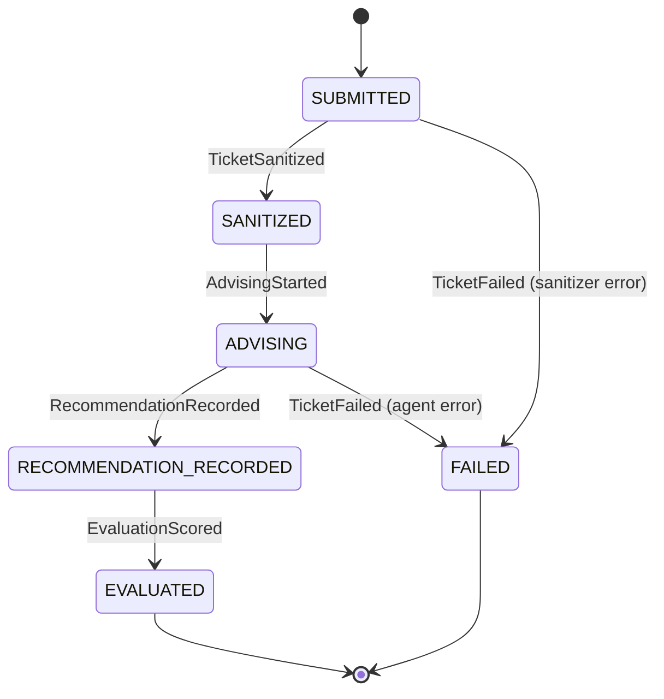
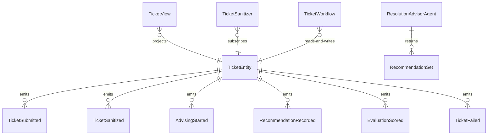

# PLAN — support-next-steps

Architectural sketch consumed by `/akka:plan` and rendered on the generated system's Architecture tab. The four mermaid diagrams below carry the theme variables and CSS overrides from Lesson 24; without them, state names render black-on-black and edge labels clip.

---

## Component graph

## Interaction sequence — J1 (happy path)

## State machine — `TicketEntity`

## Entity model

## Component table — Java file targets

| Component | Path (generated) |
|---|---|
| `TicketEndpoint` | `api/TicketEndpoint.java` |
| `AppEndpoint` | `api/AppEndpoint.java` |
| `TicketEntity` | `application/TicketEntity.java` (state in `domain/Ticket.java`, events in `domain/TicketEvent.java`) |
| `TicketSanitizer` | `application/TicketSanitizer.java` |
| `TicketWorkflow` | `application/TicketWorkflow.java` |
| `ResolutionAdvisorAgent` | `application/ResolutionAdvisorAgent.java` (tasks in `application/TicketTasks.java`) |
| `RecommendationScorer` | `application/RecommendationScorer.java` |
| `TicketView` | `application/TicketView.java` |
| `MockModelProvider` (option-a only) | `application/MockModelProvider.java` |
| Bootstrap | `Bootstrap.java` |

## Concurrency notes

- **Per-step timeout**: `awaitSanitizedStep` 15 s, `adviseStep` 60 s, `evalStep` 5 s, `error` 5 s. Default step recovery `maxRetries(2).failoverTo(TicketWorkflow::error)`. The 60 s on `adviseStep` accommodates LLM latency (Lesson 4).
- **Idempotency**: every workflow uses `"ticket-" + ticketId` as the workflow id; the `TicketSanitizer` Consumer is allowed to redeliver `TicketSubmitted` events because `TicketEntity.attachSanitized` is event-version-guarded — a second sanitize attempt against an already-sanitized ticket is a no-op.
- **One agent per ticket**: the AutonomousAgent instance id is `"advisor-" + ticketId`, which gives each task its own conversation context. The agent's `capability(...).maxIterationsPerTask(3)` caps retries at 3.
- **Eval is synchronous and deterministic**: `RecommendationScorer` runs in-process inside `evalStep`. No LLM call, no external service — the same recommendation always scores the same. This is a deliberate single-agent guarantee.
- **No saga / no compensation**: every step is either pure read, append-only event write, or a single-task agent call. There is nothing external to roll back.
