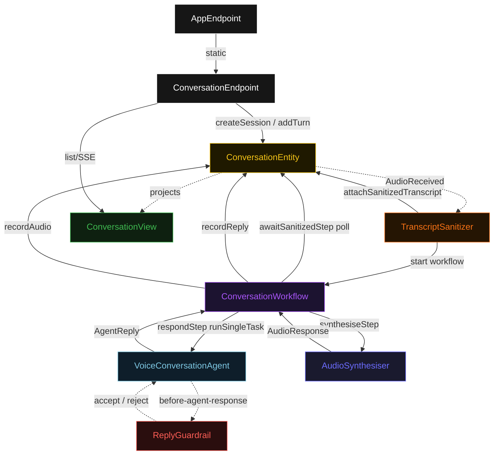
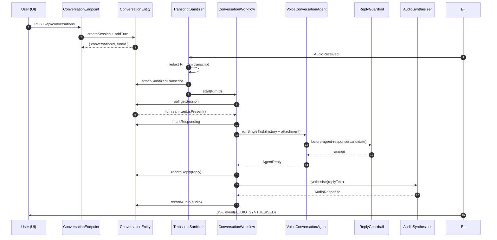
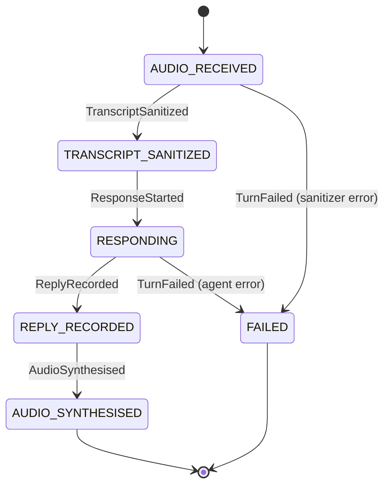
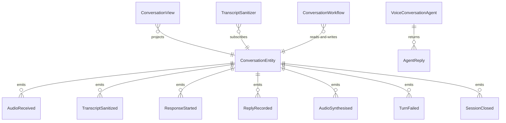

# PLAN — voice-agent

Architectural sketch consumed by `/akka:plan` and rendered on the generated system's Architecture tab. The four mermaid diagrams below carry the theme variables and CSS overrides from Lesson 24; without them, state names render black-on-black and edge labels clip.

---

## Component graph

## Interaction sequence — J1 (happy path)

## State machine — turn lifecycle in `ConversationEntity`

## Entity model

## Component table — Java file targets

| Component | Path (generated) |
|---|---|
| `ConversationEndpoint` | `api/ConversationEndpoint.java` |
| `AppEndpoint` | `api/AppEndpoint.java` |
| `ConversationEntity` | `application/ConversationEntity.java` (state in `domain/ConversationSession.java`, events in `domain/ConversationEvent.java`) |
| `TranscriptSanitizer` | `application/TranscriptSanitizer.java` |
| `ConversationWorkflow` | `application/ConversationWorkflow.java` |
| `VoiceConversationAgent` | `application/VoiceConversationAgent.java` (tasks in `application/ConversationTasks.java`) |
| `ReplyGuardrail` | `application/ReplyGuardrail.java` |
| `AudioSynthesiser` | `application/AudioSynthesiser.java` |
| `ConversationView` | `application/ConversationView.java` |
| `MockModelProvider` (option-a only) | `application/MockModelProvider.java` |
| Bootstrap | `Bootstrap.java` |

## Concurrency notes

- **Per-step timeout**: `awaitSanitizedStep` 15 s, `respondStep` 60 s, `synthesiseStep` 10 s, `error` 5 s. Default step recovery `maxRetries(2).failoverTo(ConversationWorkflow::error)`. The 60 s on `respondStep` accommodates LLM latency (Lesson 4).
- **Idempotency**: every workflow uses `"turn-" + turnId` as the workflow id; the `TranscriptSanitizer` Consumer may redeliver `AudioReceived` events; `ConversationEntity.attachSanitizedTranscript` is event-version-guarded — a second sanitize attempt against an already-sanitized turn is a no-op.
- **One agent per turn**: the AutonomousAgent instance id is `"voice-" + turnId`, giving each task its own conversation context. The agent's `capability(...).maxIterationsPerTask(3)` caps guardrail-triggered retries at 3.
- **Guardrail-driven retry**: when `ReplyGuardrail` rejects a candidate response, the rejection is returned as a structured error to the agent loop. The loop counts toward `maxIterationsPerTask`; if all 3 iterations fail validation, the workflow's `respondStep` fails over to `error` and the entity transitions to `FAILED`.
- **TTS is synchronous and deterministic**: `AudioSynthesiser` runs in-process inside `synthesiseStep`. The stub returns a WAV byte array without any external call — the same reply always produces the same audio length. Production deployers wire a real TTS interface without changing the step logic.
- **Multi-turn sessions**: a single `ConversationEntity` accumulates all `Turn` records in its state list. Each new turn starts an independent `ConversationWorkflow`; workflows do not share state.
- **No saga / no compensation**: every step is either pure read, append-only event write, or a single-task agent call. Nothing requires rollback.
