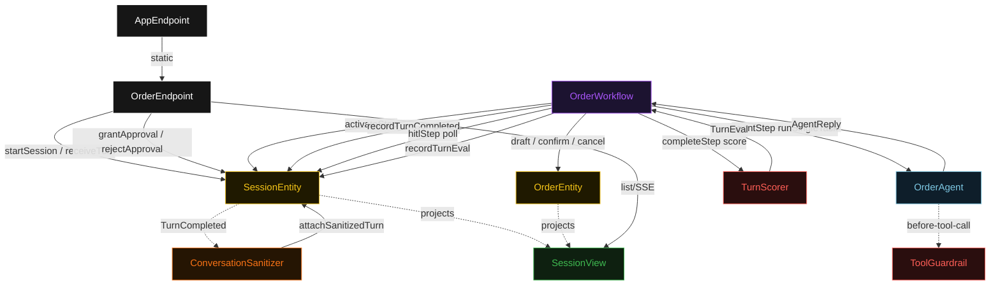
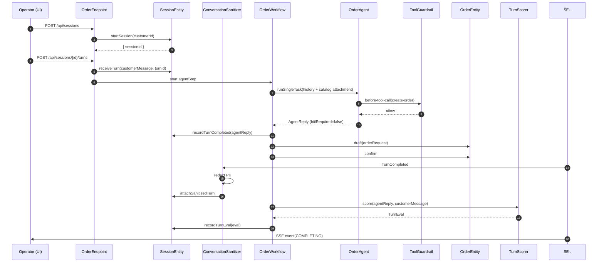
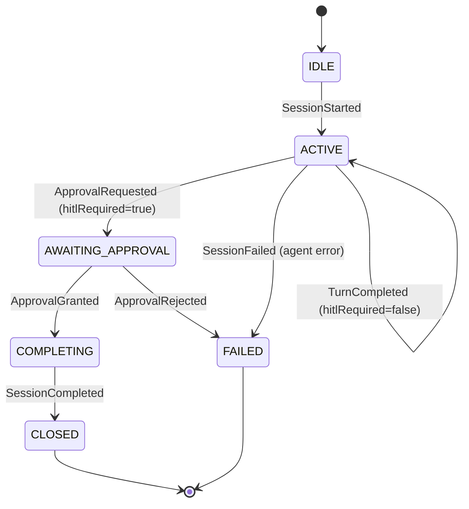
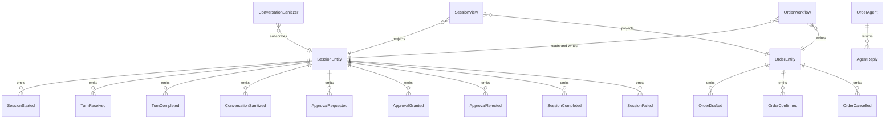

# PLAN — whatsapp-order-agent

Architectural sketch consumed by `/akka:plan` and rendered on the generated system's Architecture tab. The four mermaid diagrams below carry the theme variables and CSS overrides from Lesson 24; without them, state names render black-on-black and edge labels clip.

---

## Component graph

## Interaction sequence — J1 (happy path, single-item order)

## State machine — `SessionEntity`

## Entity model

## Component table — Java file targets

| Component | Path (generated) |
|---|---|
| `OrderEndpoint` | `api/OrderEndpoint.java` |
| `AppEndpoint` | `api/AppEndpoint.java` |
| `SessionEntity` | `application/SessionEntity.java` (state in `domain/Session.java`, events in `domain/SessionEvent.java`) |
| `OrderEntity` | `application/OrderEntity.java` (state in `domain/Order.java`, events in `domain/OrderEvent.java`) |
| `ConversationSanitizer` | `application/ConversationSanitizer.java` |
| `OrderWorkflow` | `application/OrderWorkflow.java` |
| `OrderAgent` | `application/OrderAgent.java` (tasks in `application/OrderTasks.java`) |
| `ToolGuardrail` | `application/ToolGuardrail.java` |
| `TurnScorer` | `application/TurnScorer.java` |
| `ProductCatalogService` | `application/ProductCatalogService.java` |
| `SessionView` | `application/SessionView.java` |
| `MockModelProvider` (option-a only) | `application/MockModelProvider.java` |
| Bootstrap | `Bootstrap.java` |

## Concurrency notes

- **Per-step timeout**: `activateStep` 5 s, `agentStep` 60 s, `hitlStep` 300 s, `completeStep` 5 s, `error` 5 s. Default step recovery `maxRetries(2).failoverTo(OrderWorkflow::error)`. The 60 s on `agentStep` accommodates LLM latency (Lesson 4). The 300 s on `hitlStep` gives operators a reasonable window to approve or reject.
- **Idempotency**: every workflow uses `"session-" + sessionId` as the workflow id. `ConversationSanitizer` is redelivery-safe — a second `TurnCompleted` for the same `turnId` is detected by the entity's applier as a no-op if `piiCategoriesRedacted` is already present.
- **One agent per session**: the AutonomousAgent instance id is `"agent-" + sessionId`, which gives each customer conversation its own context window. `maxIterationsPerTask(4)` caps guardrail-triggered re-plans at 4.
- **Guardrail-driven re-plan**: when `ToolGuardrail` blocks a tool call, the rejection is returned as a structured error to the agent loop. The loop counts toward `maxIterationsPerTask`; if all 4 iterations fail validation, `agentStep` fails over to `error` and the session entity transitions to `FAILED`.
- **Eval is synchronous and deterministic**: `TurnScorer` runs in-process inside `completeStep`. No LLM call — the same reply always scores the same.
- **HITL serialisation**: the `hitlStep` polls via `SessionEntity.getSession` — it does not block a thread. The 300 s timeout is the maximum operator response window; if it expires, the workflow fails over to `error`.
- **No saga / no compensation**: order write operations are append-only events on `OrderEntity`. A cancelled order records `OrderCancelled`; there is nothing to roll back.
