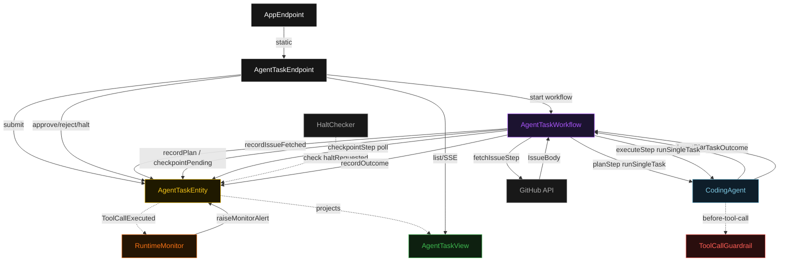
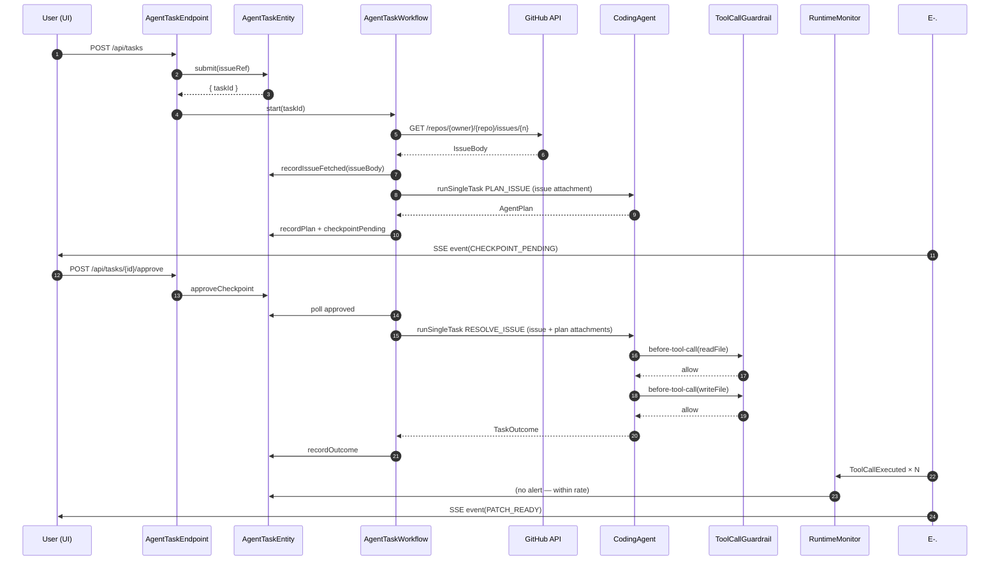
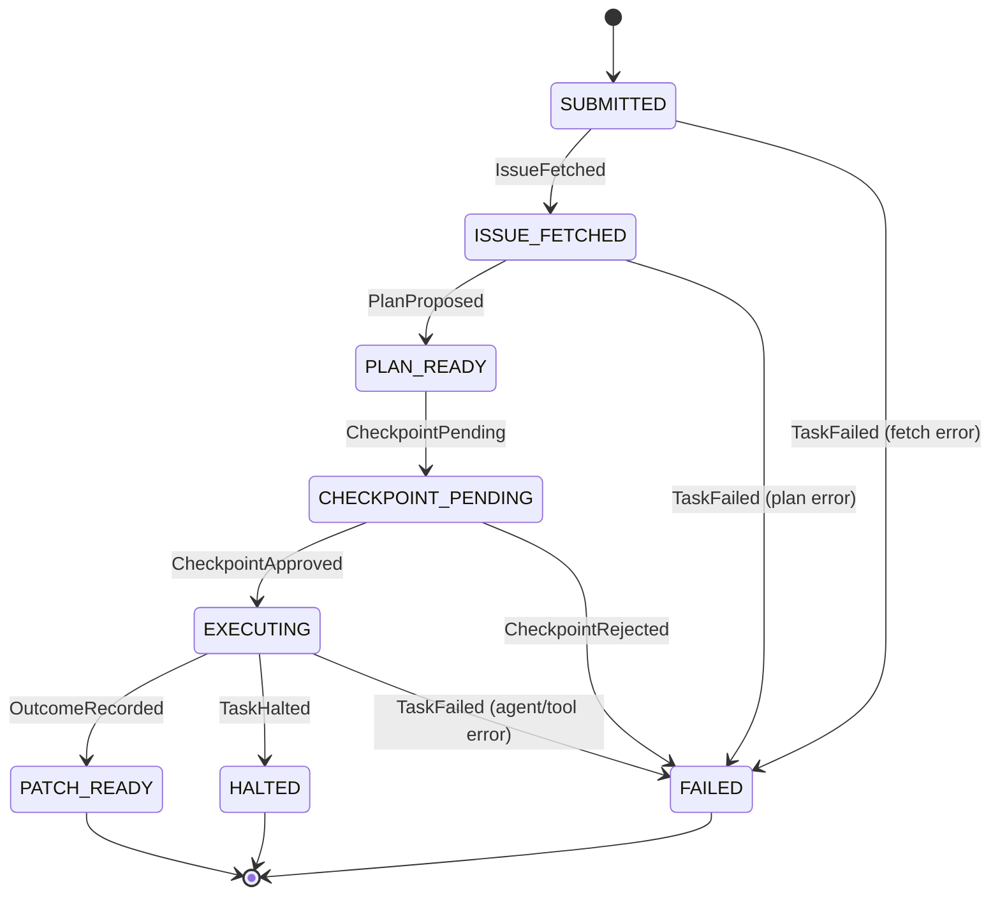
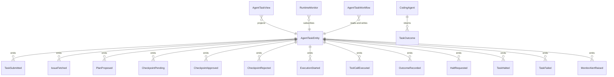

# PLAN — autonomous-agent-pattern

Architectural sketch consumed by `/akka:plan` and rendered on the generated system's Architecture tab. The four mermaid diagrams below carry the theme variables and CSS overrides from Lesson 24; without them, state names render black-on-black and edge labels clip.

---

## Component graph

## Interaction sequence — J1 (happy path)

## State machine — `AgentTaskEntity`

## Entity model

## Component table — Java file targets

| Component | Path (generated) |
|---|---|
| `AgentTaskEndpoint` | `api/AgentTaskEndpoint.java` |
| `AppEndpoint` | `api/AppEndpoint.java` |
| `AgentTaskEntity` | `application/AgentTaskEntity.java` (state in `domain/AgentTask.java`, events in `domain/AgentTaskEvent.java`) |
| `AgentTaskWorkflow` | `application/AgentTaskWorkflow.java` |
| `CodingAgent` | `application/CodingAgent.java` (tasks in `application/AgentTasks.java`) |
| `ToolCallGuardrail` | `application/ToolCallGuardrail.java` |
| `HaltChecker` | `application/HaltChecker.java` |
| `RuntimeMonitor` | `application/RuntimeMonitor.java` |
| `AgentTaskView` | `application/AgentTaskView.java` |
| `MockModelProvider` (option-a only) | `application/MockModelProvider.java` |
| Bootstrap | `Bootstrap.java` |

## Concurrency notes

- **Per-step timeout**: `fetchIssueStep` 10 s, `planStep` 60 s, `checkpointStep` 305 s, `executeStep` 300 s, `outcomeStep` 5 s, `error` 5 s. Default step recovery `maxRetries(1).failoverTo(AgentTaskWorkflow::error)` (Lesson 4). The 300 s on `executeStep` covers multi-iteration tool loops.
- **Idempotency**: every workflow uses `"task-" + taskId` as the workflow id; `AgentTaskEntity.submit` is idempotent on a second call with the same `taskId` — it returns the existing `taskId` without emitting a second `TaskSubmitted`.
- **One agent per task**: the CodingAgent instance id is `"planner-" + taskId` for the plan phase and `"executor-" + taskId` for the execute phase, giving each phase its own conversation context. The agent's `capability(...).maxIterationsPerTask(12)` bounds the tool loop.
- **Guardrail-driven recovery**: when `ToolCallGuardrail` blocks a call, the block reason is returned to the agent as a structured `tool-blocked` error. The agent loop proposes an alternative within the same iteration budget. Blocked calls do not count toward `maxIterationsPerTask` — only full iterations do.
- **Halt is collaborative**: the halt flag on `AgentTaskEntity` is the source of truth. `HaltChecker` reads it at the start of each iteration. If the current iteration is already in a tool call, that call completes before the halt takes effect. No JVM thread interrupts.
- **Monitor is non-blocking**: `RuntimeMonitor` Consumer processes `ToolCallExecuted` events asynchronously. An alert never delays the agent loop. If `RuntimeMonitor` itself fails, the agent continues — monitoring is best-effort.
- **No external writes before checkpoint**: `checkpointStep` (step 3 of 5) gates all `writeFile` and `runShell` tool calls. The `planStep` agent call is declared with `TaskDef.instructions("Phase: PLAN — produce an AgentPlan only, no writes.")` — the system prompt and task instruction together prevent writes in the plan phase.
