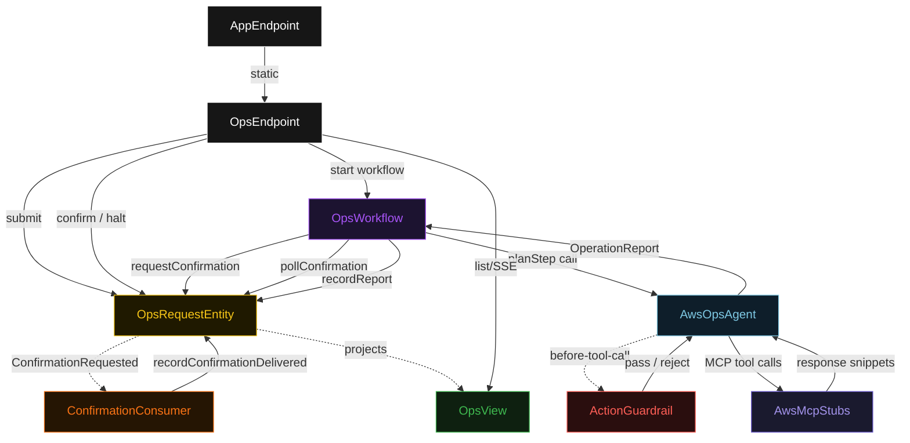
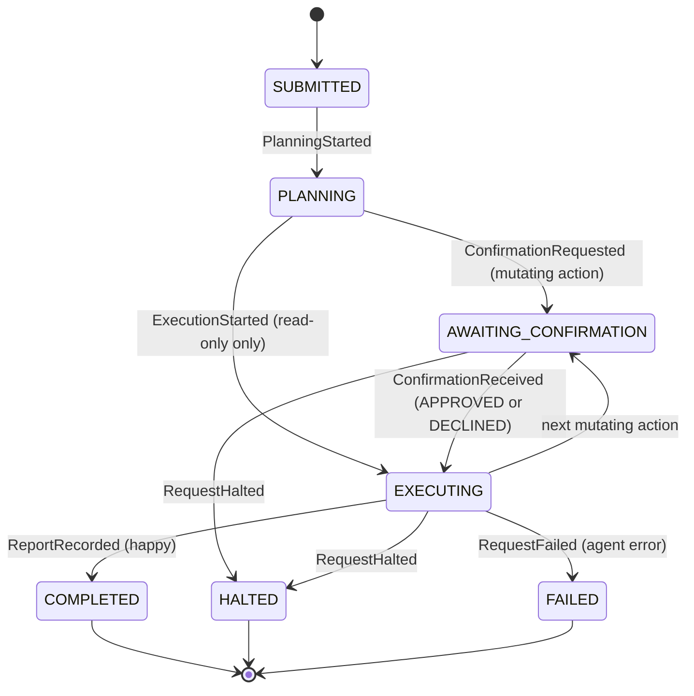
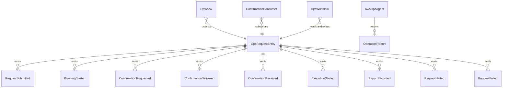

# PLAN — aws-ops-assistant

Architectural sketch consumed by `/akka:plan` and rendered on the generated system's Architecture tab. The four mermaid diagrams below carry the theme variables and CSS overrides from Lesson 24; without them, state names render black-on-black and edge labels clip.

---

## Component graph



## Interaction sequence — J2 (mutating request with HITL confirmation)

```mermaid
sequenceDiagram
  autonumber
  participant U as User (UI)
  participant API as OpsEndpoint
  participant E as OpsRequestEntity
  participant W as OpsWorkflow
  participant A as AwsOpsAgent
  participant G as ActionGuardrail
  participant MCP as AwsMcpStubs

  U->>API: POST /api/ops-requests (scope=MUTATING)
  API->>E: submit(request)
  E-->>API: { opsRequestId }
  API->>W: start(opsRequestId)
  W->>E: startPlanning
  W->>A: runSingleTask(requestText + context)
  A->>G: before-tool-call(ModifyInstanceAttribute)
  G-->>A: pass (EC2 is allowed)
  A->>MCP: EC2.DescribeInstances (READ — no confirmation)
  MCP-->>A: instance list snippet
  Note over A,W: Agent plans mutating call; pauses for HITL
  W->>E: requestConfirmation(ConfirmationRequest)
  E-.->>U: SSE event(AWAITING_CONFIRMATION)
  U->>API: POST /confirm { actionId, outcome=APPROVED }
  API->>E: receiveConfirmation(decision)
  E-.->>W: ConfirmationReceived
  W->>A: resume with APPROVED signal
  A->>G: before-tool-call(ModifyInstanceAttribute)
  G-->>A: pass
  A->>MCP: EC2.ModifyInstanceAttribute
  MCP-->>A: synthetic 200-OK
  A-->>W: OperationReport{COMPLETED}
  W->>E: recordReport(report)
  E-.->>U: SSE event(COMPLETED)
```

## State machine — `OpsRequestEntity`



## Entity model



## Component table — Java file targets

| Component | Path (generated) |
|---|---|
| `OpsEndpoint` | `api/OpsEndpoint.java` |
| `AppEndpoint` | `api/AppEndpoint.java` |
| `OpsRequestEntity` | `application/OpsRequestEntity.java` (state in `domain/OpsRequestState.java`, events in `domain/OpsRequestEvent.java`) |
| `ConfirmationConsumer` | `application/ConfirmationConsumer.java` |
| `OpsWorkflow` | `application/OpsWorkflow.java` |
| `AwsOpsAgent` | `application/AwsOpsAgent.java` (tasks in `application/OpsTasks.java`) |
| `ActionGuardrail` | `application/ActionGuardrail.java` |
| `AwsMcpStubs` | `application/AwsMcpStubs.java` |
| `OpsView` | `application/OpsView.java` |
| `MockModelProvider` (option-a only) | `application/MockModelProvider.java` |
| Bootstrap | `Bootstrap.java` |

## Concurrency notes

- **Per-step timeout**: `planStep` 15 s, `confirmStep` 600 s (10-minute human window), `executeStep` 120 s, `reportStep` 10 s, `error` 10 s. Default step recovery `maxRetries(1).failoverTo(OpsWorkflow::error)`. The 120 s on `executeStep` accommodates LLM latency across multi-action requests (Lesson 4).
- **Idempotency**: every workflow uses `"ops-" + opsRequestId` as the workflow id; `ConfirmationConsumer` is allowed to redeliver `ConfirmationRequested` because `OpsRequestEntity.recordConfirmationDelivered` is event-version-guarded — a second delivery for the same `actionId` is a no-op.
- **One agent per request**: the AutonomousAgent instance id is `"ops-agent-" + opsRequestId`, giving each request its own conversation context. `maxIterationsPerTask(12)` accommodates up to 12 action-plan-and-execute turns within a single request.
- **Guardrail on every tool call**: `ActionGuardrail` fires before each individual MCP tool call, not once per request. A request that mixes allowed and disallowed services will have some calls pass and others blocked — all recorded in the final `OperationReport`.
- **Halt is checked between actions**: the workflow reads `OpsRequestEntity.getRequest` between every action dispatch and checks `status == HALTED`. A halt during an in-flight single MCP call allows that call to finish (one atomic operation) before the workflow observes the flag and stops.
- **HITL loop**: the `confirmStep` can iterate multiple times within a single workflow execution — once per mutating action in the plan. The 600 s timeout applies per confirmation window, not to the total sum.
- **No saga / no compensation**: AWS MCP stub calls are fire-and-forget; if an action fails the workflow records `FAILED` in the `ActionResult` and continues to the next action. There is no rollback — a deployer adding real AWS credentials must decide their own rollback strategy outside this blueprint.
