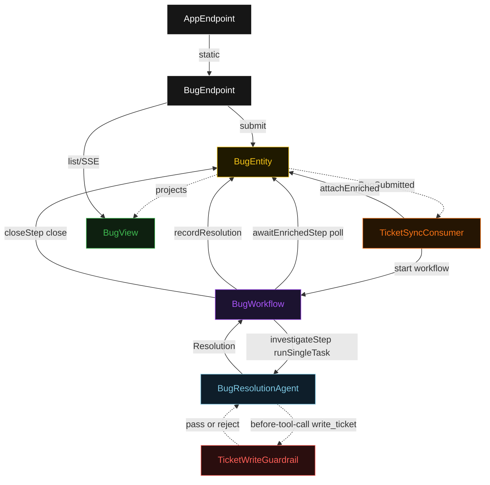
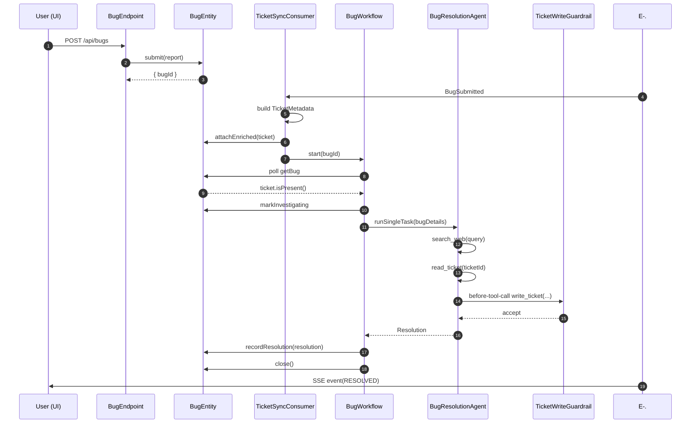
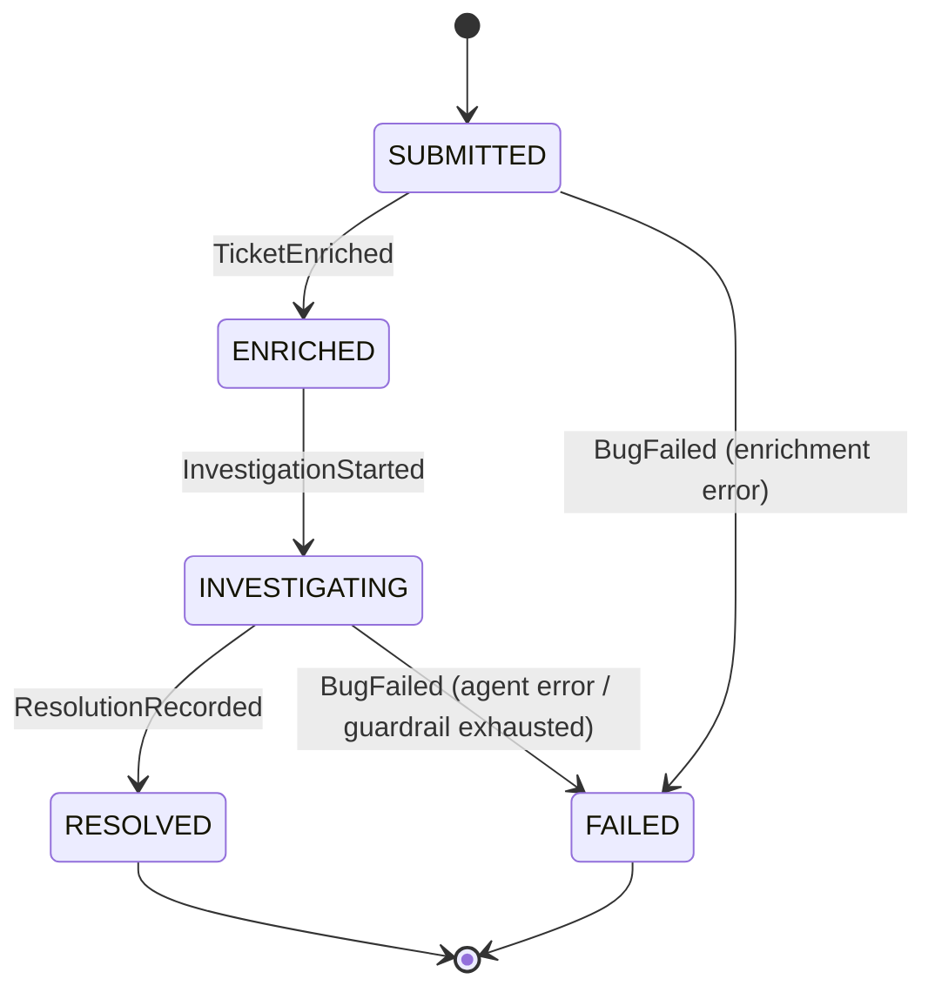
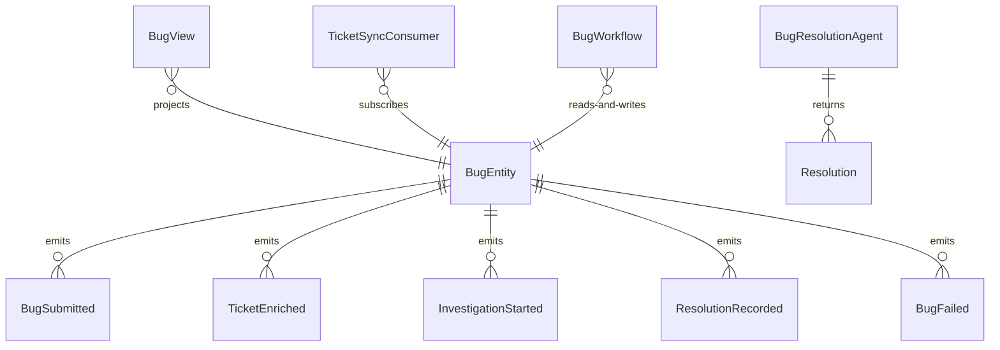

# PLAN — bug-assistant

Architectural sketch consumed by `/akka:plan` and rendered on the generated system's Architecture tab. The four mermaid diagrams below carry the theme variables and CSS overrides from Lesson 24; without them, state names render black-on-black and edge labels clip.

---

## Component graph

## Interaction sequence — J1 (happy path)

## State machine — `BugEntity`

## Entity model

## Component table — Java file targets

| Component | Path (generated) |
|---|---|
| `BugEndpoint` | `api/BugEndpoint.java` |
| `AppEndpoint` | `api/AppEndpoint.java` |
| `BugEntity` | `application/BugEntity.java` (state in `domain/Bug.java`, events in `domain/BugEvent.java`) |
| `TicketSyncConsumer` | `application/TicketSyncConsumer.java` |
| `BugWorkflow` | `application/BugWorkflow.java` |
| `BugResolutionAgent` | `application/BugResolutionAgent.java` (tasks in `application/BugTasks.java`) |
| `TicketWriteGuardrail` | `application/TicketWriteGuardrail.java` |
| `BugView` | `application/BugView.java` |
| `MockModelProvider` (option-a only) | `application/MockModelProvider.java` |
| Bootstrap | `Bootstrap.java` |

## Concurrency notes

- **Per-step timeout**: `awaitEnrichedStep` 15 s, `investigateStep` 90 s, `closeStep` 5 s, `error` 5 s. Default step recovery `maxRetries(2).failoverTo(BugWorkflow::error)`. The 90 s on `investigateStep` accommodates multi-turn tool-call sequences (Lesson 4).
- **Idempotency**: every workflow uses `"bug-" + bugId` as the workflow id; the `TicketSyncConsumer` Consumer is allowed to redeliver `BugSubmitted` events because `BugEntity.attachEnriched` is event-version-guarded — a second enrichment attempt against an already-enriched bug is a no-op.
- **One agent per bug**: the AutonomousAgent instance id is `"resolver-" + bugId`, giving each task its own conversation context. The agent's `capability(...).maxIterationsPerTask(5)` caps guardrail-triggered retries at 5.
- **Guardrail-driven retry**: when `TicketWriteGuardrail` rejects a `write_ticket` call, the rejection is returned as a structured error to the agent loop. The loop counts toward `maxIterationsPerTask`; if all 5 iterations fail validation, the workflow's `investigateStep` fails over to `error` and the entity transitions to `FAILED`.
- **Tool calls are simulated in-process**: `search_web` and `read_ticket` are backed by the mock-search-results.jsonl seed data. No external HTTP call happens; this keeps the blueprint self-contained.
- **No saga / no compensation**: every step is either a pure read, an append-only event write, or a single-task agent call. There is nothing external to roll back.
