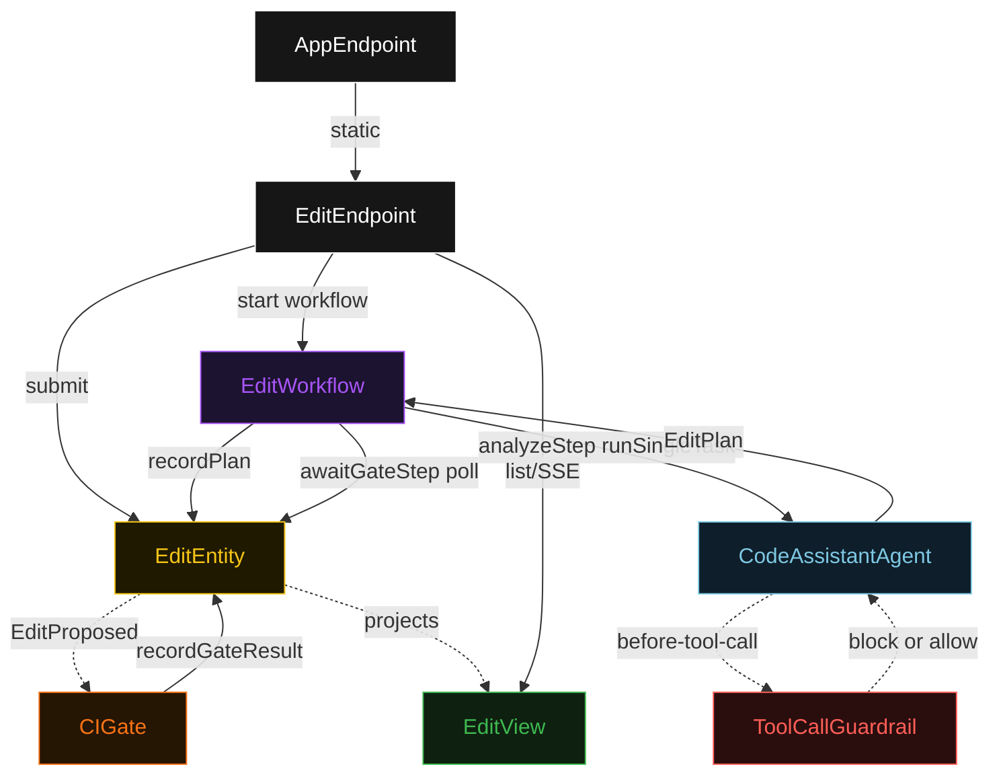
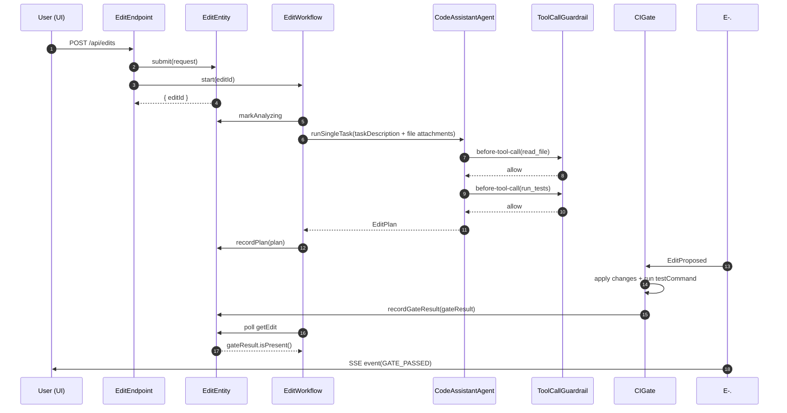
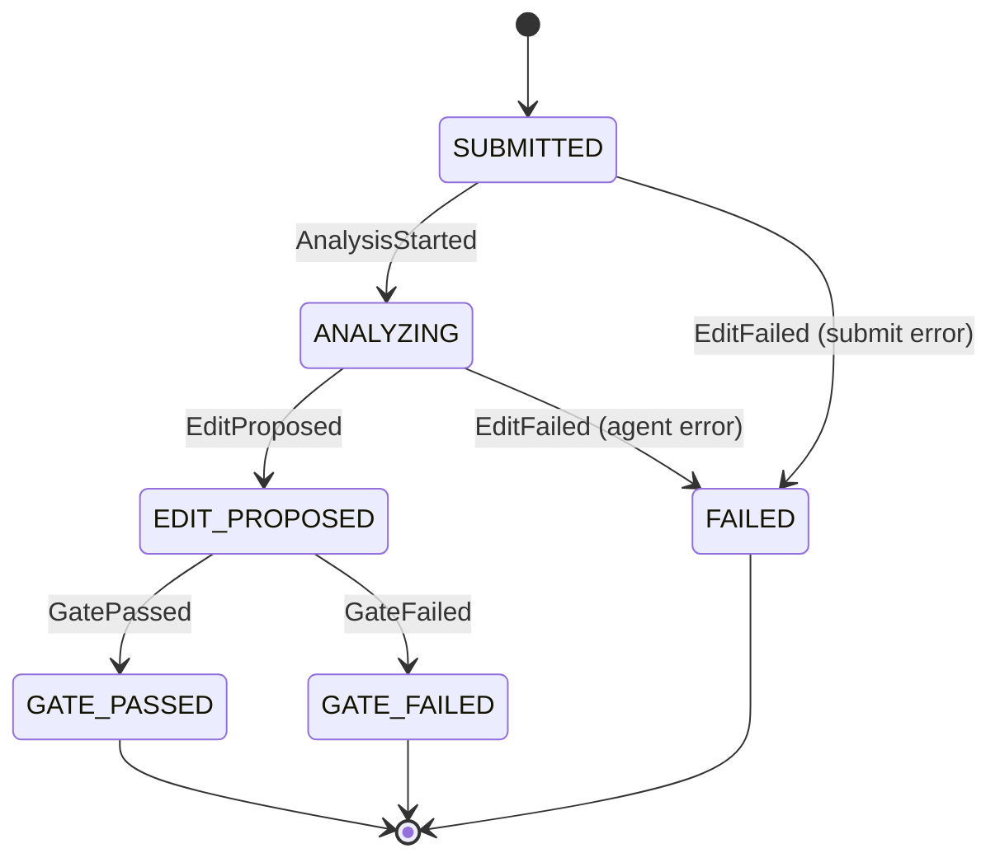
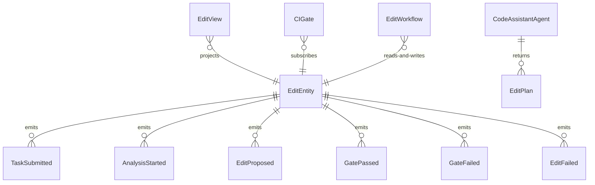

# PLAN — code-assistant

Architectural sketch consumed by `/akka:plan` and rendered on the generated system's Architecture tab. The four mermaid diagrams below carry the theme variables and CSS overrides from Lesson 24; without them, state names render black-on-black and edge labels clip.

---

## Component graph

## Interaction sequence — J1 (happy path)

## State machine — `EditEntity`

## Entity model

## Component table — Java file targets

| Component | Path (generated) |
|---|---|
| `EditEndpoint` | `api/EditEndpoint.java` |
| `AppEndpoint` | `api/AppEndpoint.java` |
| `EditEntity` | `application/EditEntity.java` (state in `domain/Edit.java`, events in `domain/EditEvent.java`) |
| `CIGate` | `application/CIGate.java` |
| `EditWorkflow` | `application/EditWorkflow.java` |
| `CodeAssistantAgent` | `application/CodeAssistantAgent.java` (tasks in `application/EditTasks.java`) |
| `ToolCallGuardrail` | `application/ToolCallGuardrail.java` |
| `EditView` | `application/EditView.java` |
| `MockModelProvider` (option-a only) | `application/MockModelProvider.java` |
| Bootstrap | `Bootstrap.java` |

## Concurrency notes

- **Per-step timeout**: `analyzeStep` 90 s (accommodates LLM latency plus multi-file attachment parsing), `awaitGateStep` 30 s (CI gate is in-process), `error` 5 s (Lesson 4). Default step recovery `maxRetries(2).failoverTo(EditWorkflow::error)`.
- **Idempotency**: every workflow uses `"edit-" + editId` as the workflow id; `EditEndpoint` mints `editId` before writing the entity event, so a retry of the POST with the same body (same `taskDescription` and `snapshotId`) resolves to the same entity and workflow without duplication.
- **One agent per task**: the AutonomousAgent instance id is `"assistant-" + editId`, giving each task its own conversation context. The agent's `capability(...).maxIterationsPerTask(4)` caps guardrail-triggered retries at 4.
- **Guardrail-driven retry**: when `ToolCallGuardrail` blocks a tool call, the rejection is returned as a structured `tool-blocked` error to the agent loop. The loop counts toward `maxIterationsPerTask`; if the agent exhausts its budget trying blocked calls, the workflow's `analyzeStep` fails over to `error` and the entity transitions to `FAILED`.
- **CI gate is synchronous and deterministic**: `CIGate` runs the test suite in-process against an in-memory copy of the repository snapshot. No LLM call, no external service. The same edit plan always produces the same gate result for the same repository snapshot, keeping the single-agent guarantee honest.
- **No saga / no compensation**: every step is either pure read, append-only event write, or a single-task agent call. The CI gate runs against an in-memory copy of the repository; it does not write to disk and has nothing to roll back.
