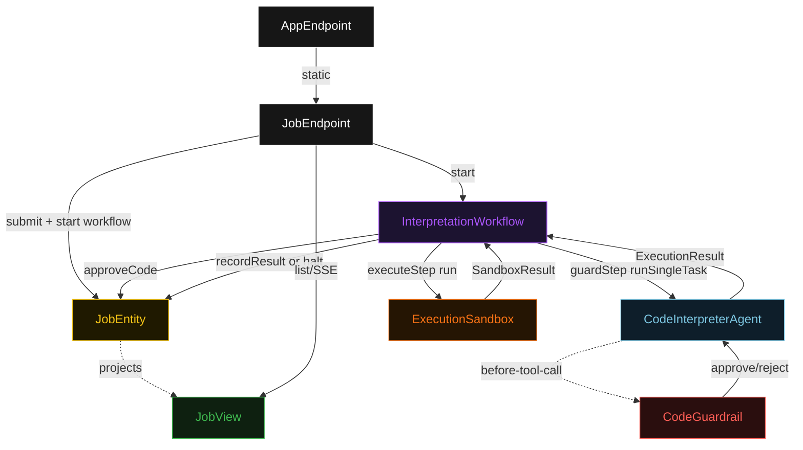
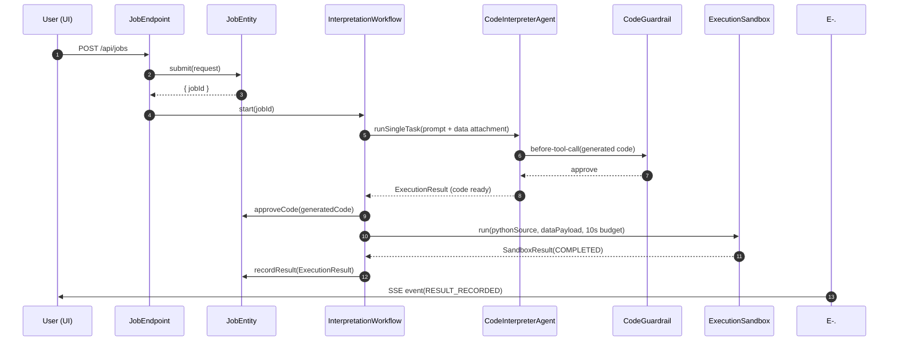
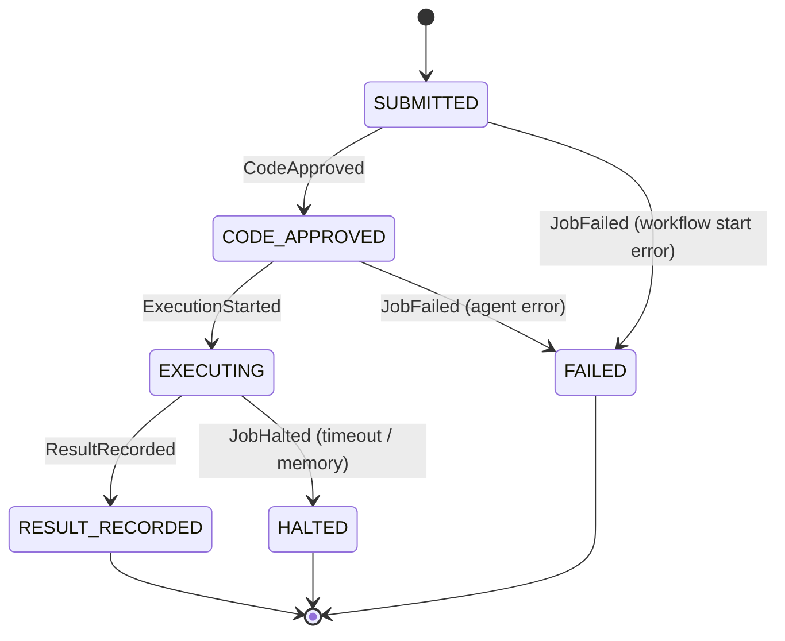
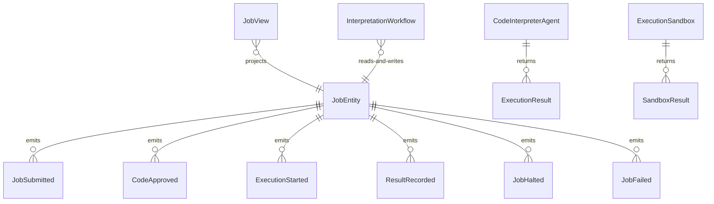

# PLAN — code-interpreter-agent

Architectural sketch consumed by `/akka:plan` and rendered on the generated system's Architecture tab. The four mermaid diagrams below carry the theme variables and CSS overrides from Lesson 24; without them, state names render black-on-black and edge labels clip.

---

## Component graph

## Interaction sequence — J1 (happy path)

## State machine — `JobEntity`

## Entity model

## Component table — Java file targets

| Component | Path (generated) |
|---|---|
| `JobEndpoint` | `api/JobEndpoint.java` |
| `AppEndpoint` | `api/AppEndpoint.java` |
| `JobEntity` | `application/JobEntity.java` (state in `domain/Job.java`, events in `domain/JobEvent.java`) |
| `InterpretationWorkflow` | `application/InterpretationWorkflow.java` |
| `CodeInterpreterAgent` | `application/CodeInterpreterAgent.java` (tasks in `application/InterpretationTasks.java`) |
| `CodeGuardrail` | `application/CodeGuardrail.java` |
| `ExecutionSandbox` | `application/ExecutionSandbox.java` |
| `JobView` | `application/JobView.java` |
| `MockModelProvider` (option-a only) | `application/MockModelProvider.java` |
| Bootstrap | `Bootstrap.java` |

## Concurrency notes

- **Per-step timeout**: `guardStep` 60 s, `executeStep` 15 s, `error` 5 s. Default step recovery `maxRetries(2).failoverTo(InterpretationWorkflow::error)`. The 60 s on `guardStep` accommodates LLM latency plus potential guardrail-triggered retries (Lesson 4).
- **Idempotency**: every workflow uses `"job-" + jobId` as the workflow id; the `JobEndpoint` starts the workflow after the entity is created. A duplicate `POST /api/jobs` with the same payload mints a new jobId, so there is no deduplication concern at the submit layer.
- **One agent per job**: the AutonomousAgent instance id is `"interpreter-" + jobId`, giving each task its own conversation context. The agent's `capability(...).maxIterationsPerTask(3)` caps guardrail-triggered retries at 3.
- **Guardrail-driven retry**: when `CodeGuardrail` rejects a tool call, the rejection is returned as a structured error to the agent loop. The loop counts toward `maxIterationsPerTask`; if all 3 iterations produce code that violates the guardrail, the workflow's `guardStep` fails over to `error` and the entity transitions to `FAILED`.
- **Halt is terminal**: `ExecutionSandbox` enforces wall-clock and memory budgets inside `executeStep`. On breach it calls `JobEntity.halt(breachType)` and returns. The workflow does not retry halted executions — the halt is a safety signal, not a recoverable error.
- **Sandbox is synchronous**: `ExecutionSandbox.run(...)` runs in the same thread as `executeStep` under a `ScheduledExecutorService` watchdog. No LLM call, no external service — the same code on the same data always produces the same result. This keeps the pattern's "one agent" invariant honest.
- **No saga / no compensation**: every step is either an entity write or a single-task agent call. There is nothing external to roll back.
