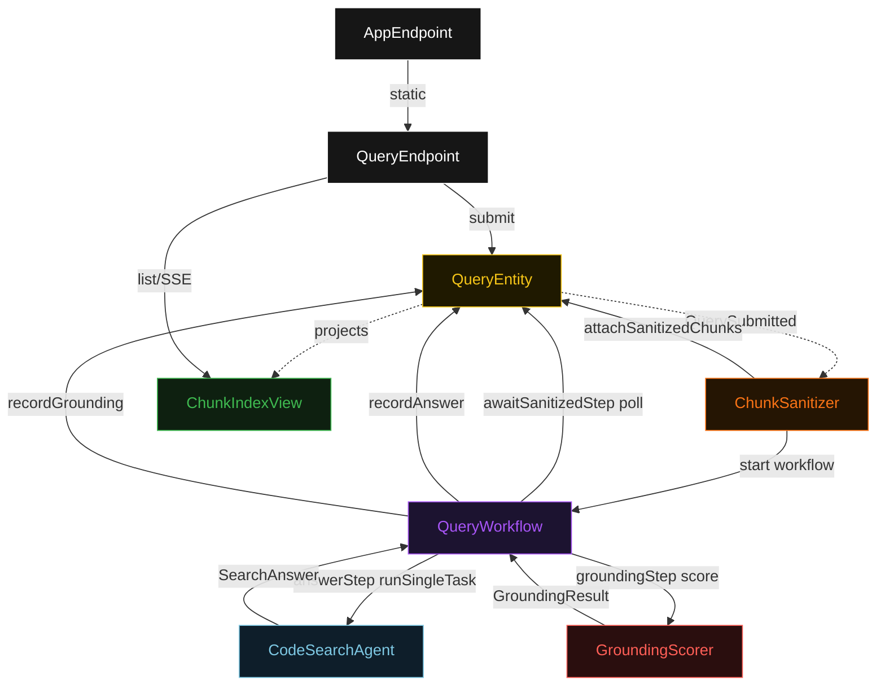
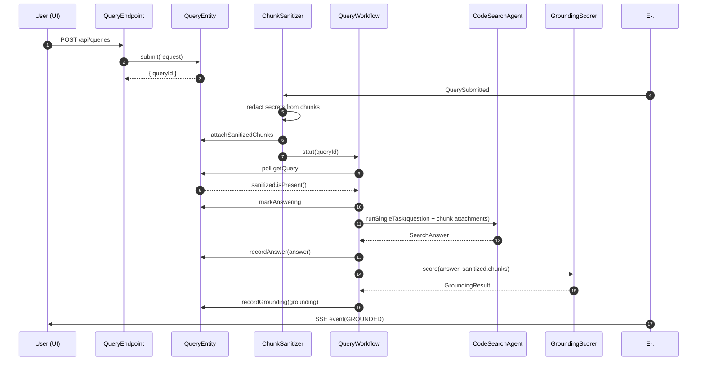
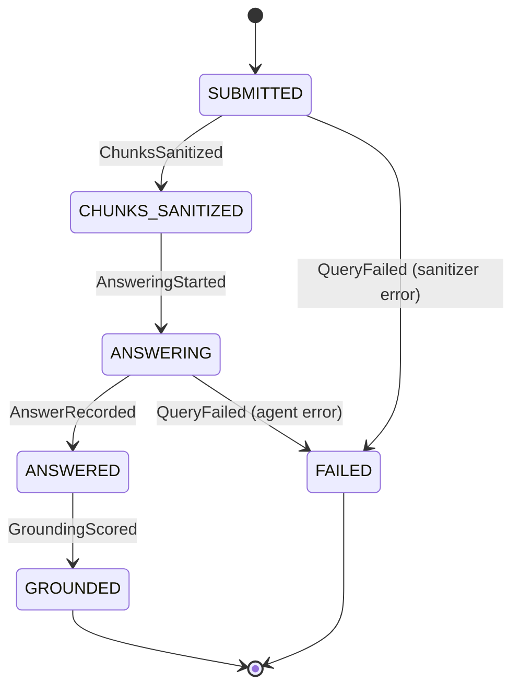
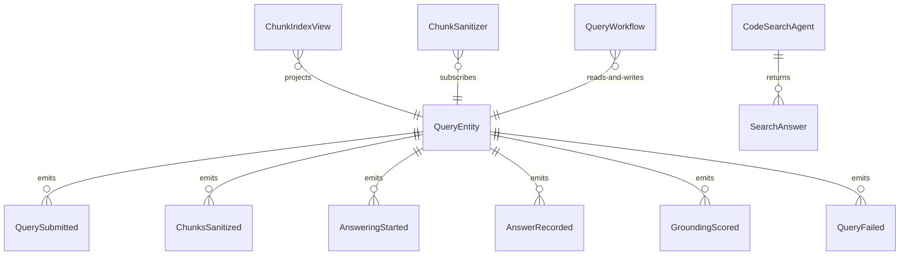

# PLAN — code-search-rag-agent

Architectural sketch consumed by `/akka:plan` and rendered on the generated system's Architecture tab. The four mermaid diagrams below carry the theme variables and CSS overrides from Lesson 24; without them, state names render black-on-black and edge labels clip.

---

## Component graph

## Interaction sequence — J1 (happy path)

## State machine — `QueryEntity`

## Entity model

## Component table — Java file targets

| Component | Path (generated) |
|---|---|
| `QueryEndpoint` | `api/QueryEndpoint.java` |
| `AppEndpoint` | `api/AppEndpoint.java` |
| `QueryEntity` | `application/QueryEntity.java` (state in `domain/Query.java`, events in `domain/QueryEvent.java`) |
| `ChunkSanitizer` | `application/ChunkSanitizer.java` |
| `QueryWorkflow` | `application/QueryWorkflow.java` |
| `CodeSearchAgent` | `application/CodeSearchAgent.java` (tasks in `application/QueryTasks.java`) |
| `GroundingScorer` | `application/GroundingScorer.java` |
| `ChunkIndexView` | `application/ChunkIndexView.java` |
| `MockModelProvider` (option-a only) | `application/MockModelProvider.java` |
| Bootstrap | `Bootstrap.java` |

## Concurrency notes

- **Per-step timeout**: `awaitSanitizedStep` 15 s, `answerStep` 60 s, `groundingStep` 5 s, `error` 5 s. Default step recovery `maxRetries(2).failoverTo(QueryWorkflow::error)`. The 60 s on `answerStep` accommodates LLM latency with multiple chunk attachments (Lesson 4).
- **Idempotency**: every workflow uses `"query-" + queryId` as the workflow id; the `ChunkSanitizer` Consumer is allowed to redeliver `QuerySubmitted` events because `QueryEntity.attachSanitizedChunks` is event-version-guarded — a second sanitize attempt against an already-sanitized query is a no-op.
- **One agent per query**: the AutonomousAgent instance id is `"searcher-" + queryId`, which gives each task its own conversation context. The agent's `capability(...).maxIterationsPerTask(3)` limits retries.
- **Grounding is synchronous and deterministic**: `GroundingScorer` runs in-process inside `groundingStep`. No LLM call, no external service — the same answer + chunks always produce the same score. This is a deliberate single-agent guarantee.
- **No saga / no compensation**: every step is either a pure read, append-only event write, or a single-task agent call. There is nothing external to roll back.
- **Chunk attachment fan-out**: `answerStep` attaches one file per chunk (`chunkId.txt`). If the sanitized chunk list is empty (no chunks matched the corpus tag), the agent receives the question with zero attachments and is expected to return a "not found" answer.
