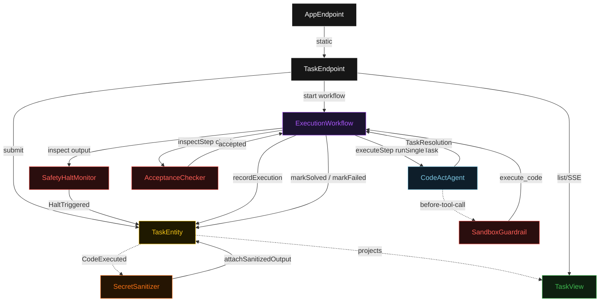
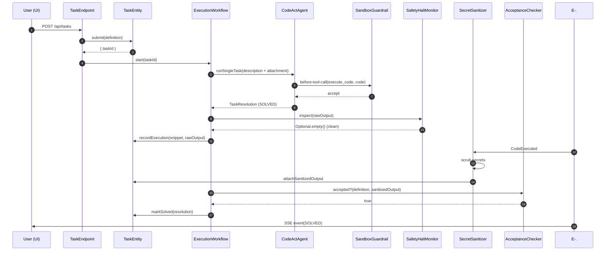
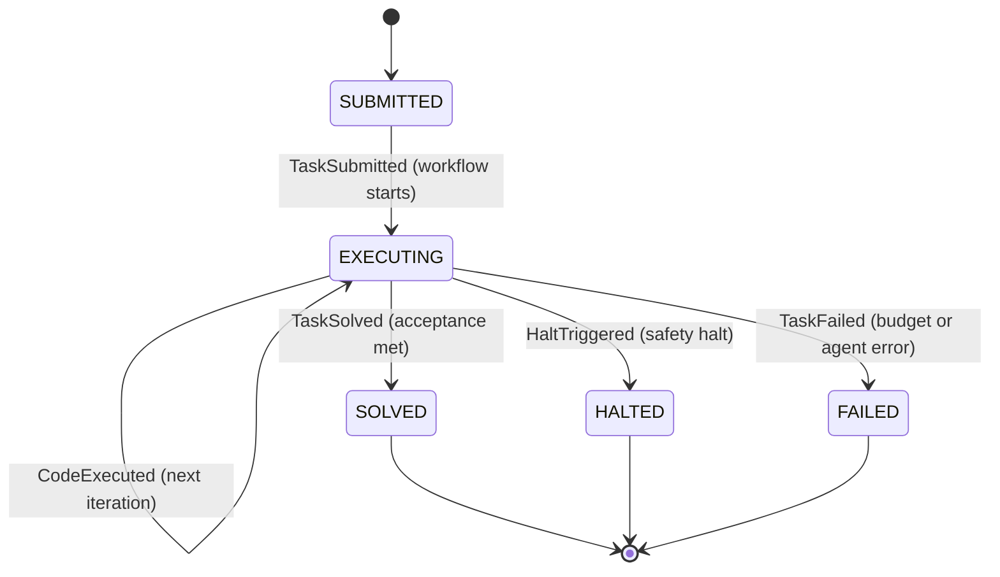
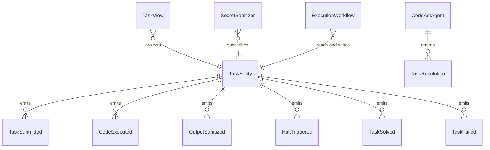

# PLAN — codeact-sandboxed-agent

Architectural sketch consumed by `/akka:plan` and rendered on the generated system's Architecture tab. The four mermaid diagrams below carry the theme variables and CSS overrides from Lesson 24; without them, state names render black-on-black and edge labels clip.

---

## Component graph

## Interaction sequence — J1 (happy path)

## State machine — `TaskEntity`

## Entity model

## Component table — Java file targets

| Component | Path (generated) |
|---|---|
| `TaskEndpoint` | `api/TaskEndpoint.java` |
| `AppEndpoint` | `api/AppEndpoint.java` |
| `TaskEntity` | `application/TaskEntity.java` (state in `domain/Task.java`, events in `domain/TaskEvent.java`) |
| `SecretSanitizer` | `application/SecretSanitizer.java` |
| `ExecutionWorkflow` | `application/ExecutionWorkflow.java` |
| `CodeActAgent` | `application/CodeActAgent.java` (tasks in `application/CodeActTasks.java`) |
| `SandboxGuardrail` | `application/SandboxGuardrail.java` |
| `SafetyHaltMonitor` | `application/SafetyHaltMonitor.java` |
| `AcceptanceChecker` | `application/AcceptanceChecker.java` |
| `TaskView` | `application/TaskView.java` |
| `MockModelProvider` (option-a only) | `application/MockModelProvider.java` |
| Bootstrap | `Bootstrap.java` |

## Concurrency notes

- **Per-step timeout**: `executeStep` 60 s, `inspectStep` 15 s, `solvedStep` 5 s, `haltedStep` 5 s, `error` 5 s. Default step recovery `maxRetries(2).failoverTo(ExecutionWorkflow::error)`. The 60 s on `executeStep` accommodates LLM latency plus sandbox execution time (Lesson 4).
- **Idempotency**: every workflow uses `"exec-" + taskId` as the workflow id; the `SecretSanitizer` Consumer is allowed to redeliver `CodeExecuted` events because `TaskEntity.attachSanitizedOutput` is event-version-guarded — a second sanitize attempt for the same iteration number is a no-op.
- **One agent per task**: the AutonomousAgent instance id is `"codeact-" + taskId`, giving each task its own conversation context. The agent's `capability(...).maxIterationsPerTask(5)` caps guardrail-triggered rewrites at 5 attempts total.
- **Guardrail-driven rewrite**: when `SandboxGuardrail` rejects a `before-tool-call`, the rejection is returned as a structured error to the agent loop naming the forbidden pattern. The loop counts toward `maxIterationsPerTask`; if all 5 iterations fail the guardrail, the workflow's `executeStep` fails over to `error` and the entity transitions to `FAILED`.
- **Safety halt is synchronous**: `SafetyHaltMonitor` runs inside `executeStep` after each sandbox run, before the `CodeExecuted` event is written. A halt short-circuits the event write and transitions immediately to `HALTED`. This guarantees the raw output never lands in the entity log when a halt fires.
- **AcceptanceChecker is deterministic**: no LLM call. The same sanitized output against the same acceptance criterion always yields the same result. This keeps the single-agent invariant honest.
- **No saga / no compensation**: all state transitions are append-only event writes. The sandbox is in-process and stateless between iterations.
