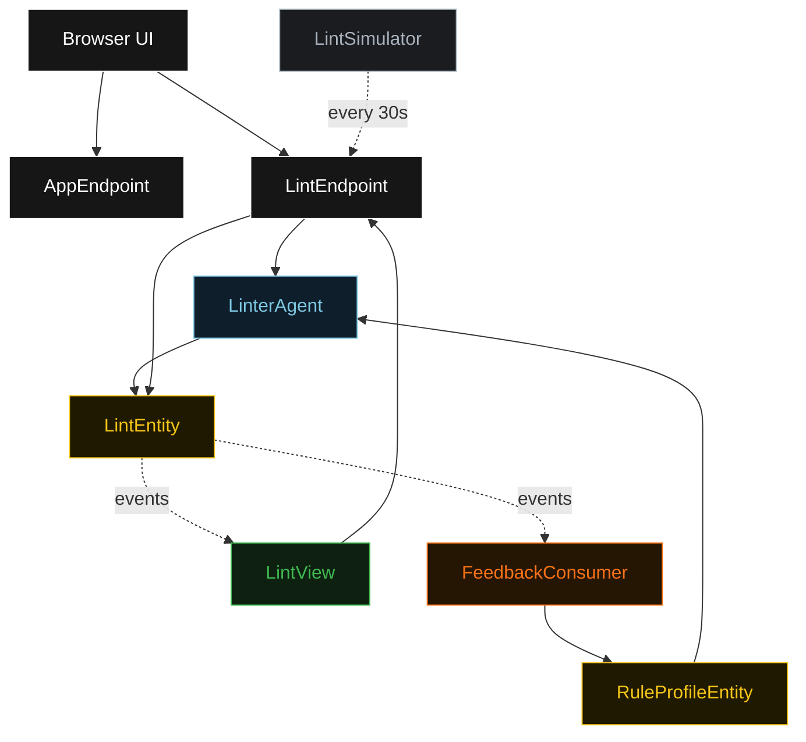
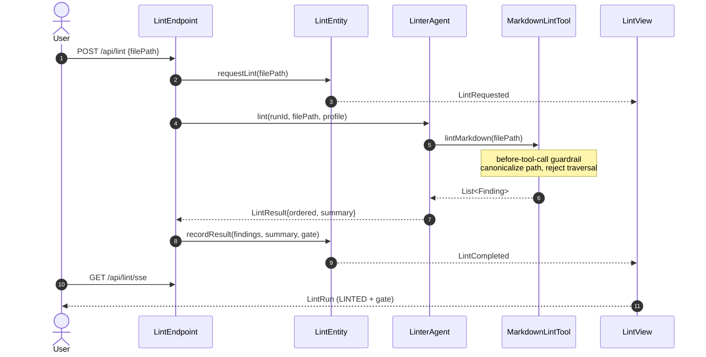
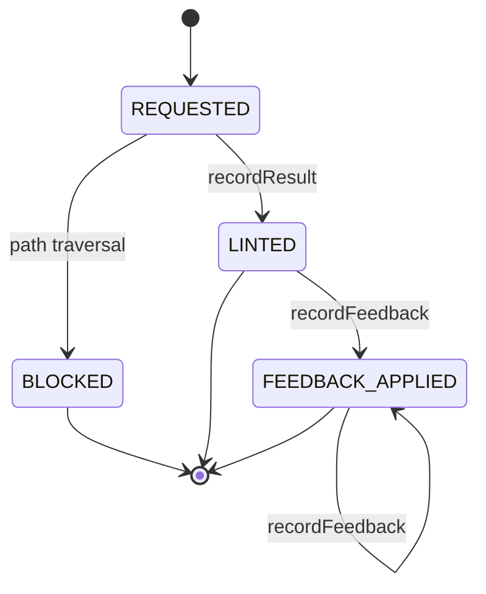
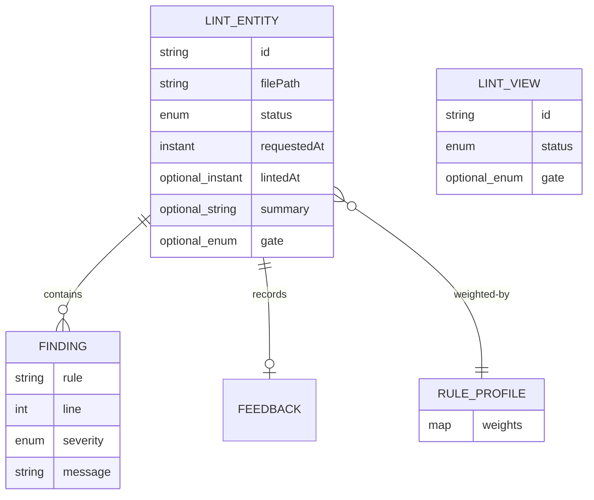

# PLAN — doc-linter

Architectural sketch. All four mermaid diagrams + the component table.

---

## Component graph

## Interaction sequence

## State machine

## Entity model

## Component table

| Component | Akka primitive | Path (generated) |
|---|---|---|
| LinterAgent | Agent | `application/LinterAgent.java` |
| MarkdownLintTool | function tool | `application/MarkdownLintTool.java` |
| LintEntity | EventSourcedEntity | `application/LintEntity.java` |
| RuleProfileEntity | KeyValueEntity | `application/RuleProfileEntity.java` |
| LintView | View | `application/LintView.java` |
| FeedbackConsumer | Consumer | `application/FeedbackConsumer.java` |
| LintSimulator | TimedAction | `application/LintSimulator.java` |
| LintEndpoint | HttpEndpoint | `api/LintEndpoint.java` |
| AppEndpoint | HttpEndpoint | `api/AppEndpoint.java` |

## Concurrency notes

- **Step timeouts** — no Workflow in this blueprint, so the 5-second default does not bite. The single `LinterAgent.lint` call runs request/response; the endpoint awaits it directly. If a Workflow is added later, override `settings()` with `stepTimeout >= 60s` on the agent-calling step (Lesson 4).
- **Idempotency** — `runId` is a UUID minted per request and used as the `LintEntity` id, so retries of the same request target the same entity.
- **Guardrail ordering** — the before-tool-call guardrail runs before any file read; a blocked run never touches the filesystem and lands in a terminal `BLOCKED` state.
- **No saga / compensation** — every step is internal and reversible by replaying events; there is no external side effect to compensate.
