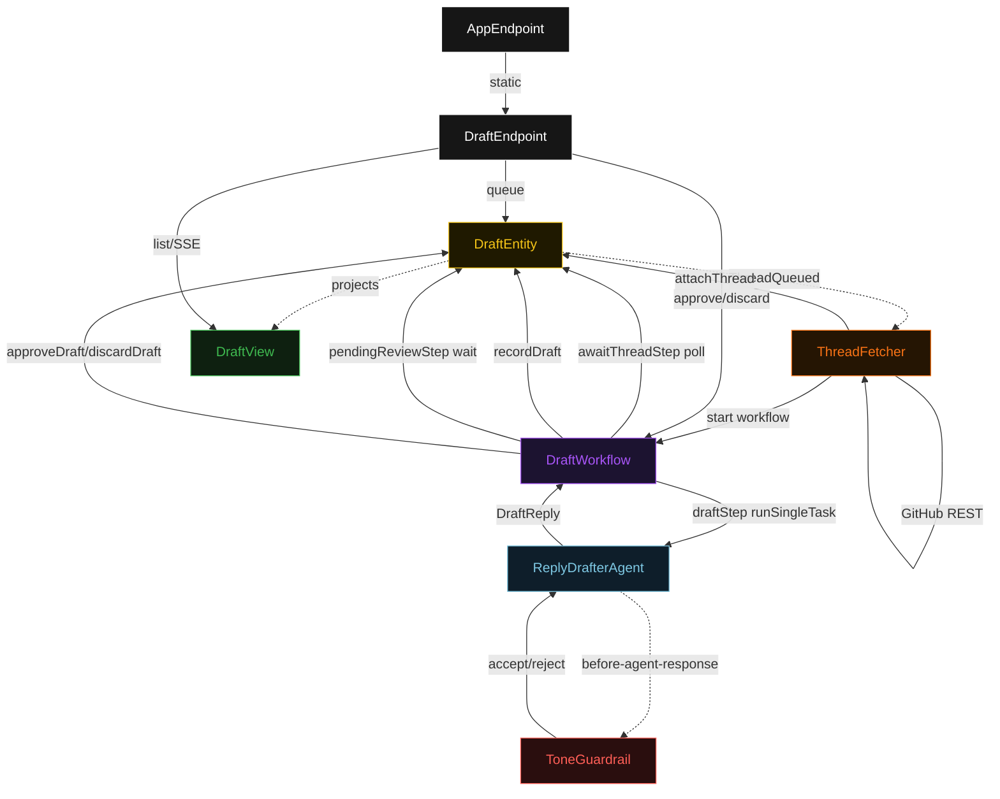
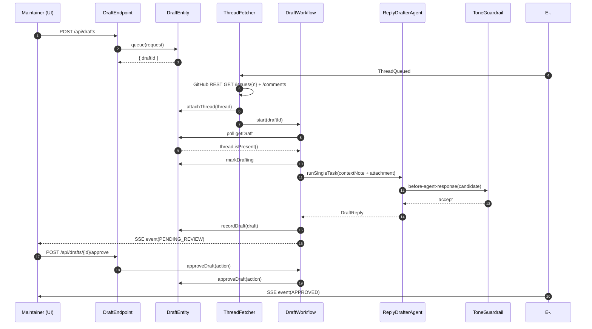
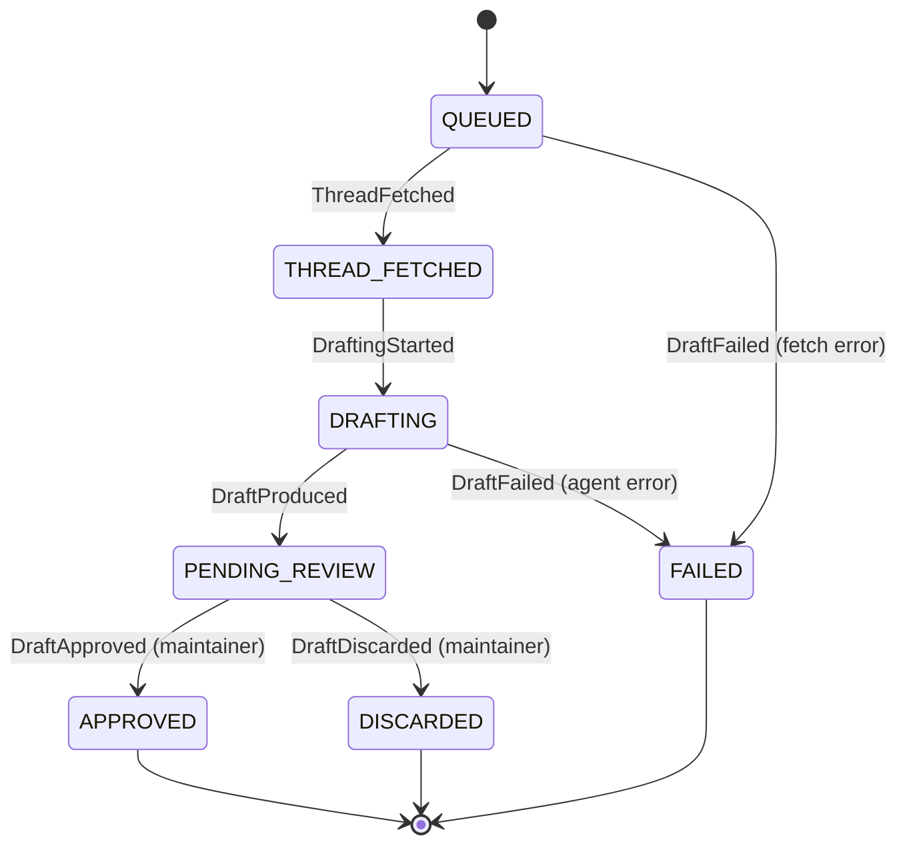
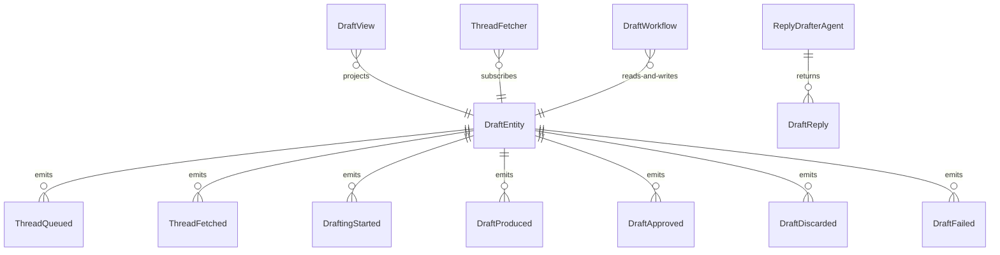

# PLAN — gitty

Architectural sketch consumed by `/akka:plan` and rendered on the generated system's Architecture tab. The four mermaid diagrams below carry the theme variables and CSS overrides from Lesson 24; without them, state names render black-on-black and edge labels clip.

---

## Component graph

## Interaction sequence — J1 (happy path)

## State machine — `DraftEntity`

## Entity model

## Component table — Java file targets

| Component | Path (generated) |
|---|---|
| `DraftEndpoint` | `api/DraftEndpoint.java` |
| `AppEndpoint` | `api/AppEndpoint.java` |
| `DraftEntity` | `application/DraftEntity.java` (state in `domain/Draft.java`, events in `domain/DraftEvent.java`) |
| `ThreadFetcher` | `application/ThreadFetcher.java` |
| `DraftWorkflow` | `application/DraftWorkflow.java` |
| `ReplyDrafterAgent` | `application/ReplyDrafterAgent.java` (tasks in `application/DraftTasks.java`) |
| `ToneGuardrail` | `application/ToneGuardrail.java` |
| `DraftView` | `application/DraftView.java` |
| `MockModelProvider` (option-a only) | `application/MockModelProvider.java` |
| `MockThreadFetcher` (option-a only) | `application/MockThreadFetcher.java` |
| Bootstrap | `Bootstrap.java` |

## Concurrency notes

- **Per-step timeout**: `awaitThreadStep` 20 s, `draftStep` 60 s, `pendingReviewStep` no timeout (human gate), `error` 5 s. Default step recovery `maxRetries(2).failoverTo(DraftWorkflow::error)`. The 60 s on `draftStep` accommodates LLM latency (Lesson 4).
- **Idempotency**: every workflow uses `"draft-" + draftId` as the workflow id; the `ThreadFetcher` Consumer is allowed to redeliver `ThreadQueued` events because `DraftEntity.attachThread` is event-version-guarded — a second fetch attempt against an already-fetched draft is a no-op.
- **One agent per draft**: the AutonomousAgent instance id is `"drafter-" + draftId`, giving each task its own conversation context. The agent's `capability(...).maxIterationsPerTask(3)` caps guardrail-triggered retries at 3.
- **Guardrail-driven retry**: when `ToneGuardrail` rejects a candidate response, the structured error is returned to the agent loop. The loop counts toward `maxIterationsPerTask`; if all 3 iterations fail validation, `draftStep` fails over to `error` and the entity transitions to `FAILED`.
- **HITL is a workflow pause**: `pendingReviewStep` has no step timeout and waits indefinitely for a maintainer action. The workflow only advances when `DraftEndpoint` calls `DraftWorkflow.approveDraft(...)` or `DraftWorkflow.discardDraft(...)`.
- **No GitHub write in the sample**: `ThreadFetcher` reads the GitHub API; no component writes back. The `DraftApproved` event records the approved text for the deployer to post separately.
- **No saga / no compensation**: every step is either a pure read, an append-only event write, a single-task agent call, or a human wait. There is nothing external to roll back.
