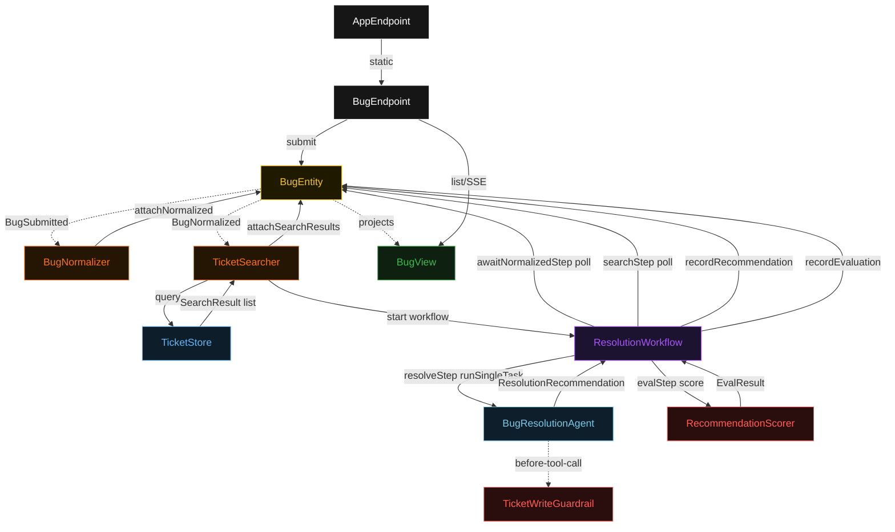
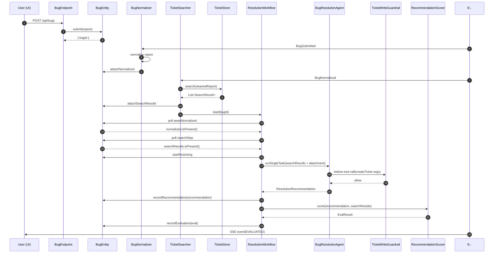
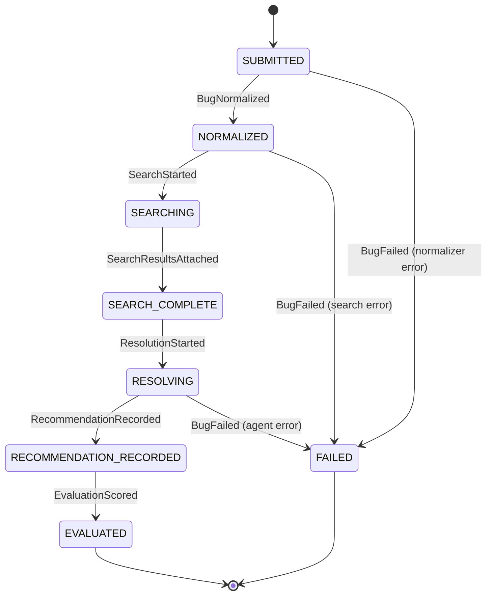
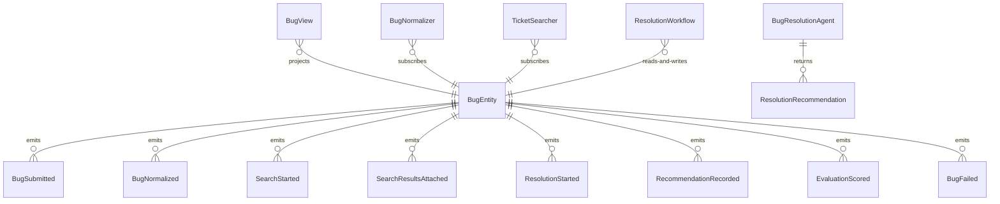

# PLAN — java-bug-assistant

Architectural sketch consumed by `/akka:plan` and rendered on the generated system's Architecture tab. The four mermaid diagrams below carry the theme variables and CSS overrides from Lesson 24; without them, state names render black-on-black and edge labels clip.

---

## Component graph

## Interaction sequence — J1 (happy path)

## State machine — `BugEntity`

## Entity model

## Component table — Java file targets

| Component | Path (generated) |
|---|---|
| `BugEndpoint` | `api/BugEndpoint.java` |
| `AppEndpoint` | `api/AppEndpoint.java` |
| `BugEntity` | `application/BugEntity.java` (state in `domain/Bug.java`, events in `domain/BugEvent.java`) |
| `BugNormalizer` | `application/BugNormalizer.java` |
| `TicketSearcher` | `application/TicketSearcher.java` |
| `TicketStore` | `application/TicketStore.java` |
| `ResolutionWorkflow` | `application/ResolutionWorkflow.java` |
| `BugResolutionAgent` | `application/BugResolutionAgent.java` (tasks in `application/BugTasks.java`) |
| `TicketWriteGuardrail` | `application/TicketWriteGuardrail.java` |
| `RecommendationScorer` | `application/RecommendationScorer.java` |
| `BugView` | `application/BugView.java` |
| `MockModelProvider` (option-a only) | `application/MockModelProvider.java` |
| Bootstrap | `Bootstrap.java` |

## Concurrency notes

- **Per-step timeout**: `awaitNormalizedStep` 15 s, `searchStep` 30 s, `resolveStep` 60 s, `evalStep` 5 s, `error` 5 s. Default step recovery `maxRetries(2).failoverTo(ResolutionWorkflow::error)`. The 60 s on `resolveStep` accommodates LLM latency (Lesson 4).
- **Idempotency**: every workflow uses `"resolution-" + bugId` as the workflow id; the `TicketSearcher` Consumer is allowed to redeliver `BugNormalized` events because `BugEntity.attachSearchResults` is event-version-guarded — a second search attempt against an already-searched bug is a no-op.
- **One agent per bug**: the AutonomousAgent instance id is `"resolver-" + bugId`, giving each task its own conversation context. The agent's `capability(...).maxIterationsPerTask(4)` caps guardrail-triggered retries at 4.
- **Guardrail-driven retry**: when `TicketWriteGuardrail` rejects a tool call, the rejection is returned as a structured error to the agent loop. The loop counts toward `maxIterationsPerTask`; if all 4 iterations fail validation, the workflow's `resolveStep` fails over to `error` and the entity transitions to `FAILED`.
- **Eval is synchronous and deterministic**: `RecommendationScorer` runs in-process inside `evalStep`. No LLM call, no external service — the same recommendation always scores the same.
- **TicketStore is read-only at runtime**: the seeded tickets are loaded once at startup and never mutated by the running workflow. The guardrail prevents unvalidated writes; validated writes in a real deployment would go through `BugEndpoint` → `BugEntity`, not directly through the store.
