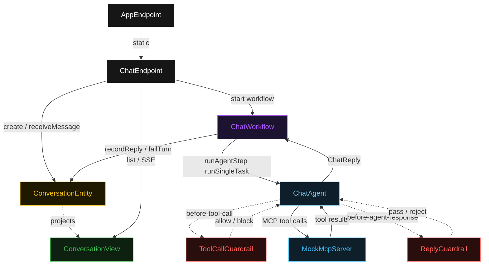
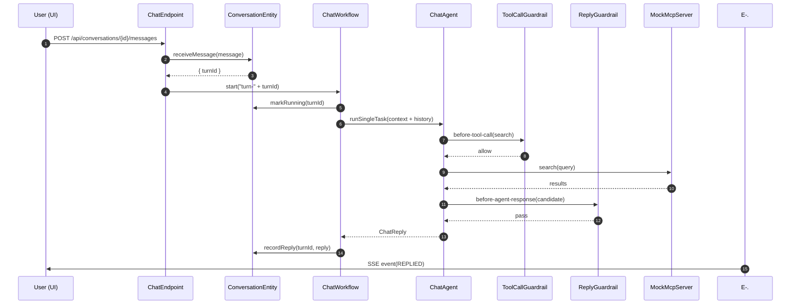
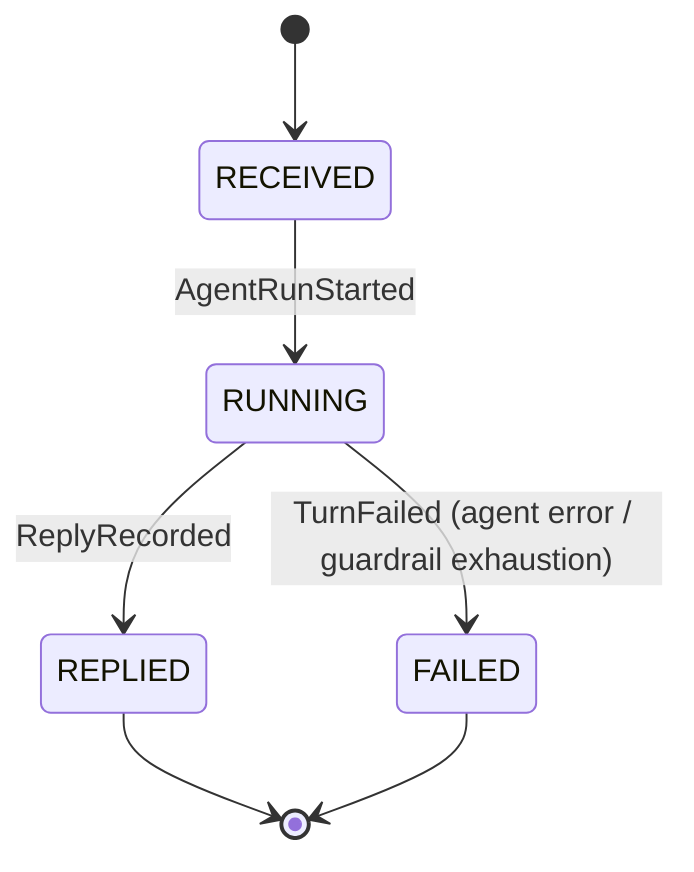
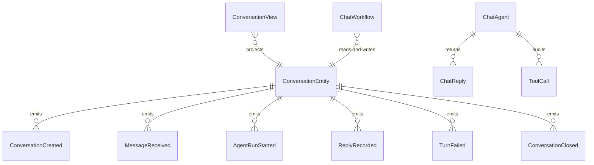

# PLAN — mcp-chat-server

Architectural sketch consumed by `/akka:plan` and rendered on the generated system's Architecture tab. The four mermaid diagrams below carry the theme variables and CSS overrides from Lesson 24; without them, state names render black-on-black and edge labels clip.

---

## Component graph

## Interaction sequence — J1 (happy path)

## State machine — `ConversationEntity` turn lifecycle

## Entity model

## Component table — Java file targets

| Component | Path (generated) |
|---|---|
| `ChatEndpoint` | `api/ChatEndpoint.java` |
| `AppEndpoint` | `api/AppEndpoint.java` |
| `ConversationEntity` | `application/ConversationEntity.java` (state in `domain/Conversation.java`, events in `domain/ConversationEvent.java`) |
| `ChatWorkflow` | `application/ChatWorkflow.java` |
| `ChatAgent` | `application/ChatAgent.java` (tasks in `application/ChatTasks.java`) |
| `ToolCallGuardrail` | `application/ToolCallGuardrail.java` |
| `ReplyGuardrail` | `application/ReplyGuardrail.java` |
| `ConversationView` | `application/ConversationView.java` |
| `MockMcpServer` | `application/MockMcpServer.java` |
| `MockModelProvider` (option-a only) | `application/MockModelProvider.java` |
| Bootstrap | `Bootstrap.java` |

## Concurrency notes

- **Per-step timeout**: `runAgentStep` 60 s, `recordReplyStep` 10 s, `error` 5 s. Default step recovery `maxRetries(2).failoverTo(ChatWorkflow::error)`. The 60 s on `runAgentStep` accommodates LLM latency plus MCP round-trips (Lesson 4).
- **Idempotency**: every workflow uses `"turn-" + turnId` as the workflow id; if `ChatEndpoint` receives a duplicate `POST /conversations/{id}/messages` with the same `turnId`, the second `ConversationEntity.receiveMessage` call is a no-op (event-version-guarded) and the second `start(ChatWorkflow)` is a no-op (workflow already exists).
- **One agent per conversation**: the AutonomousAgent instance id is `"agent-" + conversationId`, giving each conversation its own context window across turns. The agent's `capability(...).maxIterationsPerTask(4)` caps guardrail-triggered retries.
- **Blocked tool does not abort**: when `ToolCallGuardrail` blocks a call, the agent receives a structured refusal rather than an exception. The iteration counter is NOT incremented for blocked tool calls — only for rejected agent responses. This lets the agent recover gracefully within its budget.
- **Reply guardrail retry**: when `ReplyGuardrail` rejects a candidate response, the rejection is returned as a structured error to the agent loop. The loop counts toward `maxIterationsPerTask`; if all 4 iterations fail validation, the workflow's `runAgentStep` fails over to `error` and the turn transitions to `FAILED`.
- **MockMcpServer lifecycle**: the stub is started as a managed lifecycle bean before the Akka runtime begins accepting requests and shut down after the runtime drains. Graceful shutdown waits for in-flight tool calls to complete (timeout 5 s).
- **No saga / no compensation**: every step is either an entity command or a single-task agent call. There is nothing external to roll back.
