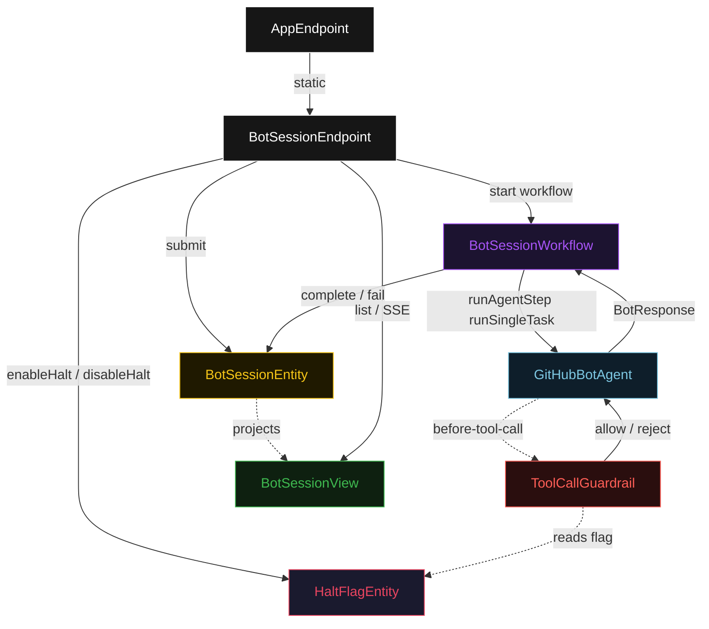
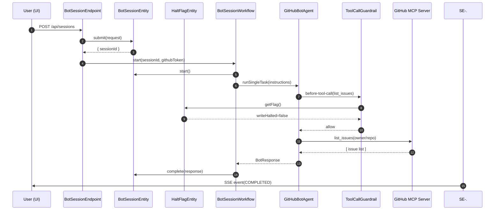
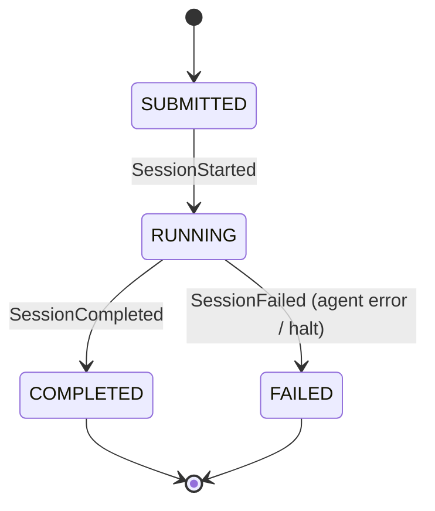
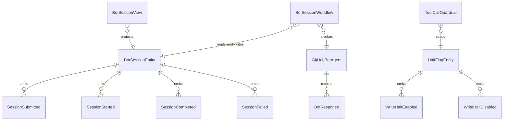

# PLAN — mcp-github-bot

Architectural sketch consumed by `/akka:plan` and rendered on the generated system's Architecture tab. The four mermaid diagrams below carry the theme variables and CSS overrides from Lesson 24; without them, state names render black-on-black and edge labels clip.

---

## Component graph

## Interaction sequence — J1 (happy path, no halt)

## State machine — `BotSessionEntity`

## Entity model

## Component table — Java file targets

| Component | Path (generated) |
|---|---|
| `BotSessionEndpoint` | `api/BotSessionEndpoint.java` |
| `AppEndpoint` | `api/AppEndpoint.java` |
| `BotSessionEntity` | `application/BotSessionEntity.java` (state in `domain/BotSession.java`, events in `domain/BotSessionEvent.java`) |
| `HaltFlagEntity` | `application/HaltFlagEntity.java` (state in `domain/HaltFlag.java`, events in `domain/HaltFlagEvent.java`) |
| `BotSessionWorkflow` | `application/BotSessionWorkflow.java` |
| `GitHubBotAgent` | `application/GitHubBotAgent.java` (tasks in `application/BotTasks.java`) |
| `ToolCallGuardrail` | `application/ToolCallGuardrail.java` |
| `BotSessionView` | `application/BotSessionView.java` |
| `MockModelProvider` (option-a only) | `application/MockModelProvider.java` |
| `MockGitHubMcpServer` (option-a only) | `application/MockGitHubMcpServer.java` |
| Bootstrap | `Bootstrap.java` |

## Concurrency notes

- **Per-step timeout**: `runAgentStep` 90 s (accommodates multiple MCP round-trips), `recordStep` 10 s, `error` 5 s. Default step recovery `maxRetries(1).failoverTo(BotSessionWorkflow::error)`. The 90 s covers multi-tool chains (Lesson 4).
- **Idempotency**: workflow id is `"session-" + sessionId`; `BotSessionEntity.start` is event-version-guarded — a second start attempt on an already-running session is a no-op.
- **One agent per session**: the AutonomousAgent instance id is `"bot-" + sessionId`, giving each task its own tool-call context. The agent's `capability(...).maxIterationsPerTask(5)` caps the tool-call loop.
- **Guardrail on every write tool call**: `ToolCallGuardrail` reads `HaltFlagEntity` synchronously on every write-class dispatch. The read is a local componentClient call (no network hop outside the runtime). Flag changes take effect on the next tool call — there is no TTL or cache.
- **Token isolation**: `BotRequest.githubToken` is passed to `BotSessionWorkflow` as a workflow-start parameter; it is forwarded to the `McpServerConfig` at agent invocation time. The field is OMITTED from `SessionSubmitted` event and from `BotSession` entity state. It never appears in the view, in any response body, or in logs.
- **No saga / no compensation**: each workflow step is either an agent call or a single entity write. There is no distributed transaction to roll back.
