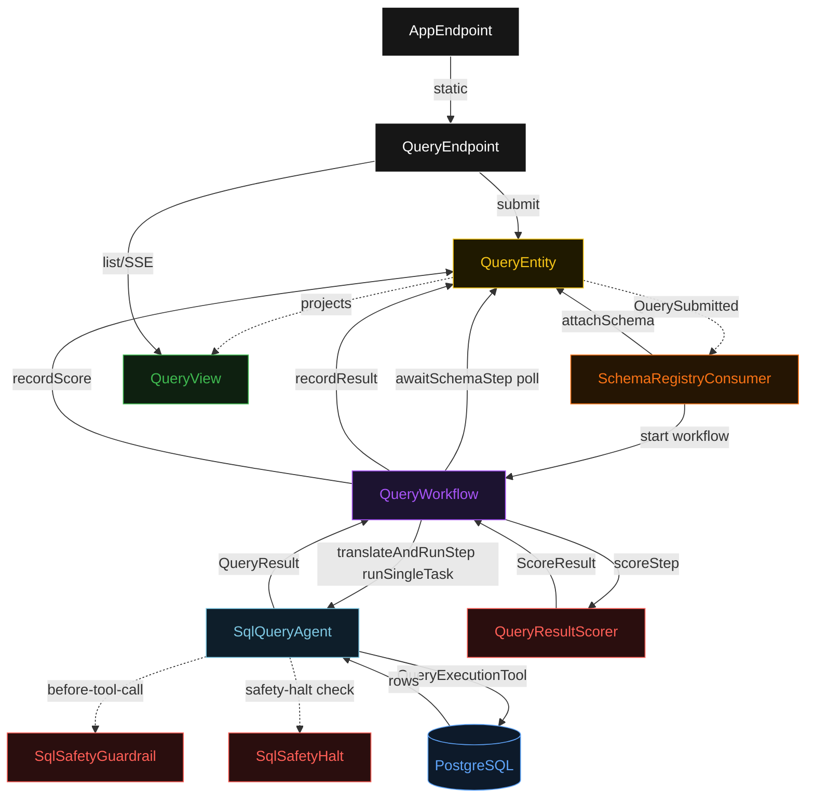
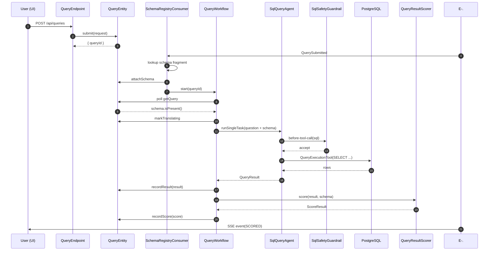
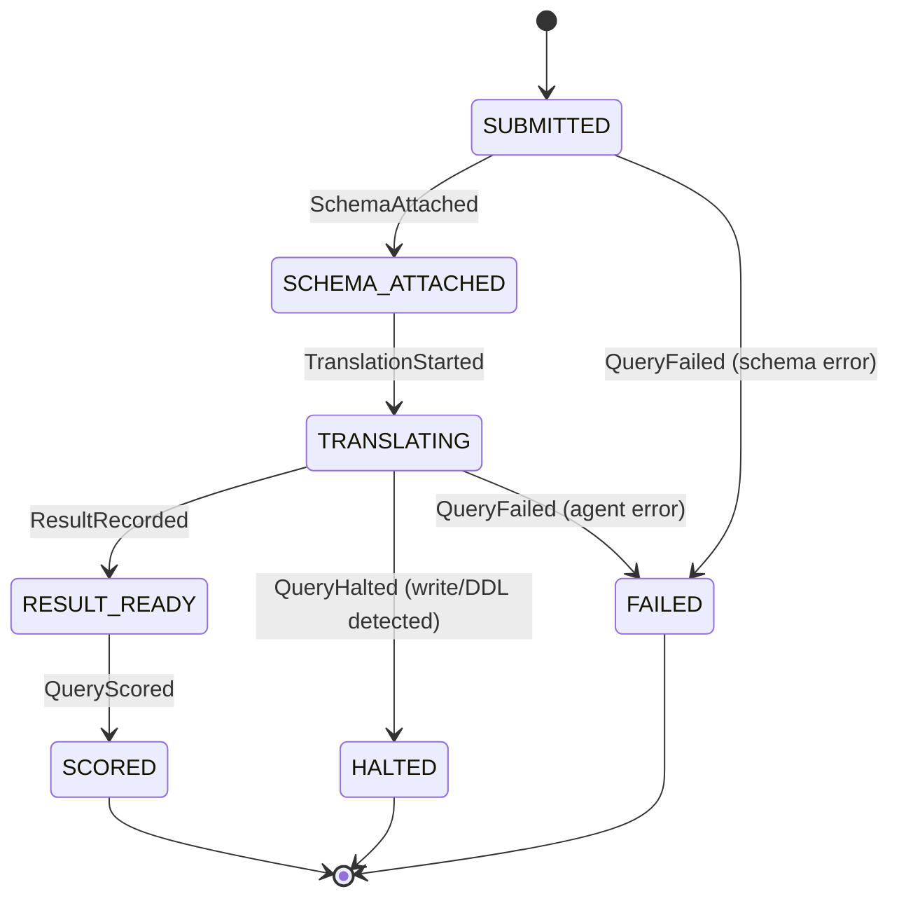
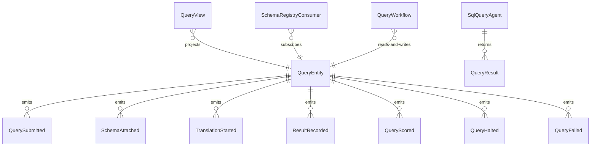

# PLAN — nl2sql

Architectural sketch consumed by `/akka:plan` and rendered on the generated system's Architecture tab. The four mermaid diagrams below carry the theme variables and CSS overrides from Lesson 24; without them, state names render black-on-black and edge labels clip.

---

## Component graph

## Interaction sequence — J1 (happy path)

## State machine — `QueryEntity`

## Entity model

## Component table — Java file targets

| Component | Path (generated) |
|---|---|
| `QueryEndpoint` | `api/QueryEndpoint.java` |
| `AppEndpoint` | `api/AppEndpoint.java` |
| `QueryEntity` | `application/QueryEntity.java` (state in `domain/Query.java`, events in `domain/QueryEvent.java`) |
| `SchemaRegistryConsumer` | `application/SchemaRegistryConsumer.java` |
| `QueryWorkflow` | `application/QueryWorkflow.java` |
| `SqlQueryAgent` | `application/SqlQueryAgent.java` (tasks in `application/QueryTasks.java`) |
| `SqlSafetyGuardrail` | `application/SqlSafetyGuardrail.java` |
| `SqlSafetyHalt` | `application/SqlSafetyHalt.java` |
| `QueryResultScorer` | `application/QueryResultScorer.java` |
| `SchemaRegistry` | `application/SchemaRegistry.java` |
| `QueryView` | `application/QueryView.java` |
| `MockModelProvider` (option-a only) | `application/MockModelProvider.java` |
| Bootstrap | `Bootstrap.java` |

## Concurrency notes

- **Per-step timeout**: `awaitSchemaStep` 10 s, `translateAndRunStep` 90 s, `scoreStep` 5 s, `error` 5 s. Default step recovery `maxRetries(2).failoverTo(QueryWorkflow::error)`. The 90 s on `translateAndRunStep` accommodates LLM latency plus Postgres round-trip (Lesson 4).
- **Idempotency**: every workflow uses `"query-" + queryId` as the workflow id; `SchemaRegistryConsumer` is idempotent because `QueryEntity.attachSchema` is event-version-guarded — a second schema attach on an already-attached query is a no-op.
- **One agent per query**: the AutonomousAgent instance id is `"agent-" + queryId`, giving each task its own conversation context. `capability(...).maxIterationsPerTask(4)` caps guardrail-triggered retries at 4.
- **Guardrail vs. halt**: G1 (`SqlSafetyGuardrail`) fires first and allows one retry per rejected tool call. H1 (`SqlSafetyHalt`) fires on the same event as a backstop; if the agent produces an unsafe SQL after exhausting retries, the halt terminates the task and the entity moves to `HALTED`.
- **Scorer is synchronous and deterministic**: `QueryResultScorer` runs in-process inside `scoreStep`. No LLM call, no Postgres query — the same result always scores the same. This is the single-agent invariant.
- **Read-only database role**: `QueryExecutionTool` connects with a Postgres role that has SELECT-only permissions, provisioned by init.sql. Even without G1/H1, a write attempt would fail at the database level — the governance layers catch it earlier and surface a clean error.
