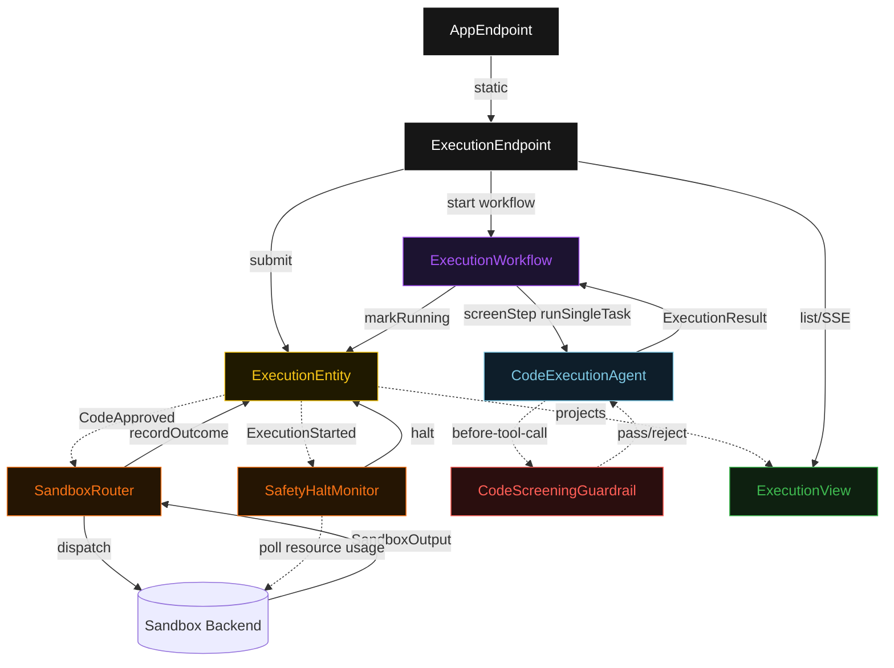
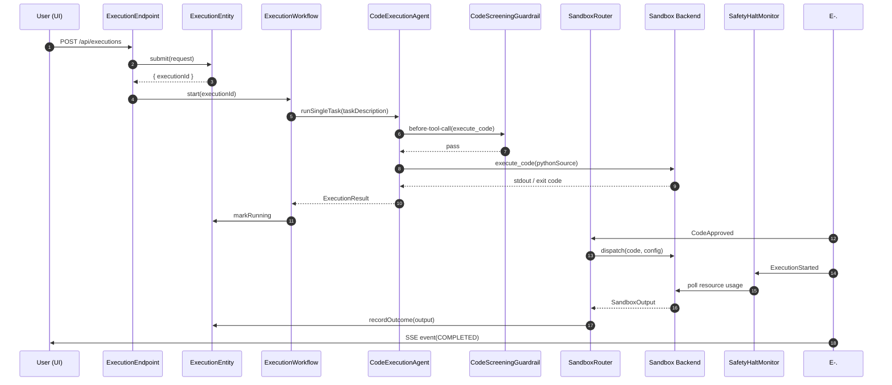
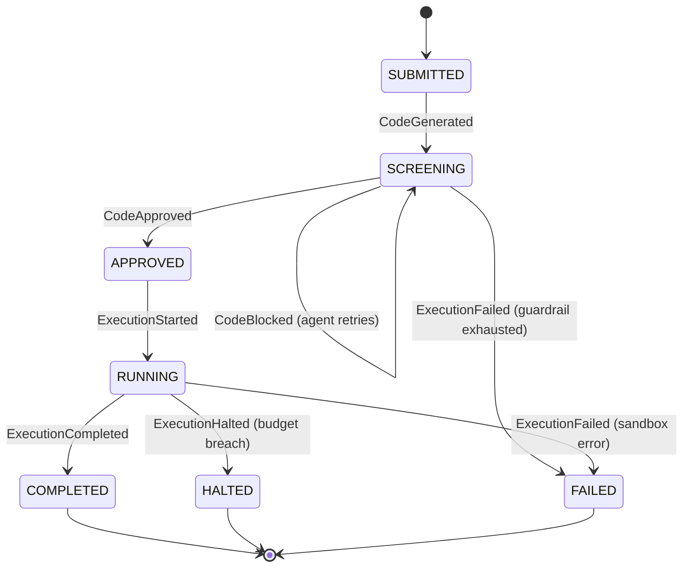
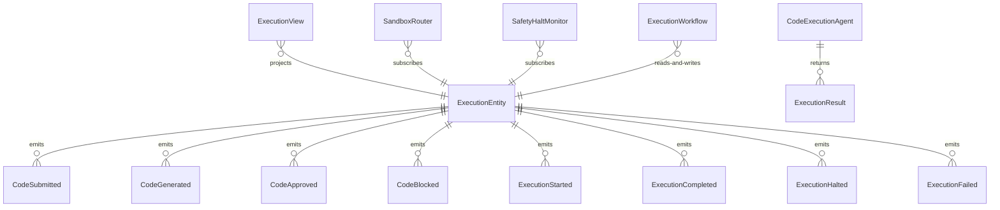

# PLAN — sandboxed-code-agent

Architectural sketch consumed by `/akka:plan` and rendered on the generated system's Architecture tab. The four mermaid diagrams below carry the theme variables and CSS overrides from Lesson 24; without them, state names render black-on-black and edge labels clip.

---

## Component graph

## Interaction sequence — J1 (happy path)

## State machine — `ExecutionEntity`

## Entity model

## Component table — Java file targets

| Component | Path (generated) |
|---|---|
| `ExecutionEndpoint` | `api/ExecutionEndpoint.java` |
| `AppEndpoint` | `api/AppEndpoint.java` |
| `ExecutionEntity` | `application/ExecutionEntity.java` (state in `domain/Execution.java`, events in `domain/ExecutionEvent.java`) |
| `SandboxRouter` | `application/SandboxRouter.java` |
| `SafetyHaltMonitor` | `application/SafetyHaltMonitor.java` |
| `ExecutionWorkflow` | `application/ExecutionWorkflow.java` |
| `CodeExecutionAgent` | `application/CodeExecutionAgent.java` (tasks in `application/ExecutionTasks.java`) |
| `CodeScreeningGuardrail` | `application/CodeScreeningGuardrail.java` |
| `SandboxDispatcher` (interface) | `application/sandbox/SandboxDispatcher.java` |
| `DockerSandboxDispatcher` | `application/sandbox/DockerSandboxDispatcher.java` |
| `E2BSandboxDispatcher` | `application/sandbox/E2BSandboxDispatcher.java` |
| `ModalSandboxDispatcher` | `application/sandbox/ModalSandboxDispatcher.java` |
| `PlaywrightSandboxDispatcher` | `application/sandbox/PlaywrightSandboxDispatcher.java` |
| `ExecutionView` | `application/ExecutionView.java` |
| `MockModelProvider` (option-a only) | `application/MockModelProvider.java` |
| Bootstrap | `Bootstrap.java` |

## Concurrency notes

- **Per-step timeout**: `screenStep` 60 s, `runStep` max(wallClockBudgetSeconds + 10, 15) s, `recordStep` 5 s, `error` 5 s. Default step recovery `maxRetries(2).failoverTo(ExecutionWorkflow::error)`. The 60 s on `screenStep` accommodates LLM latency including guardrail-triggered retries (Lesson 4).
- **Idempotency**: every workflow uses `"exec-" + executionId` as the workflow id; `ExecutionEntity.submit` is event-version-guarded — a duplicate submit against an already-started execution is a no-op.
- **One agent per execution**: the AutonomousAgent instance id is `"agent-" + executionId`, giving each task its own conversation context. `.maxIterationsPerTask(4)` caps guardrail-triggered retries at 4.
- **Guardrail-driven retry**: when `CodeScreeningGuardrail` rejects a candidate tool call, the rejection surfaces as a structured tool error to the agent loop. The loop counts toward `maxIterationsPerTask`; if all 4 iterations fail screening, `screenStep` fails over to `error` and the entity transitions to `FAILED`.
- **SafetyHaltMonitor runs independently**: the monitor's polling loop is a `ScheduledExecutorService` task, not an agent iteration. It fires based on observed sandbox resource usage. The agent may have already completed by the time a halt fires — the entity's event-version guard ensures `ExecutionHalted` is a no-op if `ExecutionCompleted` already landed.
- **SandboxRouter is pull-push**: on `CodeApproved` it reads `ExecutionEntity.getExecution()` for the code + config, dispatches to the chosen `SandboxDispatcher`, and calls `recordOutcome`. If dispatch throws, `SandboxRouter` calls `fail(reason)` on the entity.
- **No saga / no compensation**: the sandbox is fully ephemeral (Docker container or cloud microVM). There is nothing to roll back; a FAILED execution is terminal with its partial state preserved for inspection.
