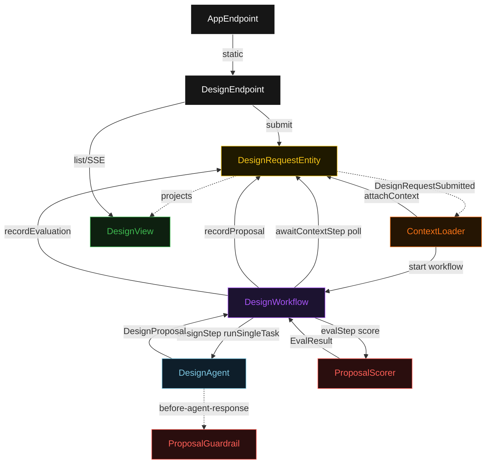
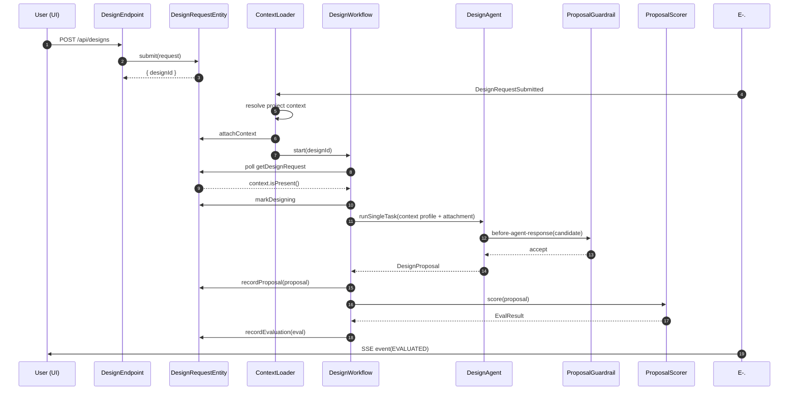
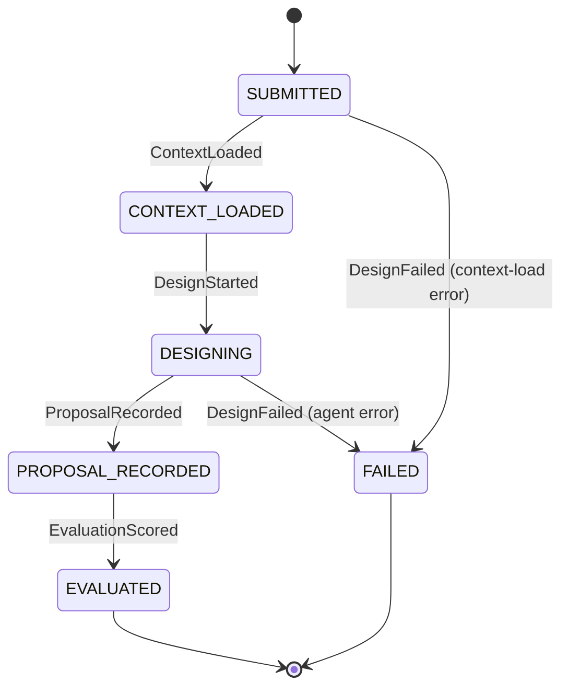
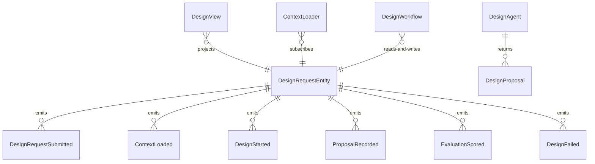

# PLAN — sdlc-technical-designer

Architectural sketch consumed by `/akka:plan` and rendered on the generated system's Architecture tab. The four mermaid diagrams below carry the theme variables and CSS overrides from Lesson 24; without them, state names render black-on-black and edge labels clip.

---

## Component graph

## Interaction sequence — J1 (happy path)

## State machine — `DesignRequestEntity`

## Entity model

## Component table — Java file targets

| Component | Path (generated) |
|---|---|
| `DesignEndpoint` | `api/DesignEndpoint.java` |
| `AppEndpoint` | `api/AppEndpoint.java` |
| `DesignRequestEntity` | `application/DesignRequestEntity.java` (state in `domain/DesignRequestState.java`, events in `domain/DesignEvent.java`) |
| `ContextLoader` | `application/ContextLoader.java` |
| `DesignWorkflow` | `application/DesignWorkflow.java` |
| `DesignAgent` | `application/DesignAgent.java` (tasks in `application/DesignTasks.java`) |
| `ProposalGuardrail` | `application/ProposalGuardrail.java` |
| `ProposalScorer` | `application/ProposalScorer.java` |
| `DesignView` | `application/DesignView.java` |
| `MockModelProvider` (option-a only) | `application/MockModelProvider.java` |
| Bootstrap | `Bootstrap.java` |

## Concurrency notes

- **Per-step timeout**: `awaitContextStep` 15 s, `designStep` 90 s, `evalStep` 5 s, `error` 5 s. Default step recovery `maxRetries(2).failoverTo(DesignWorkflow::error)`. The 90 s on `designStep` accommodates LLM latency on larger feature descriptions (Lesson 4).
- **Idempotency**: every workflow uses `"design-" + designId` as the workflow id; the `ContextLoader` Consumer is allowed to redeliver `DesignRequestSubmitted` events because `DesignRequestEntity.attachContext` is event-version-guarded — a second context-load attempt against an already-loaded request is a no-op.
- **One agent per request**: the AutonomousAgent instance id is `"designer-" + designId`, which gives each task its own conversation context. The agent's `capability(...).maxIterationsPerTask(3)` caps guardrail-triggered retries at 3.
- **Guardrail-driven retry**: when `ProposalGuardrail` rejects a candidate response, the rejection is returned as a structured error to the agent loop. The loop counts toward `maxIterationsPerTask`; if all 3 iterations fail validation, the workflow's `designStep` fails over to `error` and the entity transitions to `FAILED`.
- **Eval is synchronous and deterministic**: `ProposalScorer` runs in-process inside `evalStep`. No LLM call, no external service — the same proposal always scores the same. This is a deliberate single-agent guarantee.
- **No saga / no compensation**: every step is either a pure read, an append-only event write, or a single-task agent call. There is nothing external to roll back.
