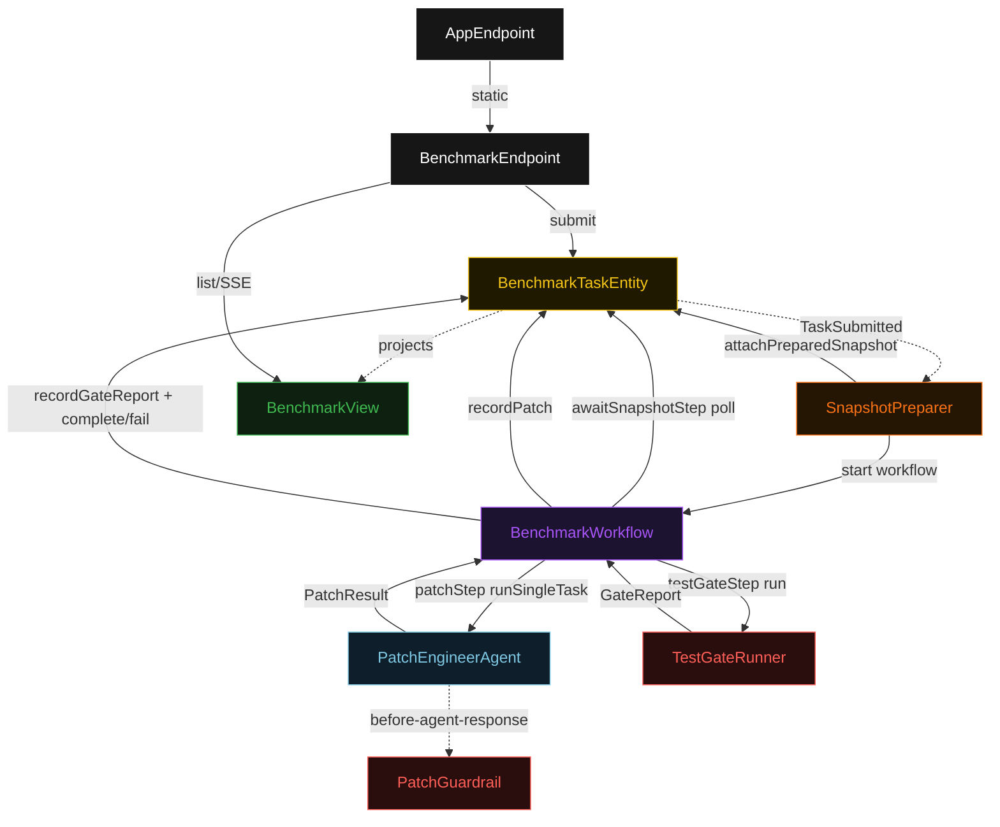
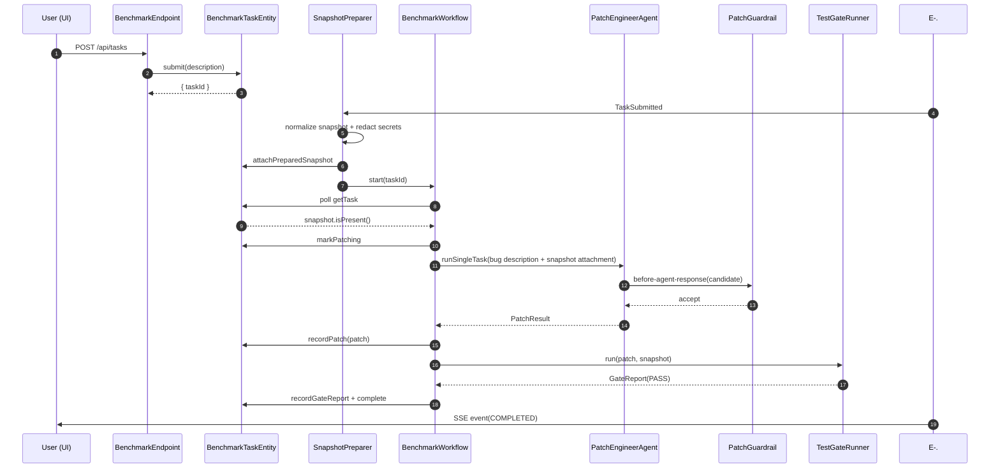
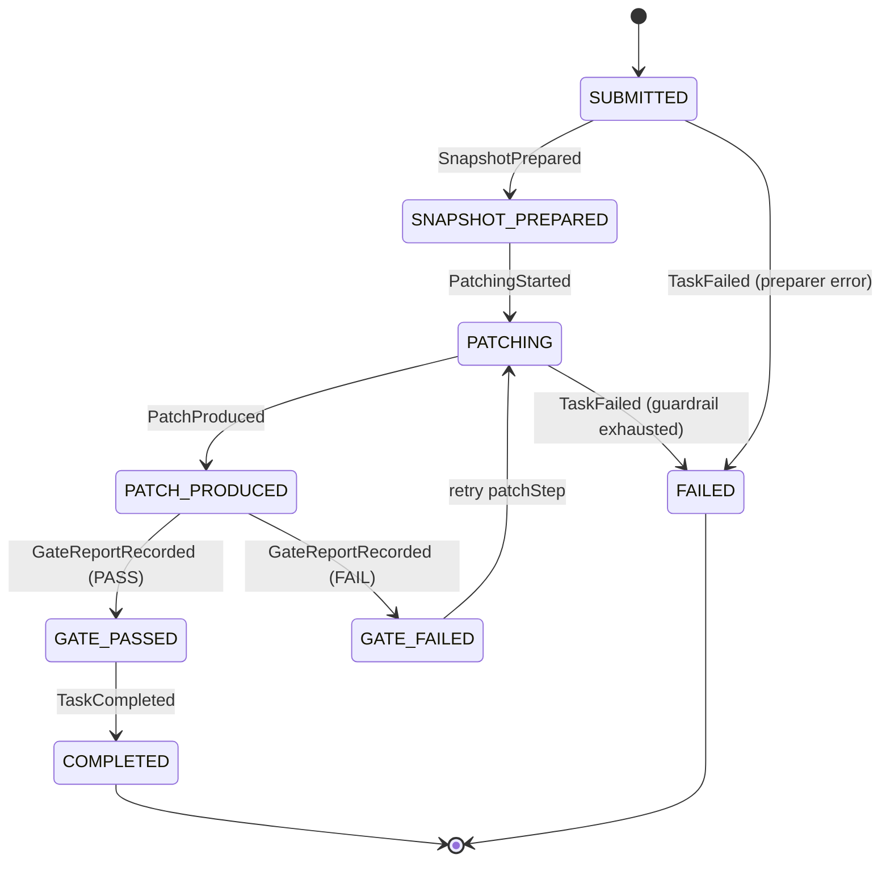
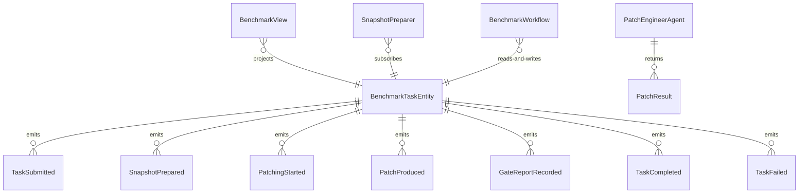

# PLAN — swe-bench-agent

Architectural sketch consumed by `/akka:plan` and rendered on the generated system's Architecture tab. The four mermaid diagrams below carry the theme variables and CSS overrides from Lesson 24; without them, state names render black-on-black and edge labels clip.

---

## Component graph

## Interaction sequence — J1 (happy path)

## State machine — `BenchmarkTaskEntity`

## Entity model

## Component table — Java file targets

| Component | Path (generated) |
|---|---|
| `BenchmarkEndpoint` | `api/BenchmarkEndpoint.java` |
| `AppEndpoint` | `api/AppEndpoint.java` |
| `BenchmarkTaskEntity` | `application/BenchmarkTaskEntity.java` (state in `domain/BenchmarkTask.java`, events in `domain/BenchmarkEvent.java`) |
| `SnapshotPreparer` | `application/SnapshotPreparer.java` |
| `BenchmarkWorkflow` | `application/BenchmarkWorkflow.java` |
| `PatchEngineerAgent` | `application/PatchEngineerAgent.java` (tasks in `application/BenchmarkTasks.java`) |
| `PatchGuardrail` | `application/PatchGuardrail.java` |
| `TestGateRunner` | `application/TestGateRunner.java` |
| `BenchmarkView` | `application/BenchmarkView.java` |
| `MockModelProvider` (option-a only) | `application/MockModelProvider.java` |
| Bootstrap | `Bootstrap.java` |

## Concurrency notes

- **Per-step timeout**: `awaitSnapshotStep` 15 s, `patchStep` 120 s, `testGateStep` 30 s, `error` 5 s. Default step recovery `maxRetries(2).failoverTo(BenchmarkWorkflow::error)`. The 120 s on `patchStep` accommodates LLM latency on larger snapshots (Lesson 4).
- **Idempotency**: every workflow uses `"bench-" + taskId` as the workflow id; the `SnapshotPreparer` Consumer is allowed to redeliver `TaskSubmitted` events because `BenchmarkTaskEntity.attachPreparedSnapshot` is event-version-guarded — a second prepare attempt against an already-prepared task is a no-op.
- **One agent per task**: the AutonomousAgent instance id is `"engineer-" + taskId`, giving each task its own conversation context. The agent's `capability(...).maxIterationsPerTask(3)` caps guardrail-triggered retries at 3.
- **Gate-driven retry**: when `TestGateRunner` returns `GateVerdict.FAIL`, the workflow transitions the entity to `GATE_FAILED` and loops back to `patchStep` (within the step's `maxRetries(2)`). If retries are exhausted, the entity transitions to `FAILED`.
- **Gate is synchronous and deterministic**: `TestGateRunner` runs in-process inside `testGateStep`. No LLM call, no external service — the same patch always produces the same gate report.
- **No saga / no compensation**: every step is either pure read, append-only event write, or a single-task agent call. There is nothing external to roll back.
