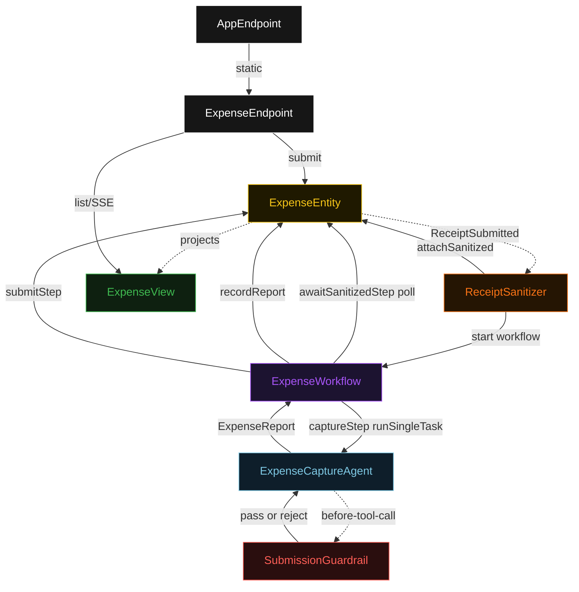
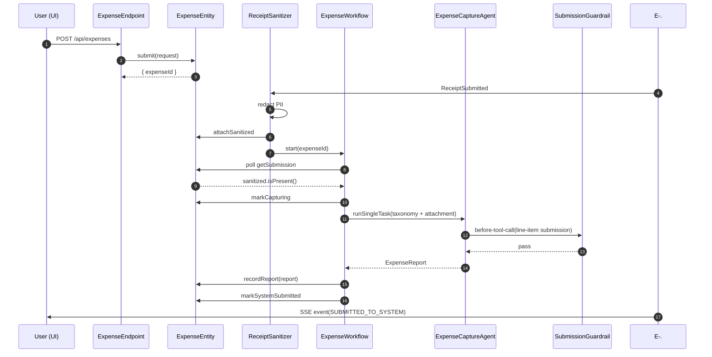
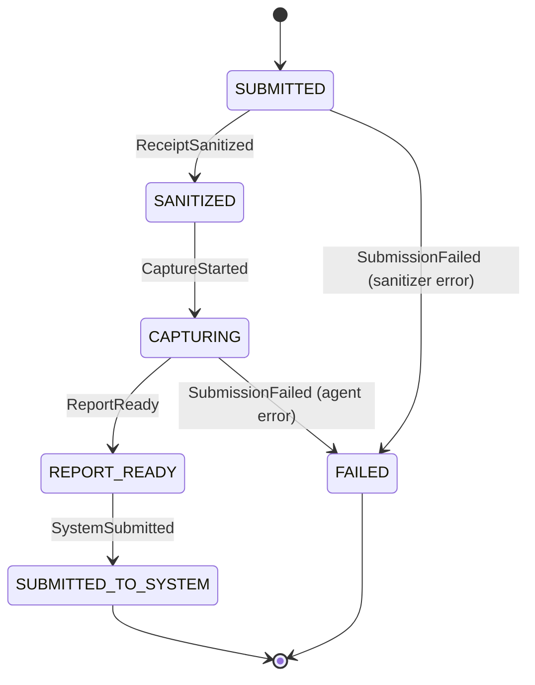
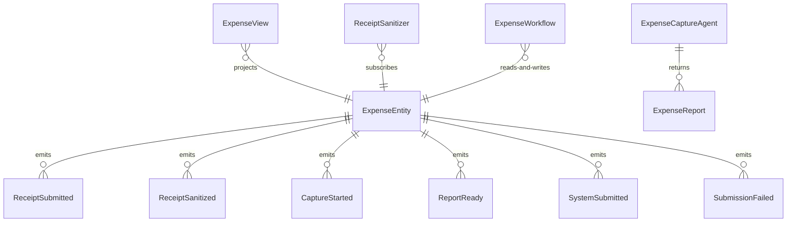

# PLAN — ambient-expense-agent

Architectural sketch consumed by `/akka:plan` and rendered on the generated system's Architecture tab. The four mermaid diagrams below carry the theme variables and CSS overrides from Lesson 24; without them, state names render black-on-black and edge labels clip.

---

## Component graph

## Interaction sequence — J1 (happy path)

## State machine — `ExpenseEntity`

## Entity model

## Component table — Java file targets

| Component | Path (generated) |
|---|---|
| `ExpenseEndpoint` | `api/ExpenseEndpoint.java` |
| `AppEndpoint` | `api/AppEndpoint.java` |
| `ExpenseEntity` | `application/ExpenseEntity.java` (state in `domain/ExpenseSubmission.java`, events in `domain/ExpenseEvent.java`) |
| `ReceiptSanitizer` | `application/ReceiptSanitizer.java` |
| `ExpenseWorkflow` | `application/ExpenseWorkflow.java` |
| `ExpenseCaptureAgent` | `application/ExpenseCaptureAgent.java` (tasks in `application/ExpenseTasks.java`) |
| `SubmissionGuardrail` | `application/SubmissionGuardrail.java` |
| `ExpenseView` | `application/ExpenseView.java` |
| `MockModelProvider` (option-a only) | `application/MockModelProvider.java` |
| Bootstrap | `Bootstrap.java` |

## Concurrency notes

- **Per-step timeout**: `awaitSanitizedStep` 15 s, `captureStep` 60 s, `submitStep` 10 s, `error` 5 s. Default step recovery `maxRetries(2).failoverTo(ExpenseWorkflow::error)`. The 60 s on `captureStep` accommodates LLM latency and multi-item extraction (Lesson 4).
- **Idempotency**: every workflow uses `"expense-" + expenseId` as the workflow id; the `ReceiptSanitizer` Consumer is allowed to redeliver `ReceiptSubmitted` events because `ExpenseEntity.attachSanitized` is event-version-guarded — a second sanitize attempt on an already-sanitized submission is a no-op.
- **One agent per submission**: the AutonomousAgent instance id is `"capture-" + expenseId`, giving each task its own conversation context. The agent's `capability(...).maxIterationsPerTask(4)` caps guardrail-triggered retries at 4 — sufficient for a multi-item receipt where several items may need reclassification.
- **Guardrail-driven correction**: when `SubmissionGuardrail` rejects a tool call for a single line item, the rejection is returned as a structured error to the agent loop. The agent can correct the item's category or amount, or mark it `BLOCKED` and proceed to the next item. A full budget exhaustion results in the workflow `captureStep` failing over to `error`.
- **No saga / no compensation**: every step is pure read, append-only event write, or a single-task agent call. There is nothing external to roll back in the simulated expense-system path.
