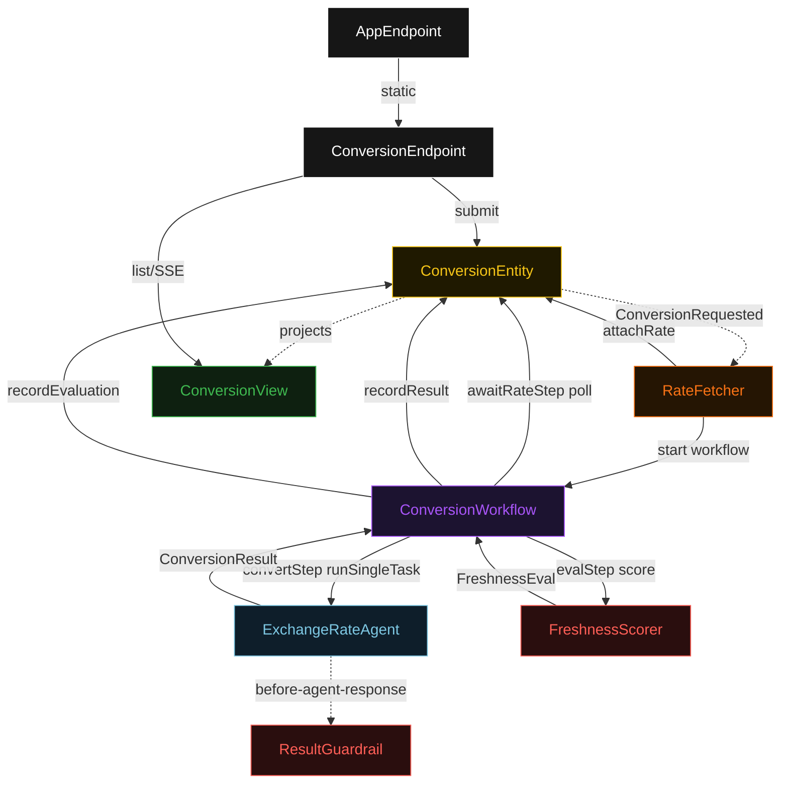
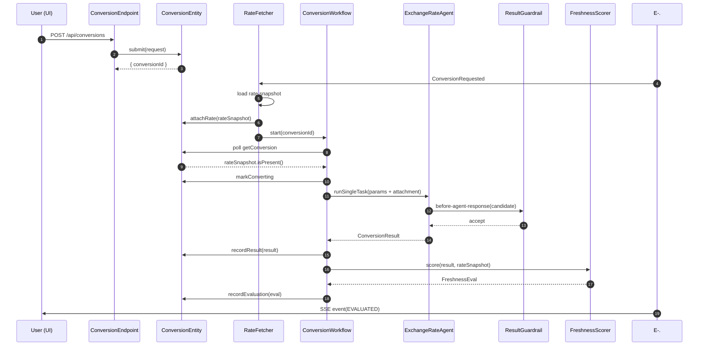
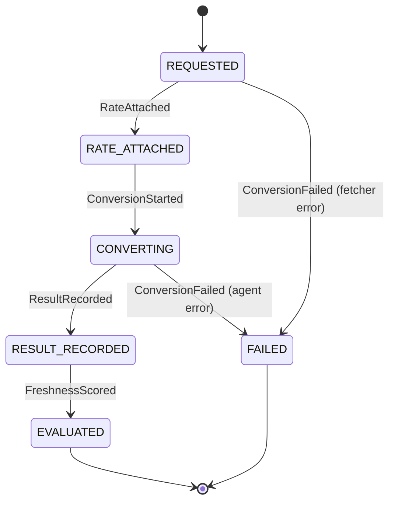
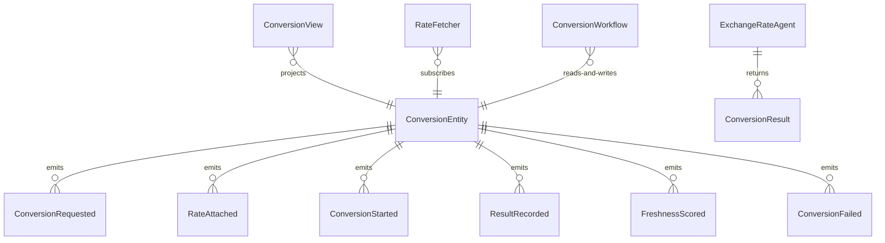

# PLAN — currency-agent

Architectural sketch consumed by `/akka:plan` and rendered on the generated system's Architecture tab. The four mermaid diagrams below carry the theme variables and CSS overrides from Lesson 24; without them, state names render black-on-black and edge labels clip.

---

## Component graph

## Interaction sequence — J1 (happy path)

## State machine — `ConversionEntity`

## Entity model

## Component table — Java file targets

| Component | Path (generated) |
|---|---|
| `ConversionEndpoint` | `api/ConversionEndpoint.java` |
| `AppEndpoint` | `api/AppEndpoint.java` |
| `ConversionEntity` | `application/ConversionEntity.java` (state in `domain/Conversion.java`, events in `domain/ConversionEvent.java`) |
| `RateFetcher` | `application/RateFetcher.java` |
| `ConversionWorkflow` | `application/ConversionWorkflow.java` |
| `ExchangeRateAgent` | `application/ExchangeRateAgent.java` (tasks in `application/ConversionTasks.java`) |
| `ResultGuardrail` | `application/ResultGuardrail.java` |
| `FreshnessScorer` | `application/FreshnessScorer.java` |
| `ConversionView` | `application/ConversionView.java` |
| `MockModelProvider` (option-a only) | `application/MockModelProvider.java` |
| Bootstrap | `Bootstrap.java` |

## Concurrency notes

- **Per-step timeout**: `awaitRateStep` 15 s, `convertStep` 60 s, `evalStep` 5 s, `error` 5 s. Default step recovery `maxRetries(2).failoverTo(ConversionWorkflow::error)`. The 60 s on `convertStep` accommodates LLM latency (Lesson 4).
- **Idempotency**: every workflow uses `"conv-" + conversionId` as the workflow id; the `RateFetcher` Consumer is allowed to redeliver `ConversionRequested` events because `ConversionEntity.attachRate` is event-version-guarded — a second rate-attach attempt on an already rate-attached conversion is a no-op.
- **One agent per conversion**: the AutonomousAgent instance id is `"agent-" + conversionId`, giving each task its own conversation context. The agent's `capability(...).maxIterationsPerTask(3)` caps guardrail-triggered retries at 3.
- **Guardrail-driven retry**: when `ResultGuardrail` rejects a candidate response, the rejection is returned as a structured error to the agent loop. The loop counts toward `maxIterationsPerTask`; if all 3 iterations fail validation, the workflow's `convertStep` fails over to `error` and the entity transitions to `FAILED`.
- **Eval is synchronous and deterministic**: `FreshnessScorer` runs in-process inside `evalStep`. No LLM call, no external service — the same rate snapshot and result always score the same. This preserves the single-agent guarantee.
- **No saga / no compensation**: every step is either pure read, append-only event write, or a single-task agent call. There is nothing external to roll back.
