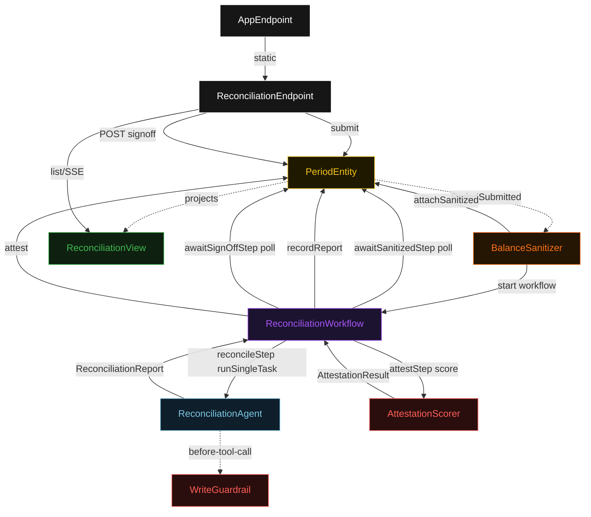
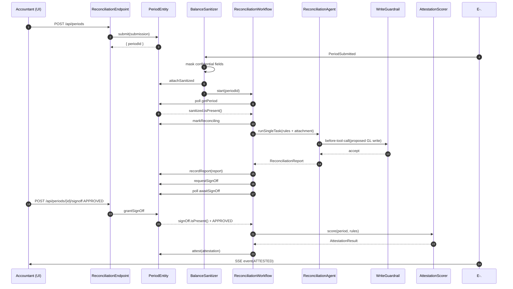
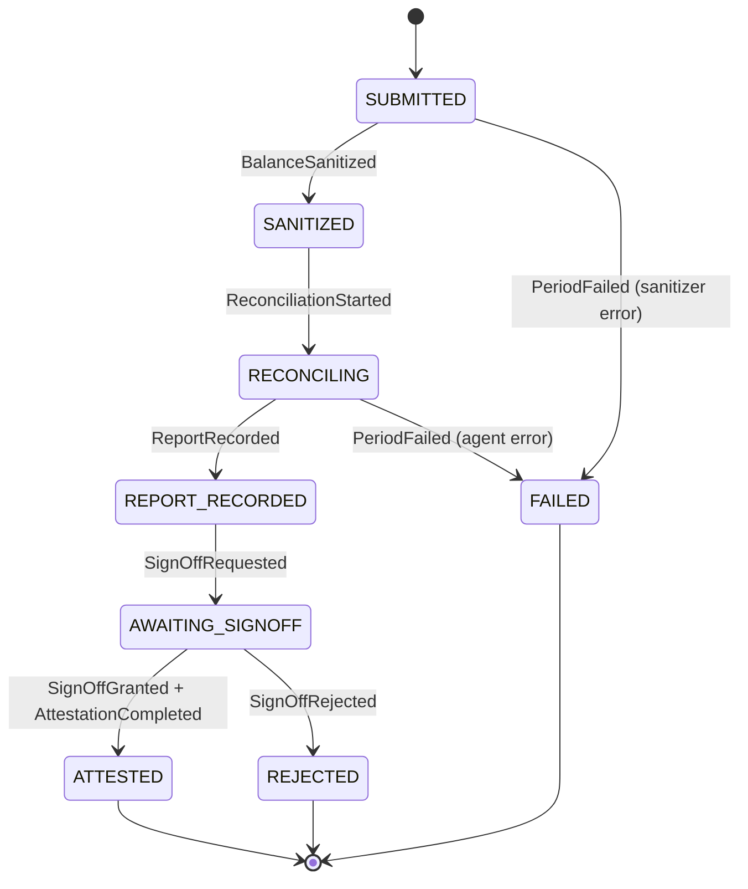
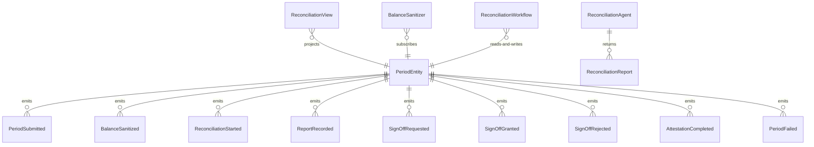

# PLAN — finance-close-reconciler

Architectural sketch consumed by `/akka:plan` and rendered on the generated system's Architecture tab. The four mermaid diagrams below carry the theme variables and CSS overrides from Lesson 24; without them, state names render black-on-black and edge labels clip.

---

## Component graph

## Interaction sequence — J1 (happy path)

## State machine — `PeriodEntity`

## Entity model

## Component table — Java file targets

| Component | Path (generated) |
|---|---|
| `ReconciliationEndpoint` | `api/ReconciliationEndpoint.java` |
| `AppEndpoint` | `api/AppEndpoint.java` |
| `PeriodEntity` | `application/PeriodEntity.java` (state in `domain/Period.java`, events in `domain/PeriodEvent.java`) |
| `BalanceSanitizer` | `application/BalanceSanitizer.java` |
| `ReconciliationWorkflow` | `application/ReconciliationWorkflow.java` |
| `ReconciliationAgent` | `application/ReconciliationAgent.java` (tasks in `application/ReconciliationTasks.java`) |
| `WriteGuardrail` | `application/WriteGuardrail.java` |
| `AttestationScorer` | `application/AttestationScorer.java` |
| `AttestationGateTest` | `test/AttestationGateTest.java` |
| `ReconciliationView` | `application/ReconciliationView.java` |
| `MockModelProvider` (option-a only) | `application/MockModelProvider.java` |
| Bootstrap | `Bootstrap.java` |

## Concurrency notes

- **Per-step timeout**: `awaitSanitizedStep` 15 s, `reconcileStep` 90 s, `awaitSignOffStep` 86400 s (24 h — human latency is unbounded), `attestStep` 5 s, `error` 5 s. Default step recovery `maxRetries(2).failoverTo(ReconciliationWorkflow::error)`. The 90 s on `reconcileStep` accommodates both LLM latency and multiple guardrail-rejected tool-call retries (Lesson 4).
- **Idempotency**: every workflow uses `"recon-" + periodId` as the workflow id; the `BalanceSanitizer` Consumer is allowed to redeliver `PeriodSubmitted` events because `PeriodEntity.attachSanitized` is event-version-guarded — a second sanitize attempt against an already-sanitized period is a no-op.
- **One agent per period**: the AutonomousAgent instance id is `"reconciler-" + periodId`, which gives each task its own conversation context. The agent's `capability(...).maxIterationsPerTask(4)` caps guardrail-triggered retries at 4.
- **Guardrail-driven retry**: when `WriteGuardrail` rejects a candidate tool call, the rejection is returned as a structured error to the agent loop. The loop counts toward `maxIterationsPerTask`; if all 4 iterations fail validation, the workflow's `reconcileStep` fails over to `error` and the entity transitions to `FAILED`.
- **HITL pause**: `awaitSignOffStep` uses a 24 h timeout. If the accountant does not respond within 24 h, the step times out and the workflow transitions to `FAILED` with reason `"sign-off-timeout"`.
- **Attestation is synchronous and deterministic**: `AttestationScorer` runs in-process inside `attestStep`. No LLM call — the same event chain always produces the same attestation result.
- **No saga / no compensation**: GL writes proposed by the agent are tool-call outputs stored in `ReconciliationReport.proposedGlWrites`. Actual posting to an ERP is out of scope; the blueprint records the proposals so a human operator can post them after sign-off.
