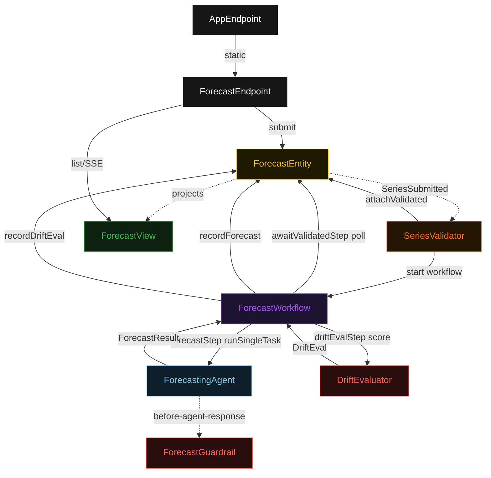
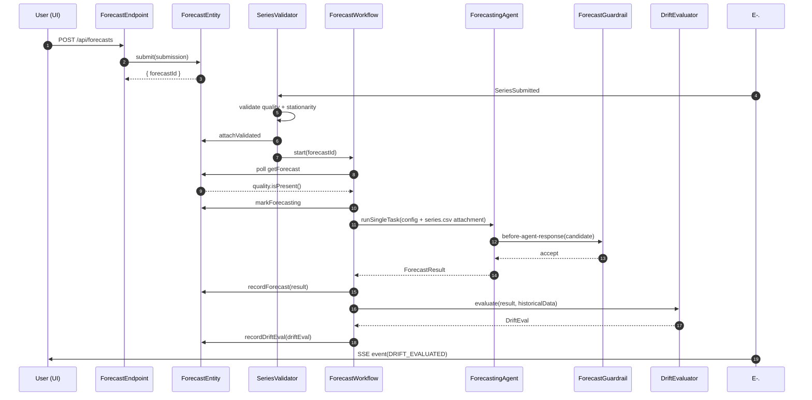
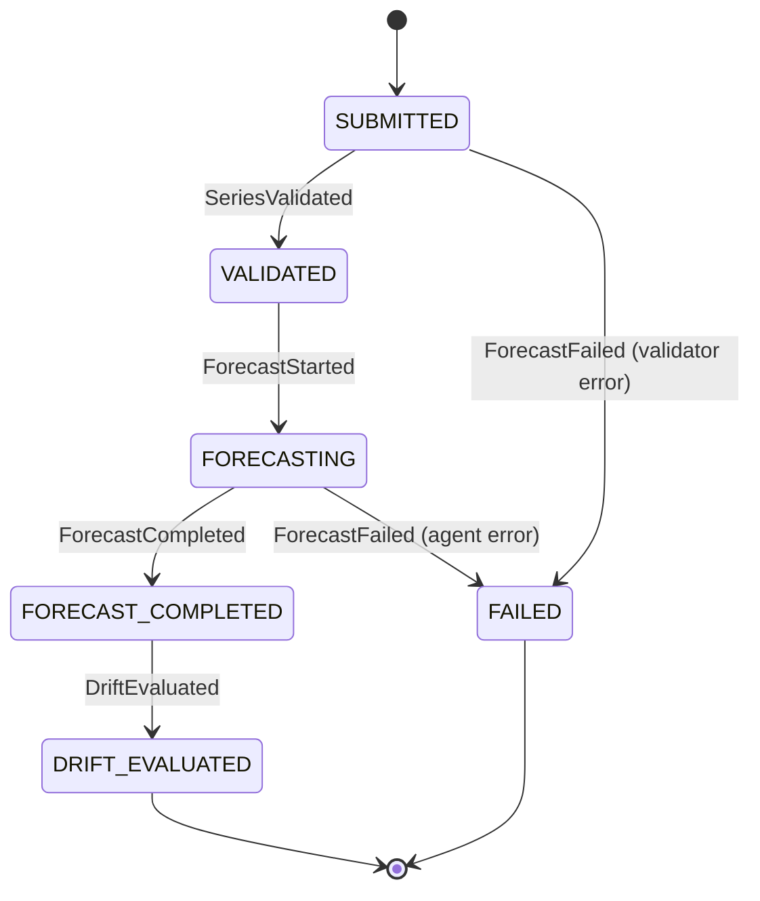
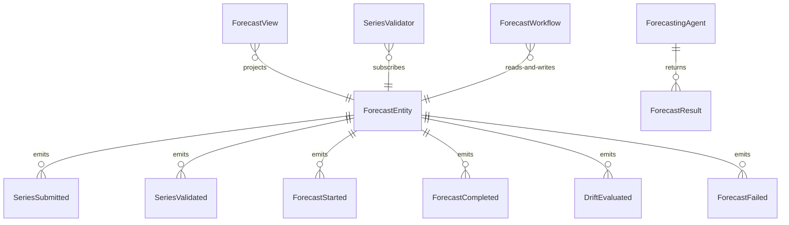

# PLAN — time-series-forecasting (java)

Architectural sketch consumed by `/akka:plan` and rendered on the generated system's Architecture tab. The four mermaid diagrams below carry the theme variables and CSS overrides from Lesson 24; without them, state names render black-on-black and edge labels clip.

---

## Component graph

## Interaction sequence — J1 (happy path)

## State machine — `ForecastEntity`

## Entity model

## Component table — Java file targets

| Component | Path (generated) |
|---|---|
| `ForecastEndpoint` | `api/ForecastEndpoint.java` |
| `AppEndpoint` | `api/AppEndpoint.java` |
| `ForecastEntity` | `application/ForecastEntity.java` (state in `domain/Forecast.java`, events in `domain/ForecastEvent.java`) |
| `SeriesValidator` | `application/SeriesValidator.java` |
| `ForecastWorkflow` | `application/ForecastWorkflow.java` |
| `ForecastingAgent` | `application/ForecastingAgent.java` (tasks in `application/ForecastTasks.java`) |
| `ForecastGuardrail` | `application/ForecastGuardrail.java` |
| `DriftEvaluator` | `application/DriftEvaluator.java` |
| `ForecastView` | `application/ForecastView.java` |
| `MockModelProvider` (option-a only) | `application/MockModelProvider.java` |
| Bootstrap | `Bootstrap.java` |

## Concurrency notes

- **Per-step timeout**: `awaitValidatedStep` 15 s, `forecastStep` 60 s, `driftEvalStep` 5 s, `error` 5 s. Default step recovery `maxRetries(2).failoverTo(ForecastWorkflow::error)`. The 60 s on `forecastStep` accommodates LLM latency on long series (Lesson 4).
- **Idempotency**: every workflow uses `"forecast-" + forecastId` as the workflow id; the `SeriesValidator` Consumer is allowed to redeliver `SeriesSubmitted` events because `ForecastEntity.attachValidated` is event-version-guarded — a second validate attempt against an already-validated forecast is a no-op.
- **One agent per forecast**: the AutonomousAgent instance id is `"forecaster-" + forecastId`, which gives each task its own conversation context. The agent's `capability(...).maxIterationsPerTask(3)` caps guardrail-triggered retries at 3.
- **Guardrail-driven retry**: when `ForecastGuardrail` rejects a candidate response, the rejection is returned as a structured error to the agent loop. The loop counts toward `maxIterationsPerTask`; if all 3 iterations fail validation, the workflow's `forecastStep` fails over to `error` and the entity transitions to `FAILED`.
- **Drift eval is synchronous and deterministic**: `DriftEvaluator` runs in-process inside `driftEvalStep`. No LLM call, no external service — the same series and result always score the same drift status. This is a deliberate single-agent guarantee.
- **No saga / no compensation**: every step is either pure read, append-only event write, or a single-task agent call. There is nothing external to roll back.
