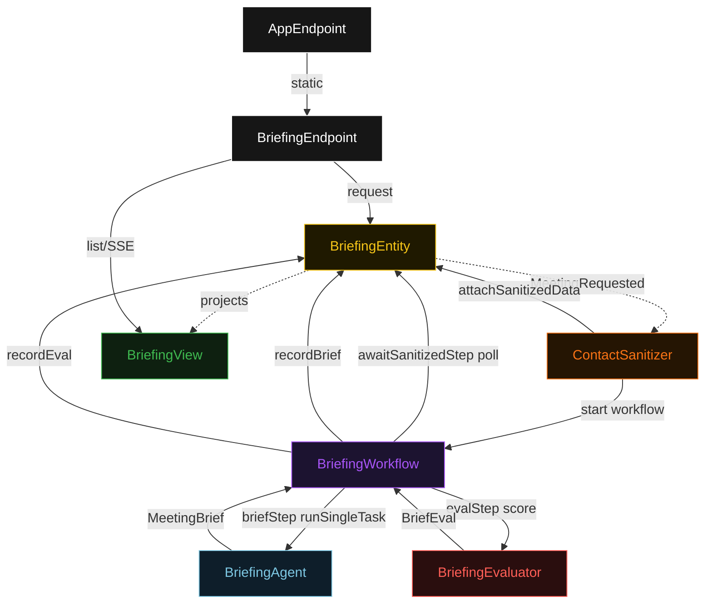
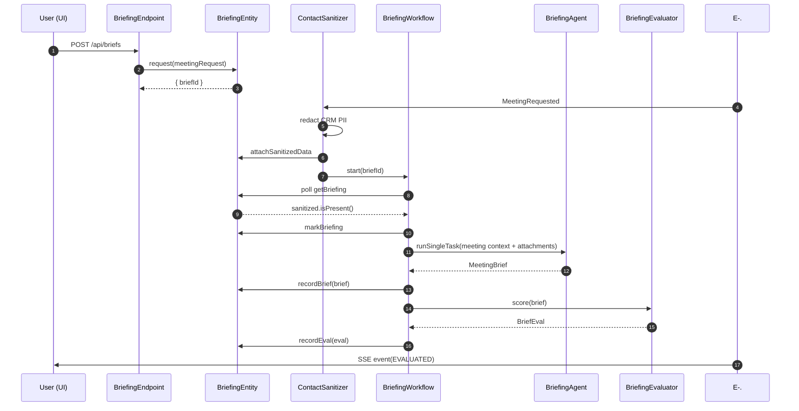
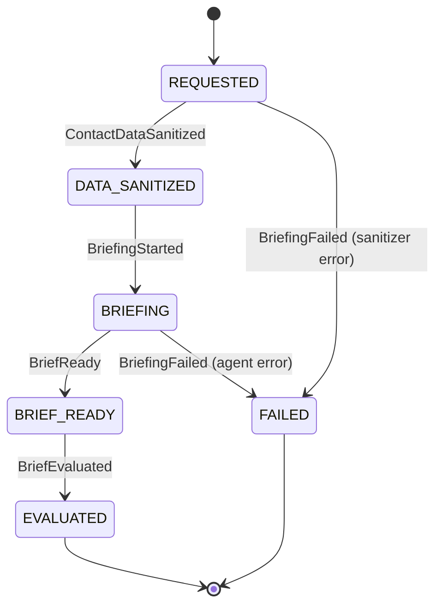
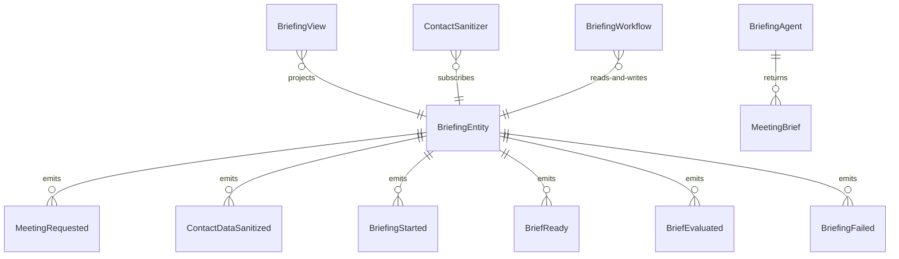

# PLAN — meeting-preparer

Architectural sketch consumed by `/akka:plan` and rendered on the generated system's Architecture tab. The four mermaid diagrams below carry the theme variables and CSS overrides from Lesson 24; without them, state names render black-on-black and edge labels clip.

---

## Component graph

## Interaction sequence — J1 (happy path)

## State machine — `BriefingEntity`

## Entity model

## Component table — Java file targets

| Component | Path (generated) |
|---|---|
| `BriefingEndpoint` | `api/BriefingEndpoint.java` |
| `AppEndpoint` | `api/AppEndpoint.java` |
| `BriefingEntity` | `application/BriefingEntity.java` (state in `domain/Briefing.java`, events in `domain/BriefingEvent.java`) |
| `ContactSanitizer` | `application/ContactSanitizer.java` |
| `BriefingWorkflow` | `application/BriefingWorkflow.java` |
| `BriefingAgent` | `application/BriefingAgent.java` (tasks in `application/BriefingTasks.java`) |
| `BriefingEvaluator` | `application/BriefingEvaluator.java` |
| `BriefingView` | `application/BriefingView.java` |
| `MockModelProvider` (option-a only) | `application/MockModelProvider.java` |
| Bootstrap | `Bootstrap.java` |

## Concurrency notes

- **Per-step timeout**: `awaitSanitizedStep` 15 s, `briefStep` 60 s, `evalStep` 5 s, `error` 5 s. Default step recovery `maxRetries(2).failoverTo(BriefingWorkflow::error)`. The 60 s on `briefStep` accommodates LLM latency (Lesson 4).
- **Idempotency**: every workflow uses `"briefing-" + briefId` as the workflow id; the `ContactSanitizer` Consumer is allowed to redeliver `MeetingRequested` events because `BriefingEntity.attachSanitizedData` is event-version-guarded — a second sanitize attempt against an already-sanitized briefing is a no-op.
- **One agent per brief**: the AutonomousAgent instance id is `"briefer-" + briefId`, which gives each task its own conversation context. The agent's `capability(...).maxIterationsPerTask(3)` caps retries at 3.
- **Eval is synchronous and deterministic**: `BriefingEvaluator` runs in-process inside `evalStep`. No LLM call, no external service — the same brief always scores the same.
- **No saga / no compensation**: every step is either a pure read, an append-only event write, or a single-task agent call. There is nothing external to roll back.
- **Three attachments**: `briefStep` passes `sanitized-crm.txt`, `financial-highlights.txt`, and `news-items.txt` as `TaskDef.attachment(...)` — never inlined into the instruction string.
