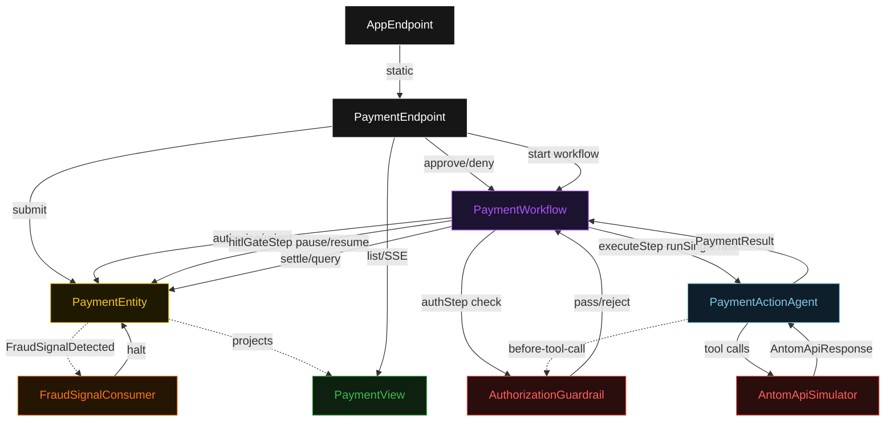
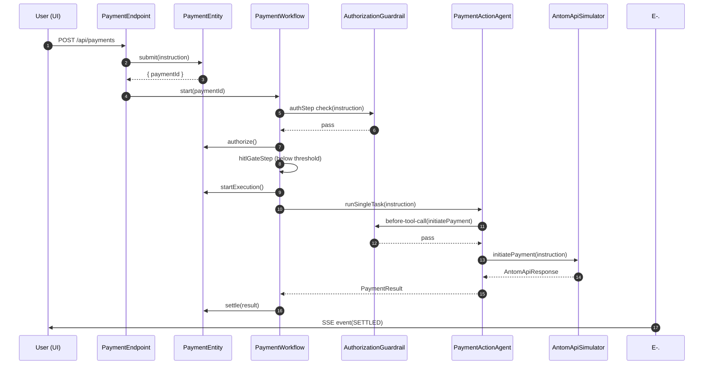
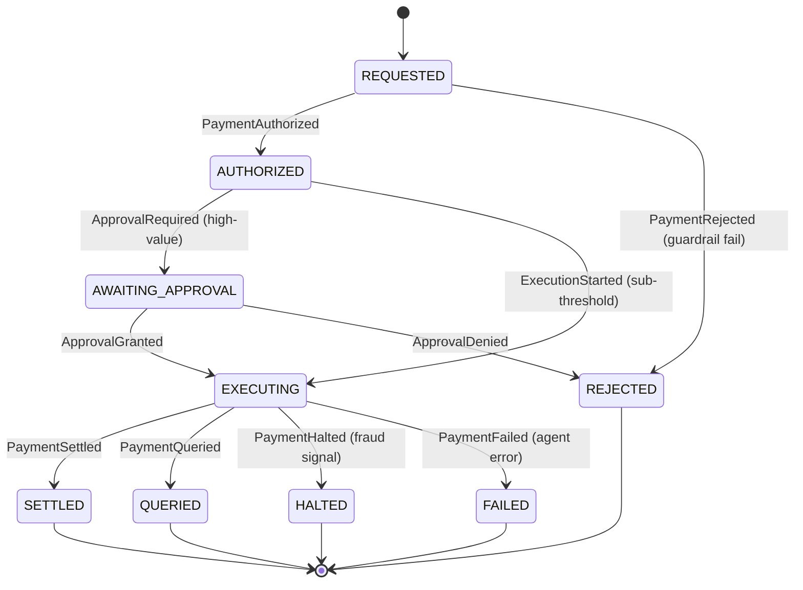
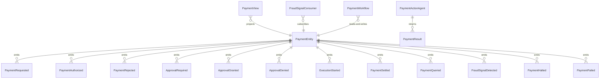

# PLAN — antom-payment

Architectural sketch consumed by `/akka:plan` and rendered on the generated system's Architecture tab. The four mermaid diagrams below carry the theme variables and CSS overrides from Lesson 24; without them, state names render black-on-black and edge labels clip.

---

## Component graph

## Interaction sequence — J1 (happy path, sub-threshold)

## State machine — `PaymentEntity`

## Entity model

## Component table — Java file targets

| Component | Path (generated) |
|---|---|
| `PaymentEndpoint` | `api/PaymentEndpoint.java` |
| `AppEndpoint` | `api/AppEndpoint.java` |
| `PaymentEntity` | `application/PaymentEntity.java` (state in `domain/Payment.java`, events in `domain/PaymentEvent.java`) |
| `FraudSignalConsumer` | `application/FraudSignalConsumer.java` |
| `PaymentWorkflow` | `application/PaymentWorkflow.java` |
| `PaymentActionAgent` | `application/PaymentActionAgent.java` (tasks in `application/PaymentTasks.java`) |
| `AuthorizationGuardrail` | `application/AuthorizationGuardrail.java` |
| `AntomApiSimulator` | `application/AntomApiSimulator.java` |
| `PaymentView` | `application/PaymentView.java` |
| `MockModelProvider` (option-a only) | `application/MockModelProvider.java` |
| Bootstrap | `Bootstrap.java` |

## Concurrency notes

- **Per-step timeout**: `authStep` 5 s, `hitlGateStep` 86 400 s (24 h operator window), `executeStep` 60 s, `recordStep` 5 s, `error` 5 s. Default step recovery `maxRetries(2).failoverTo(PaymentWorkflow::error)`. The 60 s on `executeStep` accommodates LLM latency plus the simulated Antom API call (Lesson 4).
- **Idempotency**: every workflow uses `"payment-" + paymentId` as the workflow id. `PaymentEntity.authorize` is event-version-guarded — a second authorization attempt on an already-authorized payment is a no-op.
- **One agent per payment**: the AutonomousAgent instance id is `"agent-" + paymentId`, giving each task its own conversation context. The agent's `capability(...).maxIterationsPerTask(3)` caps retries.
- **Guardrail-driven rejection**: when `AuthorizationGuardrail` rejects a tool call in the before-tool-call hook, the rejection is returned as a structured `authorization-failure` to the agent loop. The agent logs the block and does not reattempt the same tool call.
- **Halt is unconditional**: `FraudSignalConsumer` fires on any `FraudSignalDetected` event regardless of workflow step. The entity transitions to `HALTED` and any in-progress workflow step fails fast on the next tick.
- **HITL pause**: `hitlGateStep` uses `workflow.pause()` to suspend the workflow thread. The entity is in `AWAITING_APPROVAL`. `PaymentEndpoint.approve` / `.deny` call `workflow.resume(ApprovalGranted)` / `workflow.resume(ApprovalDenied)` to unblock the step.
- **No saga / no compensation**: payment tool calls are simulated; there is nothing external to roll back. A real deployer adding live Antom API calls must add a compensation step to `error` that issues a reversal if `ExecutionStarted` was already emitted.
