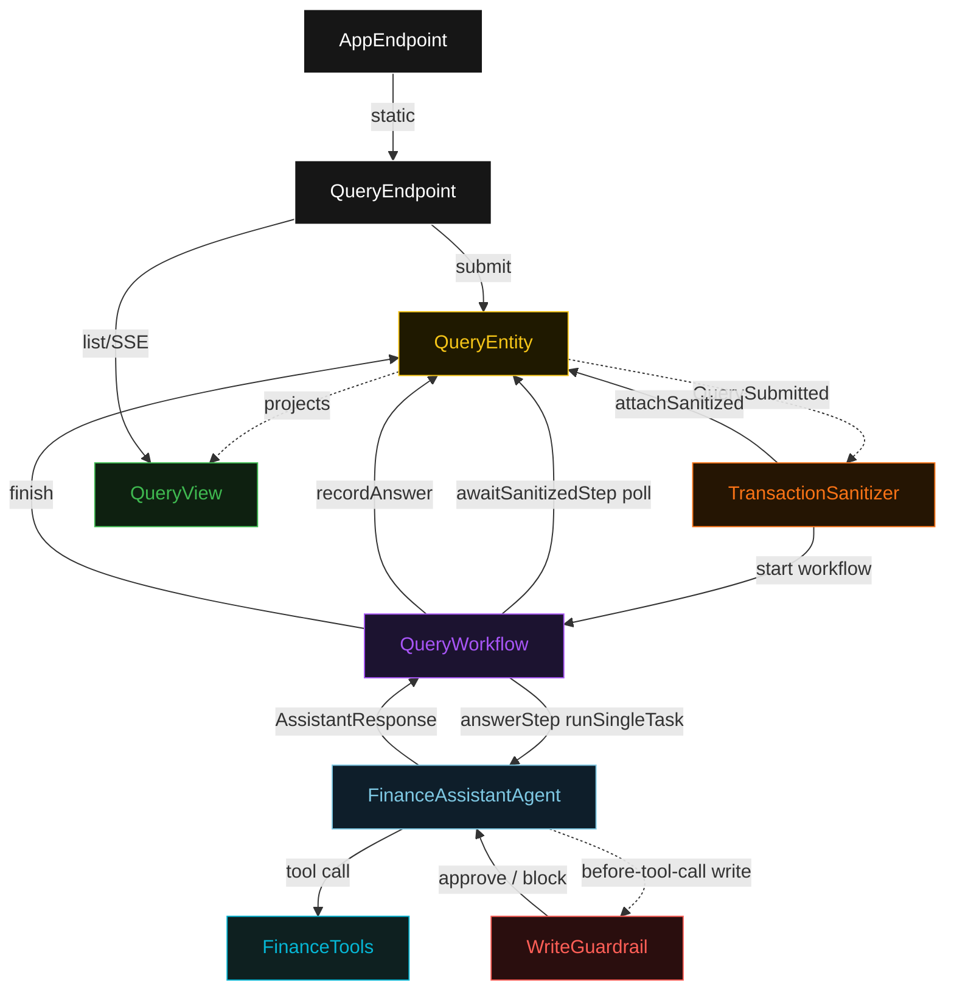
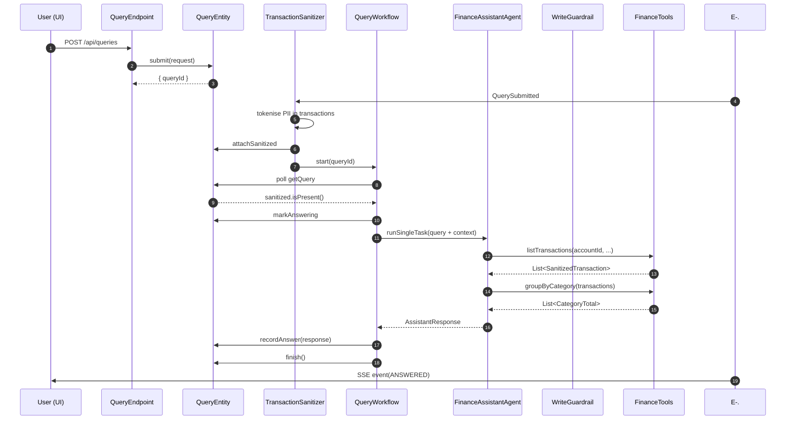
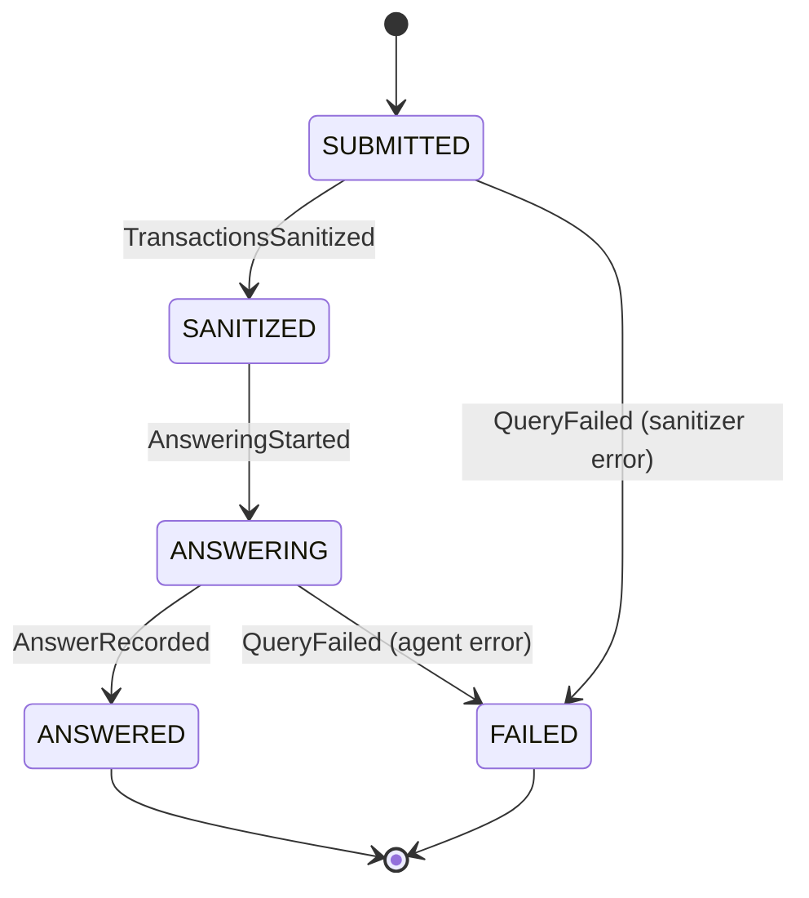
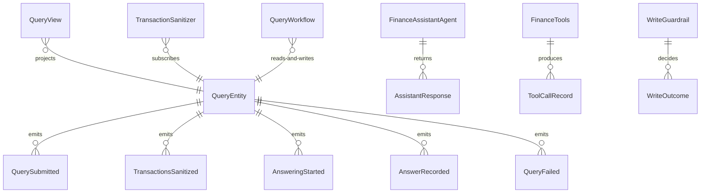

# PLAN — personal-finance-agent

Architectural sketch consumed by `/akka:plan` and rendered on the generated system's Architecture tab. The four mermaid diagrams below carry the theme variables and CSS overrides from Lesson 24; without them, state names render black-on-black and edge labels clip.

---

## Component graph

## Interaction sequence — J1 (spending summary, happy path)

## State machine — `QueryEntity`

## Entity model

## Component table — Java file targets

| Component | Path (generated) |
|---|---|
| `QueryEndpoint` | `api/QueryEndpoint.java` |
| `AppEndpoint` | `api/AppEndpoint.java` |
| `QueryEntity` | `application/QueryEntity.java` (state in `domain/Query.java`, events in `domain/QueryEvent.java`) |
| `TransactionSanitizer` | `application/TransactionSanitizer.java` |
| `QueryWorkflow` | `application/QueryWorkflow.java` |
| `FinanceAssistantAgent` | `application/FinanceAssistantAgent.java` (tasks in `application/FinanceTasks.java`) |
| `FinanceTools` | `application/FinanceTools.java` |
| `WriteGuardrail` | `application/WriteGuardrail.java` |
| `QueryView` | `application/QueryView.java` |
| `MockModelProvider` (option-a only) | `application/MockModelProvider.java` |
| Bootstrap | `Bootstrap.java` |

## Concurrency notes

- **Per-step timeout**: `awaitSanitizedStep` 15 s, `answerStep` 90 s (accommodates multiple tool-call round trips plus LLM latency — Lesson 4), `recordStep` 5 s, `error` 5 s. Default step recovery `maxRetries(2).failoverTo(QueryWorkflow::error)`.
- **Idempotency**: every workflow uses `"query-" + queryId` as the workflow id; `TransactionSanitizer` is allowed to redeliver `QuerySubmitted` events because `QueryEntity.attachSanitized` is event-version-guarded — a second sanitize call against an already-sanitized query is a no-op.
- **One agent per query**: the AutonomousAgent instance id is `"agent-" + queryId`, which gives each task its own conversation context. `capability(...).maxIterationsPerTask(5)` allows multiple tool-call rounds per query (typical finance queries call 2–3 tools).
- **Guardrail on write only**: `WriteGuardrail` inspects only `transferFunds` and `payBill` invocations. Read tools bypass it entirely. This is encoded in the tool registration metadata so the guardrail hook does not need a runtime name-check inside its body.
- **No compensation**: `getBalance` and `listTransactions` are read-only; `transferFunds` and `payBill` mutate the in-memory simulation only. There is no real bank connection and no saga rollback needed. A `FAILED` query's prior tool-call trace is preserved on the entity for audit.
- **Eval**: this baseline has no on-decision evaluator (only two controls: sanitizer + guardrail). The single-agent invariant is upheld — no second LLM call anywhere in the stack.
